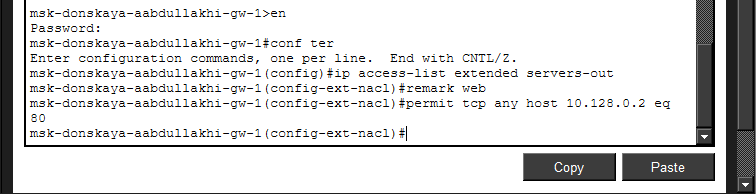
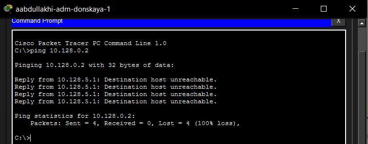
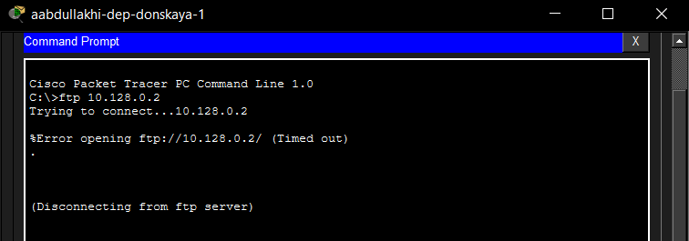
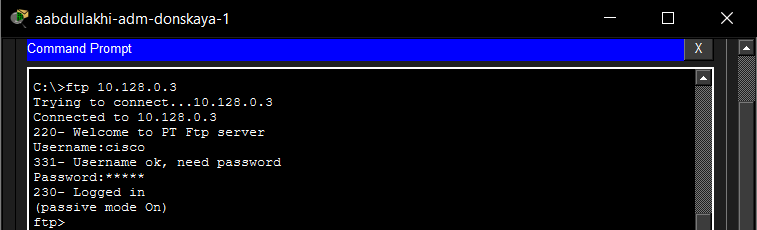
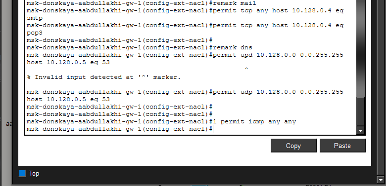
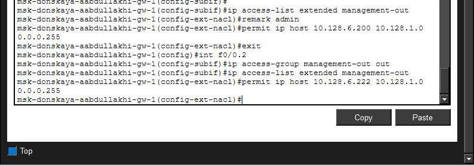
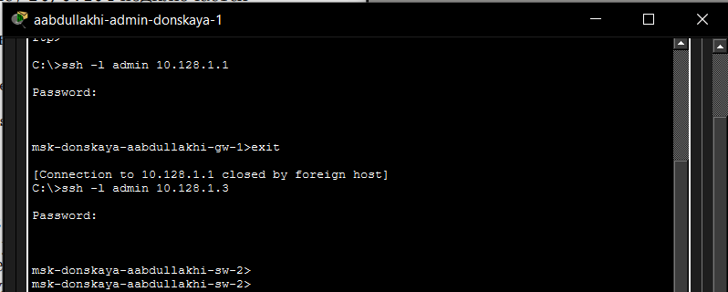

---
## Front matter
lang: ru-RU
title: Администрирование локальных сетей
subtitle: Лабораторная работа №10
author:
  - Абдуллахи Абдул Вахид
institute:
  - Российский университет дружбы народов, Москва, Россия
date: 18 Апреля 2026

## i18n babel
babel-lang: russian
babel-otherlangs: english

## Formatting pdf
toc: false
toc-title: Содержание
slide_level: 2
aspectratio: 169
section-titles: true
theme: metropolis
header-includes:
 - \metroset{progressbar=frametitle,sectionpage=progressbar,numbering=fraction}
---

# Цель 

## Цель лабораторной работы 

Освоить настройку прав доступа пользователей к ресурсам сети.

# Выполнение лабораторной работы

## Схема сети

{ width=75% }

## Настройка IP-адреса администратора

{ width=75% }

## Создание ACL для web-доступа

{ width=75% }

## Проверка HTTP-доступа

{ width=75% }

## Проверка ping до сервера

{ width=75% }

## Добавление правил для администратора

{ width=75% }

## Успешное FTP-подключение администратора

{ width=75% }

## Запрет FTP-доступа для других пользователей

{ width=75% }

## Настройка ACL для файлового сервера

{ width=75% }

## Проверка FTP-доступа к файловому серверу

{ width=75% }

## Настройка ACL для mail, DNS и ICMP

{ width=75% }

## Проверка доступа к web-серверу по имени

{ width=75% }

## Проверка работы почтового сервера

{ width=75% }

## настройка доступа для сети Other

{ width=75% }

## настройка доступа администратора к сети сетевого оборудования

{ width=75% }

## Проверка SSH-доступа к маршрутизатору и коммутатору

{ width=75% }

## Просмотр итоговых списков доступа

{ width=75% }

# Вывод

## Вывод работы

В ходе лабораторной работы была выполнена настройка списков контроля доступа (ACL) на маршрутизаторе в среде Cisco Packet Tracer. Были реализованы правила фильтрации трафика для различных сетевых сервисов, включая web-, файловый, почтовый и DNS-серверы.

Настроенные ACL позволили ограничить доступ пользователей к сетевым ресурсам в зависимости от используемых протоколов и адресов источника. Для администратора сети были предоставлены расширенные права доступа, включая возможность подключения по протоколам FTP, Telnet и SSH, а также управление сетевым оборудованием.

Проведённые проверки показали корректную работу настроенных правил: доступ к ресурсам разрешается или запрещается в соответствии с заданной политикой безопасности.

