---
## Front matter
title: "Отчёт по лабораторной работе 10"
subtitle: "Настройка списков управления доступом (ACL)"
author: "Абдуллахи Абдул Вахид"

## Generic otions
lang: ru-RU
toc-title: "Содержание"

## Bibliography
bibliography: bib/cite.bib
csl: pandoc/csl/gost-r-7-0-5-2008-numeric.csl

## Pdf output format
toc: true # Table of contents
toc-depth: 2
lof: true # List of figures
lot: true # List of tables
fontsize: 12pt
linestretch: 1.5
papersize: a
documentclass: scrreprt
## I18n polyglossia
polyglossia-lang:
  name: russian
  options:
	- spelling=modern
	- babelshorthands=true
polyglossia-otherlangs:
  name: english
## I18n babel
babel-lang: russian
babel-otherlangs: english
## Fonts
mainfont: IBM Plex Serif
romanfont: IBM Plex Serif
sansfont: IBM Plex Sans
monofont: IBM Plex Mono
mathfont: STIX Two Math
mainfontoptions: Ligatures=Common,Ligatures=TeX,Scale=0.94
romanfontoptions: Ligatures=Common,Ligatures=TeX,Scale=0.94
sansfontoptions: Ligatures=Common,Ligatures=TeX,Scale=MatchLowercase,Scale=0.94
monofontoptions: Scale=MatchLowercase,Scale=0.94,FakeStretch=0.9
mathfontoptions:
## Biblatex
biblatex: true
biblio-style: "gost-numeric"
biblatexoptions:
  - parentracker=true
  - backend=biber
  - hyperref=auto
  - language=auto
  - autolang=other*
  - citestyle=gost-numeric
## Pandoc-crossref LaTeX customization
figureTitle: "Рис."
tableTitle: "Таблица"
listingTitle: "Листинг"
lofTitle: "Список иллюстраций"
lotTitle: "Список таблиц"
lolTitle: "Листинги"
## Misc options
indent: true
header-includes:
  - \usepackage{indentfirst}
  - \usepackage{float} # keep figures where there are in the text
  - \floatplacement{figure}{H} # keep figures where there are in the text
---

#  Цель работы

Освоить настройку прав доступа пользователей к ресурсам сети.

#  Выполнение лабораторной работы

1. В логической рабочей области Cisco Packet Tracer была реализована сеть, включающая маршрутизатор Cisco 2811 (msk-donskaya-aabdullakhi-gw-1), несколько коммутаторов Cisco 2960, серверы и рабочие станции пользователей.

В рамках задания в сеть был дополнительно подключён ноутбук администратора Laptop-PT (aabdullakhi-admin-donskaya-1) к коммутатору msk-donskaya-aabdullakhi-sw-4 в порт FastEthernet0/24.

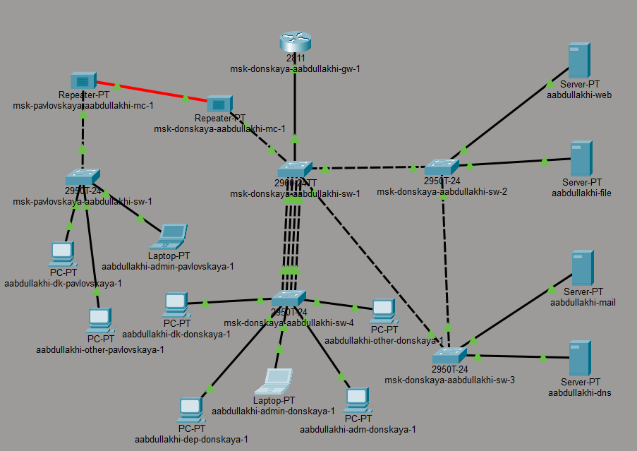

2. На ноутбуке администратора был настроен статический IP-адрес для работы в сети:
   - IP-адрес: 10.128.6.200
   - Маска подсети: 255.255.255.0
   - Шлюз по умолчанию: 10.128.6.1
   - DNS-сервер: 10.128.0.5
   
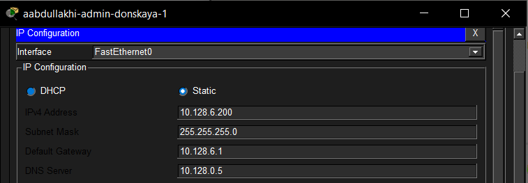

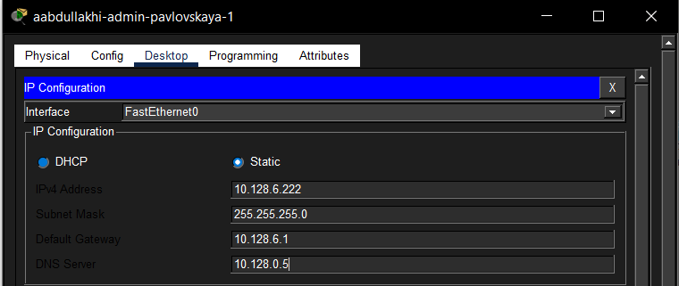

3. Выполнена настройка списков контроля доступа (ACL) на маршрутизаторе msk-donskaya-aabdullakhi-gw-1.

Был создан расширенный список доступа servers-out, разрешающий доступ к web-серверу:
   - разрешён протокол TCP для всех узлов сети;
   - доступ осуществляется к серверу 10.128.0.2;
   - используется порт 80 (HTTP).

Также добавлен комментарий для идентификации правила.

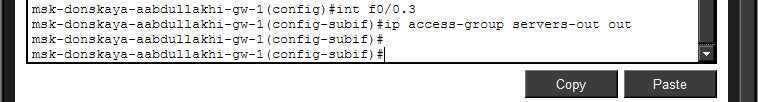

4. Настроенный список доступа был применён к интерфейсу маршрутизатора FastEthernet0/0.3 для исходящего трафика.

5. Проведена проверка доступа к web-серверу. 
При обращении к серверу через браузер по адресу http://10.128.0.2 соединение устанавливается успешно. 
При этом проверка с помощью команды ping показывает недоступность сервера, так как ICMP-трафик не разрешён правилами доступа.

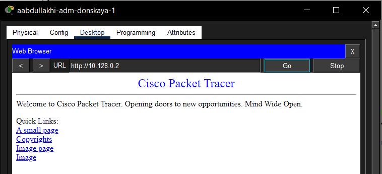

6. Далее в список контроля доступа были добавлены правила для администратора, разрешающие дополнительные протоколы управления:
   - разрешён доступ по FTP (порты 20–21);
   - разрешён доступ по Telnet;
   - доступ предоставлен только узлу с IP-адресом 10.128.6.200.
   
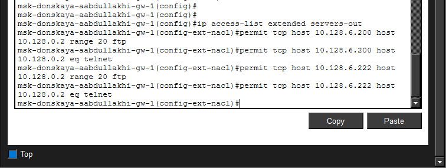

7. Выполнена проверка доступа по протоколу FTP. 
С устройства администратора установлено соединение с сервером 10.128.0.2 с использованием учётных данных (логин: cisco, пароль: cisco). Подключение прошло успешно.

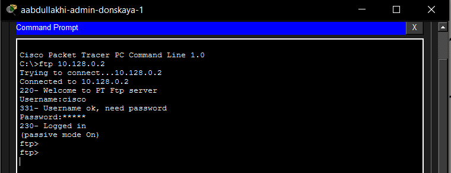

8. Проведена попытка подключения к FTP-серверу с другого устройства сети. Соединение не было установлено (тайм-аут).

9. Выполнена настройка доступа к файловому серверу.  
   В список контроля доступа servers-out были добавлены правила для файлового сервера 10.128.0.3:
   - разрешён доступ по протоколу SMB через TCP-порт 445 для всех узлов внутренней сети 10.128.0.0/16;
   - разрешён доступ по протоколу FTP к файловому серверу для любых узлов сети;
   - добавлен комментарий remark file.
   
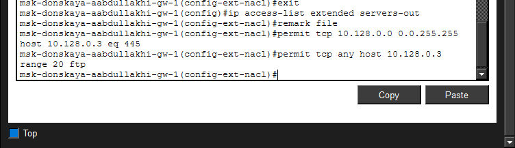

10. Проведена проверка доступа администратора к файловому серверу по протоколу FTP.  
    С ноутбука администратора выполнено подключение к узлу 10.128.0.3. После ввода имени пользователя cisco и пароля cisco соединение было успешно установлено.
    

11. Выполнена настройка доступа к почтовому серверу и DNS-серверу.  
    В список контроля доступа servers-out были добавлены правила:
    - разрешён доступ к почтовому серверу 10.128.0.4 по протоколу SMTP;
    - разрешён доступ к почтовому серверу 10.128.0.4 по протоколу POP3;
    - разрешён доступ ко внутреннему DNS-серверу 10.128.0.5 по протоколу UDP через порт 53;
    - добавлены комментарии remark mail и remark dns.  
    Кроме того, в начало списка доступа было добавлено правило разрешения ICMP-трафика для всех узлов сети.
    

12. После настройки DNS-сервера была выполнена проверка доступа к web-серверу по доменному имени.  
    В браузере рабочего узла был введён адрес http://www.donskaya.rudn.ru, после чего страница web-сервера была успешно открыта.
    
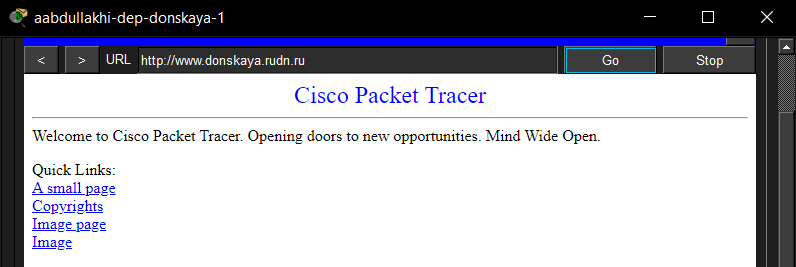

13. Проверена работа почтового сервера.  
    Между пользователями почтовой системы был выполнен обмен сообщениями. Одно из устройств получило письмо с темой i am wahid, а на другом устройстве был зафиксирован ответ RE: hello.
    
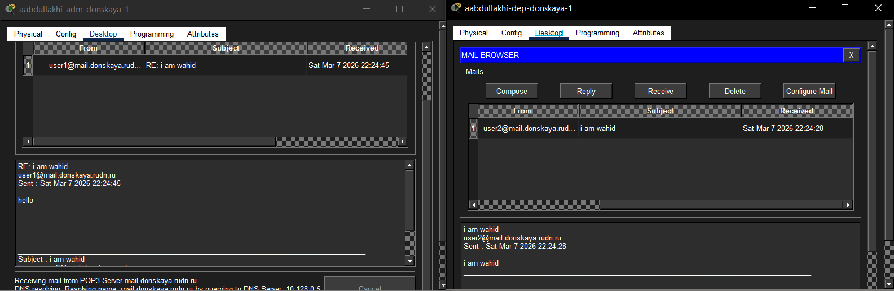

14. После добавления правила разрешения ICMP проведена повторная проверка доступности сетевых узлов.  
    Команда ping до почтового сервера mail.donskaya.rudn.ru была выполнена успешно. Также была проведена проверка доступности другого узла сети по IP-адресу 10.128.3.30.
    
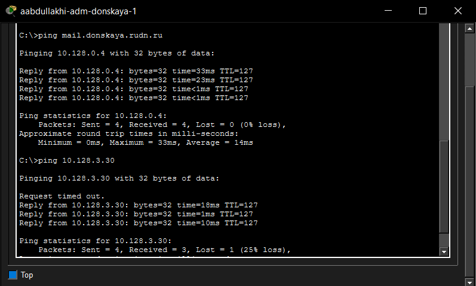

15. Выполнена настройка доступа для сети Other.  
    На маршрутизаторе был создан расширенный список контроля доступа other-in, предназначенный для фильтрации входящего трафика на интерфейсе сети Other. Добавлено правило, разрешающее устройству администратора с IP-адресом 10.128.6.200 выполнять любые сетевые действия. Список применён к интерфейсу FastEthernet0/0.104 по направлению in.
    
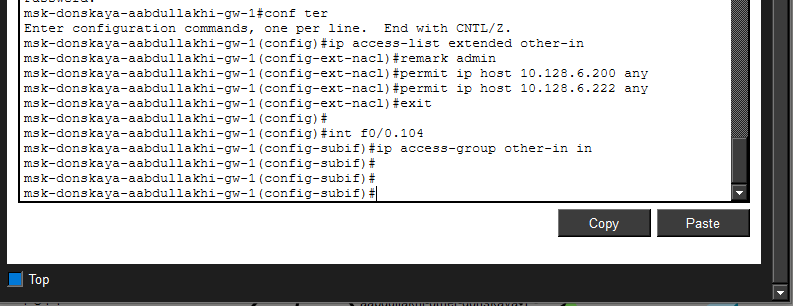

16. Выполнена настройка доступа администратора к сети сетевого оборудования.  
    Создан расширенный список контроля доступа management-out, в котором:
    - добавлен комментарий remark admin;
    - разрешён полный IP-доступ узлу администратора 10.128.6.200 к сети управления 10.128.1.0/24.  
    Список подключён к интерфейсу FastEthernet0/0.2 по направлению out.
    

17. Проведена проверка административного доступа к сетевому оборудованию по протоколу SSH.  
    С ноутбука администратора выполнено успешное подключение к маршрутизатору 10.128.1.1 и коммутатору 10.128.1.3 под учётной записью admin.
    

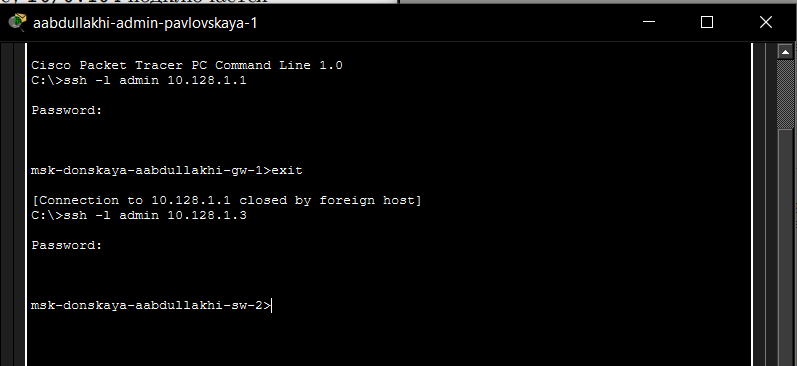

18. Для контроля итоговой конфигурации был просмотрен список правил ACL с помощью команды `show access-lists`.  
    В результате отображены все созданные списки:
    - servers-out;
    - other-in;
    - management-out.
    
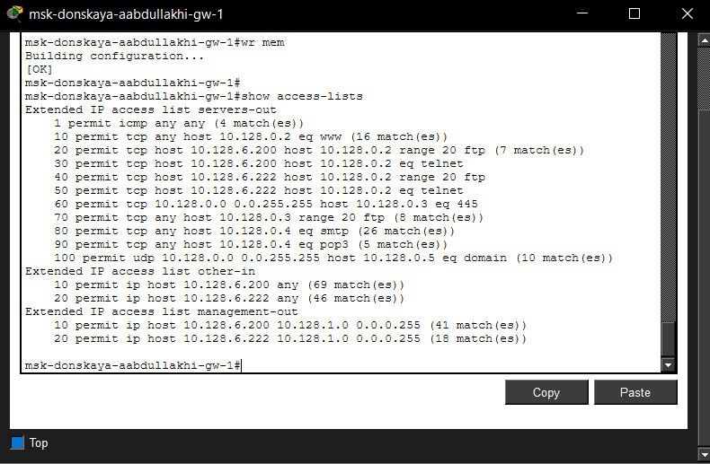

# Вывод

В ходе лабораторной работы была выполнена настройка списков контроля доступа (ACL) на маршрутизаторе в среде Cisco Packet Tracer. Были реализованы правила фильтрации трафика для различных сетевых сервисов, включая web-, файловый, почтовый и DNS-серверы.

Настроенные ACL позволили ограничить доступ пользователей к сетевым ресурсам в зависимости от используемых протоколов и адресов источника. Для администратора сети были предоставлены расширенные права доступа, включая возможность подключения по протоколам FTP, Telnet и SSH, а также управление сетевым оборудованием.

Проведённые проверки показали корректную работу настроенных правил: доступ к ресурсам разрешается или запрещается в соответствии с заданной политикой безопасности.

# Контрольные вопросы

1. Как задать действие правила для конкретного протокола?

Действие правила для конкретного протокола задаётся при создании записи ACL с указанием типа протокола, например:
- `permit tcp ...` – для протокола TCP;
- `permit udp ...` – для протокола UDP;
- `permit icmp ...` – для протокола ICMP.

2. Как задать действие правила сразу для нескольких портов?

Используется ключевое слово `range`, например:
- `permit tcp any host 10.128.0.2 range 20 21` – разрешает доступ к портам 20–21 (FTP).

3. Как узнать номер правила в списке прав доступа?

С помощью команды `show access-lists`. В выводе отображаются строки ACL с их порядковыми номерами.

4. Каким образом можно изменить порядок применения правил в списке контроля доступа?

Порядок можно изменить, задав номер строки при добавлении правила, например:  
`1 permit icmp any any` – такое правило будет помещено в начало списка. Также можно удалить и заново добавить правила в нужном порядке.

