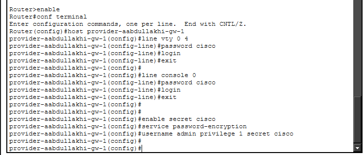
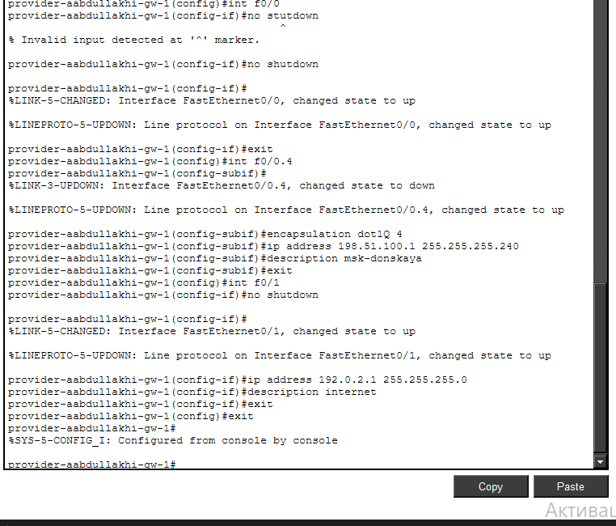
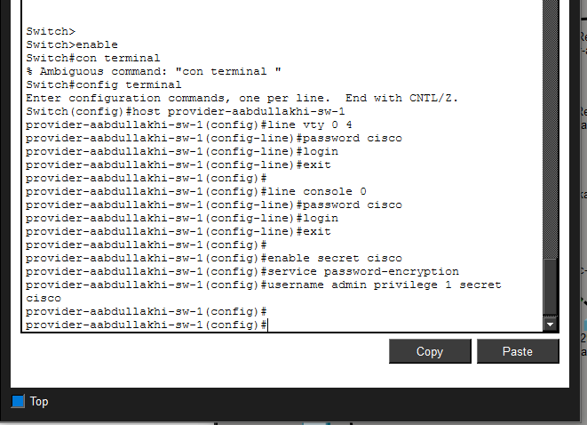
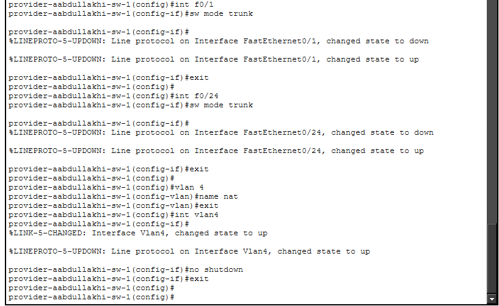
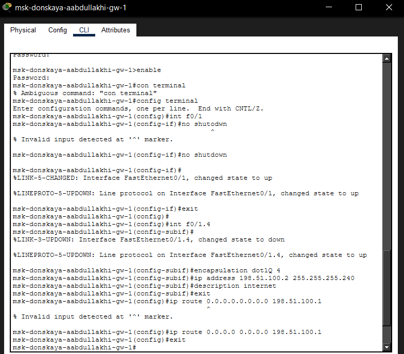
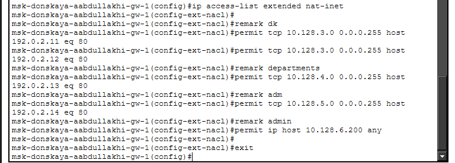
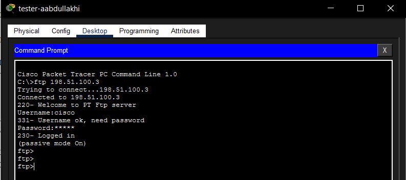

---
## Front matter
lang: ru-RU
title: Администрирование локальных сетей
subtitle: Лабораторная работа №12
author:
  - Абдуллахи Абдул Вахид
institute:
  - Российский университет дружбы народов, Москва, Россия
date: 18 Апреля 2026

## i18n babel
babel-lang: russian
babel-otherlangs: english

## Formatting pdf
toc: false
toc-title: Содержание
slide_level: 2
aspectratio: 169
section-titles: true
theme: metropolis
header-includes:
 - \metroset{progressbar=frametitle,sectionpage=progressbar,numbering=fraction}
---

# Цель 

## Цель лабораторной работы 

Приобретение практических навыков по настройке доступа локальной сети к внешней сети с использованием технологии NAT (Network Address Translation).

# Выполнение лабораторной работы

## Настройка маршрутизатора провайдера

{ width=75% }

## Настройка маршрутизатора провайдера

{ width=75% }

## Настройка коммутатора провайдера

{ width=75% }

## Настройка коммутатора провайдера

{ width=75% }

## Настройка интерфейса маршрутизатора сети «Донская»

{ width=75% }

## Настройка NAT на маршрутизаторе «Донская»

{ width=75% }

{ width=75% }

## Настройка статического NAT (проброс портов)

{ width=75% }

## Проверка доступа из сети дисплейных классов

{ width=75% }

## Проверка доступа для сети кафедр

{ width=75% }

## Проверка работы сети администрации

{ width=75% }

## Проверка сети прочих пользователей

{ width=75% }

# Проверка доступности серверов из внешней сети

## Проверка WEB-сервера

{ width=75% }

## Проверка FTP-сервера

{ width=75% }

## Проверка почтового сервера

{ width=75% }

# Вывод

В ходе выполнения лабораторной работы были освоены практические навыки настройки NAT на пограничном маршрутизаторе.  
Реализованы:

- динамическая трансляция адресов для выхода в интернет;
- статический NAT для публикации внутренних серверов;
- разграничение доступа на основе ACL;
- проверка работоспособности WEB, FTP и почтовых сервисов.

Все цели работы достигнуты, конфигурация сохранена и протестирована.

