---
## Front matter
title: "Отчёт по лабораторной работе 12"
subtitle: "Настройка доступа локальной сети к внешней сети посредством NAT"
author: "Абдуллахи Абдул Вахид"

## Generic otions
lang: ru-RU
toc-title: "Содержание"

## Bibliography
bibliography: bib/cite.bib
csl: pandoc/csl/gost-r-7-0-5-2008-numeric.csl

## Pdf output format
toc: true # Table of contents
toc-depth: 2
lof: true # List of figures
lot: true # List of tables
fontsize: 12pt
linestretch: 1.5
papersize: a
documentclass: scrreprt
## I18n polyglossia
polyglossia-lang:
  name: russian
  options:
	- spelling=modern
	- babelshorthands=true
polyglossia-otherlangs:
  name: english
## I18n babel
babel-lang: russian
babel-otherlangs: english
## Fonts
mainfont: IBM Plex Serif
romanfont: IBM Plex Serif
sansfont: IBM Plex Sans
monofont: IBM Plex Mono
mathfont: STIX Two Math
mainfontoptions: Ligatures=Common,Ligatures=TeX,Scale=0.94
romanfontoptions: Ligatures=Common,Ligatures=TeX,Scale=0.94
sansfontoptions: Ligatures=Common,Ligatures=TeX,Scale=MatchLowercase,Scale=0.94
monofontoptions: Scale=MatchLowercase,Scale=0.94,FakeStretch=0.9
mathfontoptions:
## Biblatex
biblatex: true
biblio-style: "gost-numeric"
biblatexoptions:
  - parentracker=true
  - backend=biber
  - hyperref=auto
  - language=auto
  - autolang=other*
  - citestyle=gost-numeric
## Pandoc-crossref LaTeX customization
figureTitle: "Рис."
tableTitle: "Таблица"
listingTitle: "Листинг"
lofTitle: "Список иллюстраций"
lotTitle: "Список таблиц"
lolTitle: "Листинги"
## Misc options
indent: true
header-includes:
  - \usepackage{indentfirst}
  - \usepackage{float} # keep figures where there are in the text
  - \floatplacement{figure}{H} # keep figures where there are in the text
---

#  Цель работы

Приобретение практических навыков по настройке доступа локальной сети к внешней сети с использованием технологии NAT (Network Address Translation).

#  Выполнение лабораторной работы

1. Настройка маршрутизатора провайдера

На маршрутизаторе провайдера `provider-gw-1` была выполнена первоначальная конфигурация устройства:

- задано имя устройства `provider-aabdullakhi-gw-1`;
- настроен пароль для консольного доступа;
- настроены линии VTY с паролем;
- установлен `enable secret`;
- включено шифрование паролей;
- создан пользователь `admin`;
- активирован интерфейс FastEthernet0/0;
- конфигурация сохранена в память.

2. Настройка коммутатора провайдера

На коммутаторе `provider-sw-1` выполнены начальная настройка и настройка интерфейсов:

- имя устройства — `provider-aabdullakhi-sw-1`;
- пароль для линий VTY;
- пароль для консольного доступа;
- `enable secret`;
- шифрование паролей;
- пользователь `admin`;
- интерфейсы FastEthernet0/1 и FastEthernet0/24 переведены в режим trunk;
- создана VLAN 4 с именем `nat`;
- включён интерфейс Vlan4.

3. Настройка интерфейса маршрутизатора сети «Донская»

На маршрутизаторе сети «Донская» выполнен порт FastEthernet0/1.  
Создан подинтерфейс FastEthernet0/1.4 с параметрами:

- инкапсуляция: `dot1q 4`;
- IP-адрес: `198.51.100.2`;
- маска: `255.255.255.240`;
- описание: `internet`.

Добавлен маршрут по умолчанию:  `0.0.0.0 0.0.0.0 198.51.100.1`

4. Настройка NAT на маршрутизаторе «Донская»

Создан пул адресов `main-pool`:

- диапазон: `198.51.100.2 – 198.51.100.14`;
- маска: `255.255.255.240`.

Создан расширенный список доступа `nat-inet`, разрешающий выход в интернет для внутренних сетей и узлов.

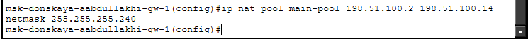

5. Настройка статического NAT (проброс портов)

Выполнен проброс портов из внешней сети во внутреннюю:

- `198.51.100.2:80 → 10.128.0.2:80`
- `198.51.100.3:80 → 10.128.0.3:80`
- `198.51.100.3:21 → 10.128.0.3:21`
- `198.51.100.4:25 → 10.128.0.4:25`
- `198.51.100.4:110 → 10.128.0.4:110`
- `198.51.100.10:3389 → 10.128.6.200:3389`

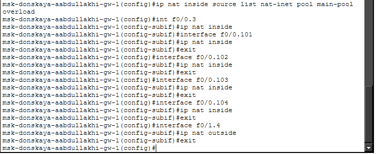

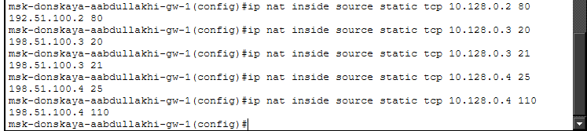

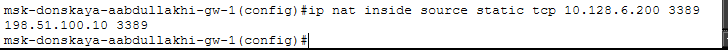

6. Проверка доступа из сети дисплейных классов

С оконечных устройств дисплейных классов проверен доступ к разрешённым ресурсам:  
`www.yandex.ru` и `stud.rudn.university` — доступ успешен.  
При попытке доступа к другим ресурсам — ограничения.

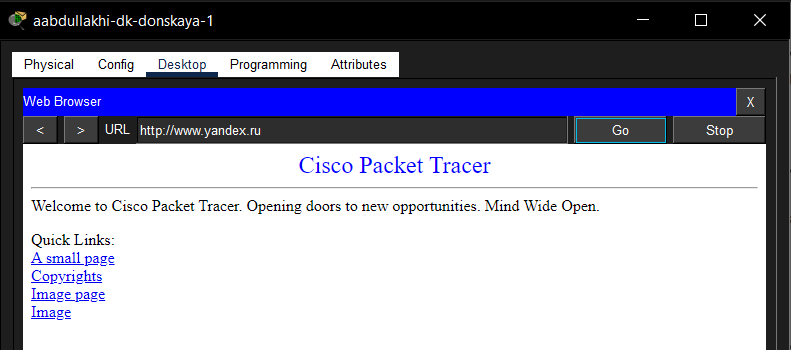

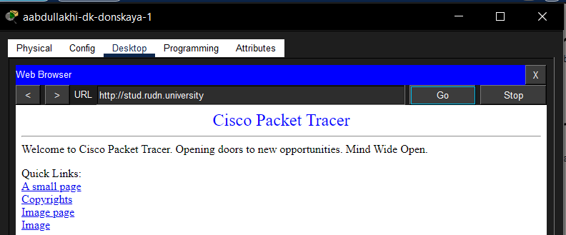

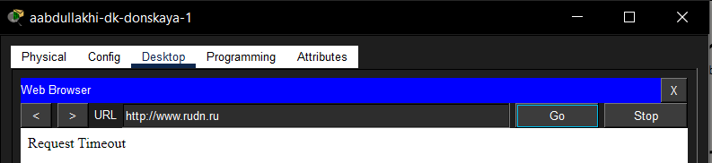

7. Проверка доступа для сети кафедр

Пользователи сети кафедр имеют доступ только к `esystem.pfur.ru`.  
Соединение устанавливается успешно, что подтверждает корректную настройку ACL и NAT.

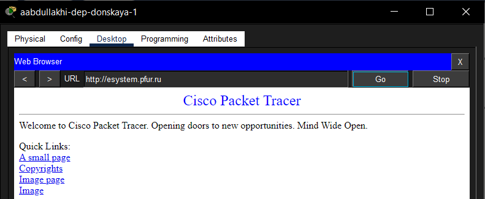

8. Проверка работы сети администрации

Пользователям сети администрации разрешён доступ только к `www.rudn.ru`.  
Доступ к данному ресурсу осуществляется успешно.

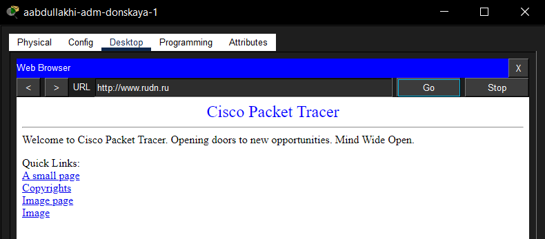

9. Проверка сети прочих пользователей

В данной сети только компьютер администратора имеет полный доступ во внешнюю сеть.  
Остальные пользователи интернет-доступа не имеют.

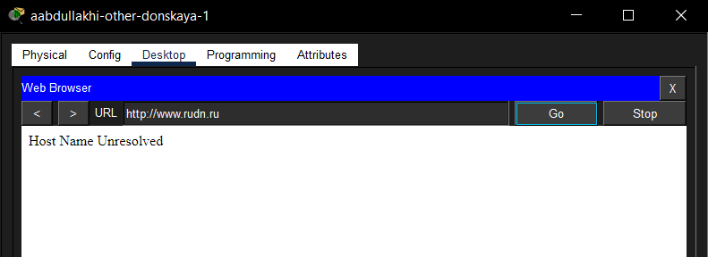

10. Проверка доступности серверов из внешней сети

С тестового ПК настроен IP-адрес:

- IP: `192.0.2.20`
- маска: `255.255.255.0`
- шлюз: `192.0.2.1`

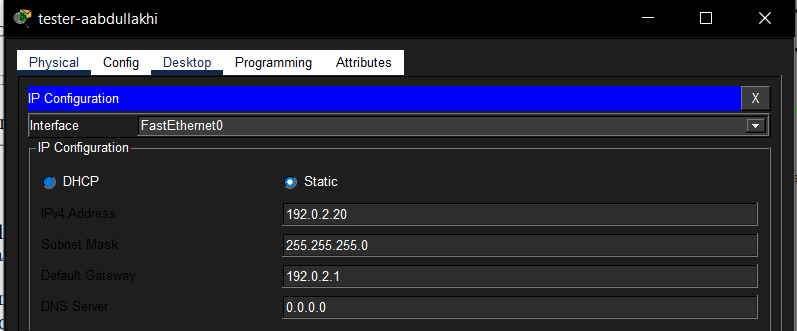

11. Проверка WEB-сервера

Через браузер выполнено подключение к `198.51.100.2` по HTTP (порт 80).  
Веб-страница загружается — NAT настроен корректно.

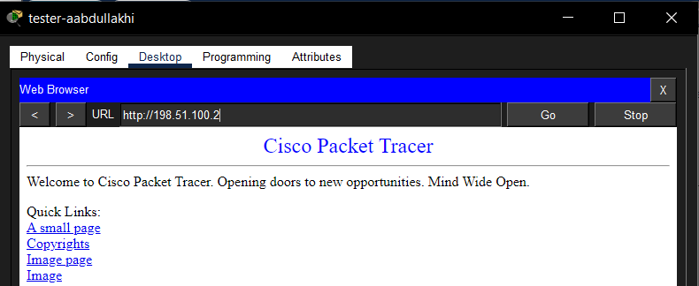

12. Проверка FTP-сервера

С тестового ПК выполнено подключение к `198.51.100.3`.  
Аутентификация пройдена, команды FTP выполняются.

13. Проверка почтового сервера

На клиенте настроены параметры:

- адрес почтового сервера: `198.51.100.4`
- протоколы: SMTP (порт 25), POP3 (порт 110)

Выполнены отправка и получение сообщений — успешно.

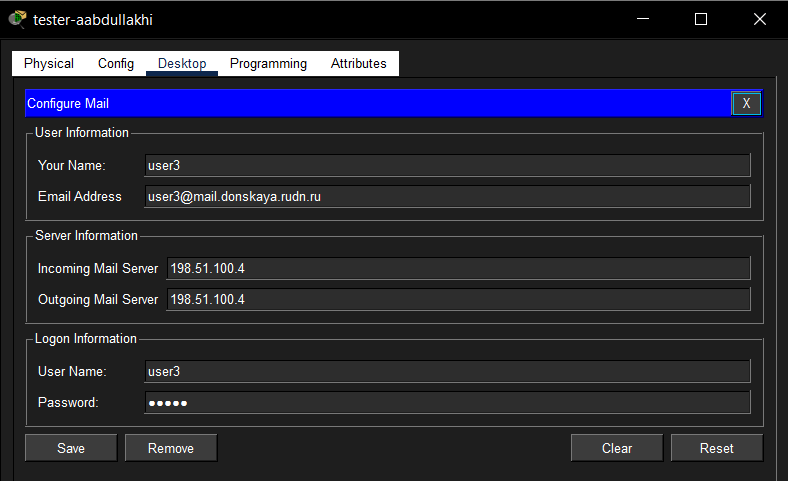

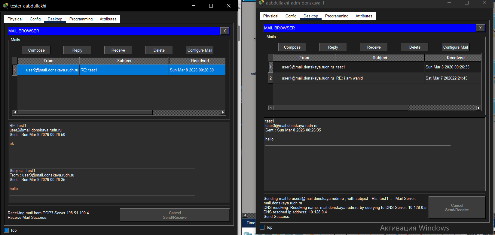

# Вывод

В ходе выполнения лабораторной работы были освоены практические навыки настройки NAT на пограничном маршрутизаторе.  
Реализованы:

- динамическая трансляция адресов для выхода в интернет;
- статический NAT для публикации внутренних серверов;
- разграничение доступа на основе ACL;
- проверка работоспособности WEB, FTP и почтовых сервисов.

Все цели работы достигнуты, конфигурация сохранена и протестирована.

# Контрольные вопросы

**1. В чём состоит основной принцип работы NAT (что даёт наличие NAT в сети организации)?**  
NAT (Network Address Translation) заменяет частные IP-адреса внутренней сети на публичный адрес при выходе в интернет. Это позволяет экономить публичные IP-адреса, скрывать внутреннюю структуру сети и обеспечивать доступ в интернет через один или несколько публичных адресов.

**2. В чём состоит принцип настройки NAT (на каком оборудовании и что нужно настроить для выхода из локальной сети во внешнюю сеть через NAT)?**  
NAT настраивается на пограничном маршрутизаторе. Необходимо:  
– определить inside/outside интерфейсы;  
– создать пул внешних адресов;  
– настроить ACL для указания транслируемых адресов;  
– применить правило NAT (часто с overload).

**3. Можно ли применить Cisco IOS NAT к субинтерфейсам?**  
Да, NAT можно применять к субинтерфейсам.

**4. Что такое пулы IP NAT?**  
Пул NAT — это диапазон публичных IP-адресов, которые динамически назначаются внутренним узлам для выхода в интернет.

**5. Что такое статические преобразования NAT?**  
Статический NAT — постоянное соответствие между внутренним и внешним IP-адресом (или портом). Используется для публикации серверов во внешней сети.

