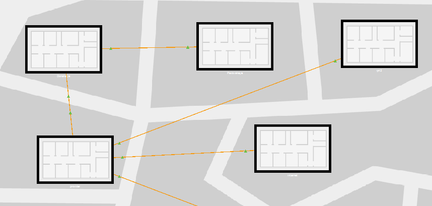
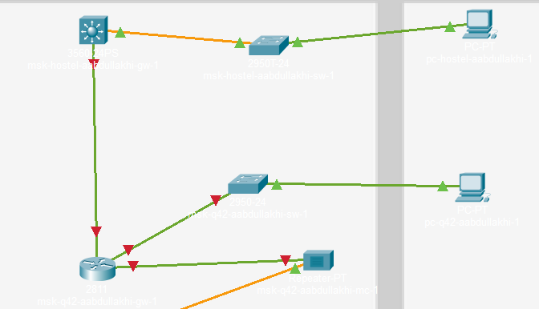
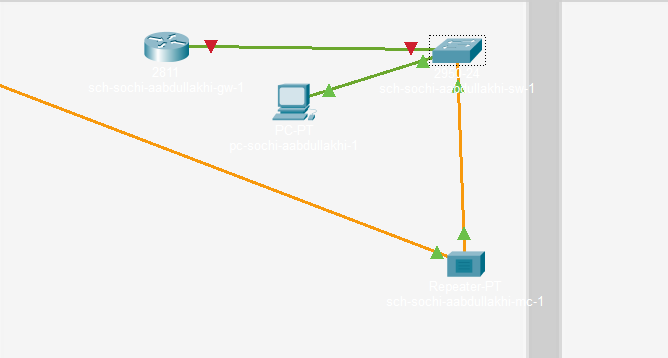
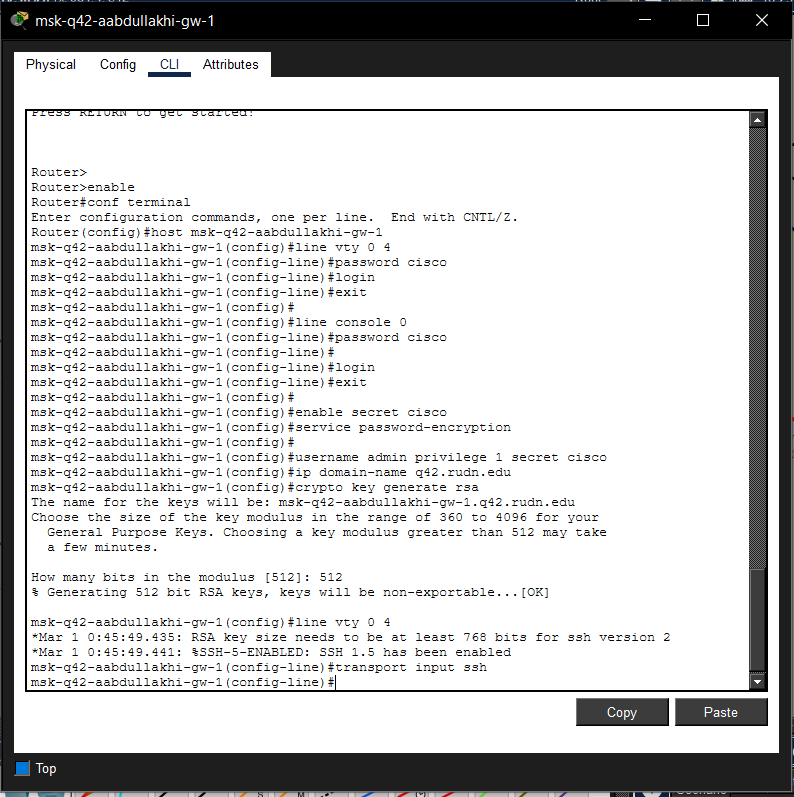
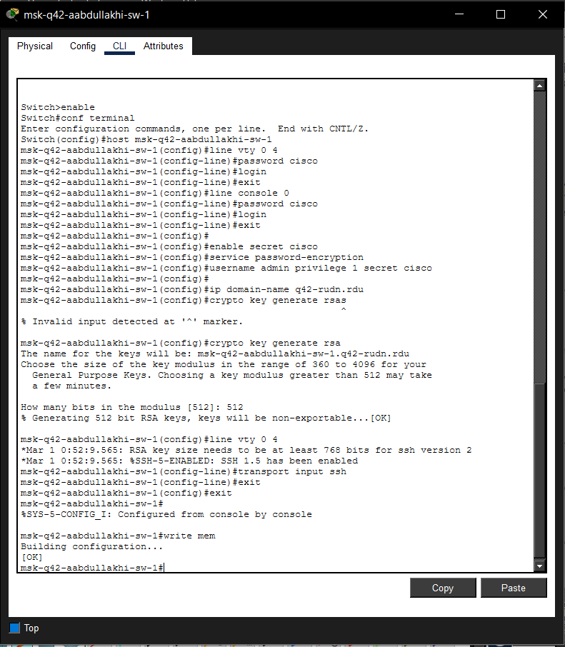
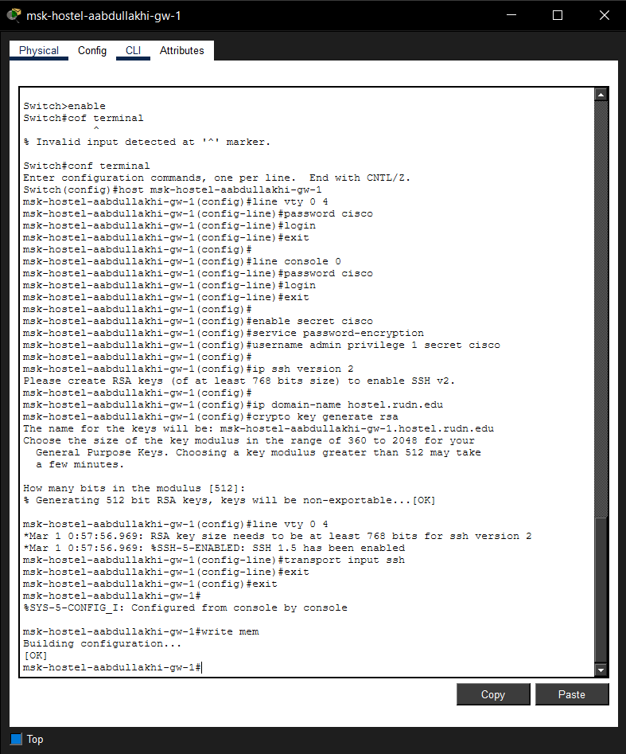
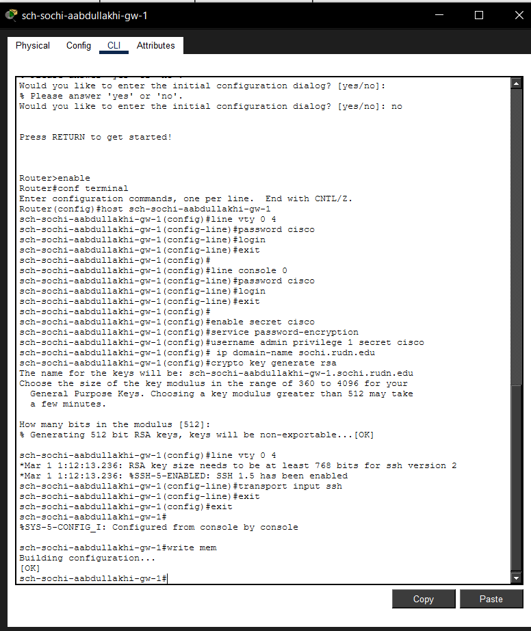

---
## Front matter
lang: ru-RU
title: Администрирование локальных сетей
subtitle: Лабораторная работа №13
author:
  - Абдуллахи Абдул Вахид
institute:
  - Российский университет дружбы народов, Москва, Россия
date: 08 Мая 2026

## i18n babel
babel-lang: russian
babel-otherlangs: english

## Formatting pdf
toc: false
toc-title: Содержание
slide_level: 2
aspectratio: 169
section-titles: true
theme: metropolis
header-includes:
 - \metroset{progressbar=frametitle,sectionpage=progressbar,numbering=fraction}
---

# Цель 

## Цель лабораторной работы 

Выполнение организационно-подготовительных мероприятий по обеспечению взаимодействия через сеть провайдера посредством статической маршрутизации локальной сети с сетью основного здания, расположенного в 42-м квартале в Москве, и сетью филиала, расположенного в г. Сочи.

# Выполнение лабораторной работы

## Расстановка оборудования

{ width=75% }

## Физическая схема связи между площадками

{ width=75% }

## Физическая схема размещения площадок в Москве

{ width=75% }

## Подсеть основной территории организации 42-го квартала в Москве

{ width=75% }

## Подсеть филиала в г. Сочи

{ width=75% }

## Первоначальная настройка маршрутизатора msk-q42-aabdullakhi-gw-1

{ width=75% }

## Первоначальная настройка коммутатора msk-q42-aabdullakhi-sw-1

{ width=75% }

## Первоначальная настройка маршрутизатора msk-hostel-aabdullakhi-gw-1

{ width=75% }

## Первоначальная настройка коммутатора msk-hostel-aabdullakhi-sw-1

{ width=75% }

## Первоначальная настройка коммутатора sch-sochi-aabdullakhi-sw-1

{ width=75% }

## Первоначальная настройка маршрутизатора sch-sochi-aabdullakhi-gw-1

{ width=75% }

# Вывод

## Вывод работы

В ходе лабораторной работы схема проекта в Cisco Packet Tracer была дополнена: в корпоративную сеть добавлены подсеть основной территории организации 42-го квартала в Москве и подсеть филиала в г. Сочи. Для новых площадок размещены маршрутизаторы, коммутаторы и оконечные устройства, выполнено подключение к провайдерскому сегменту.

Для добавленного оборудования выполнена первоначальная настройка: имена устройств, пароли, шифрование, локальные пользователи, доменные имена, RSA-ключи, SSH. Конфигурации сохранены.

