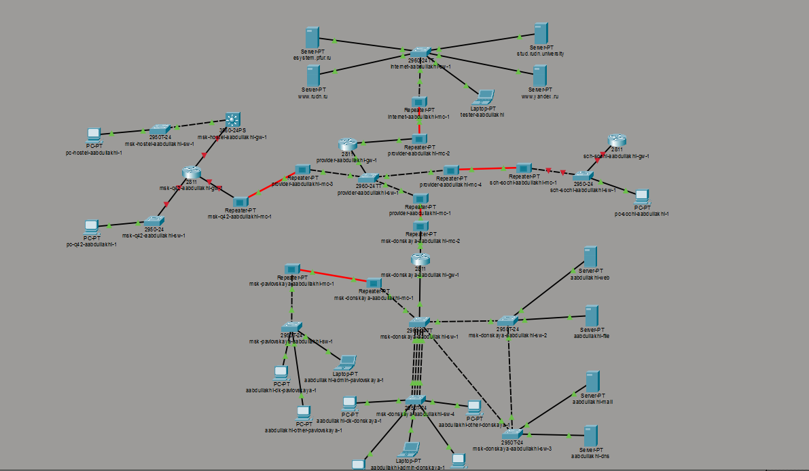
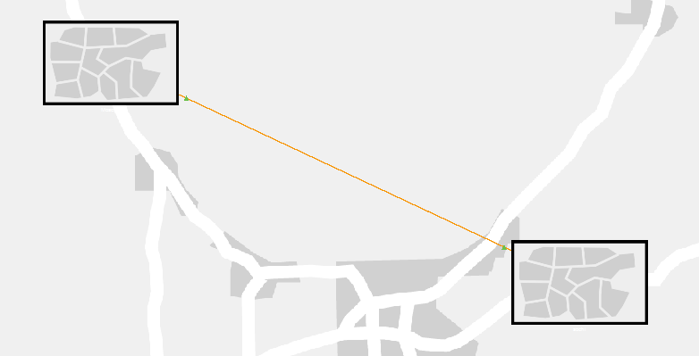
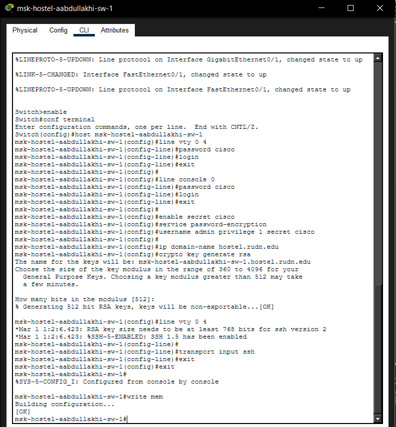
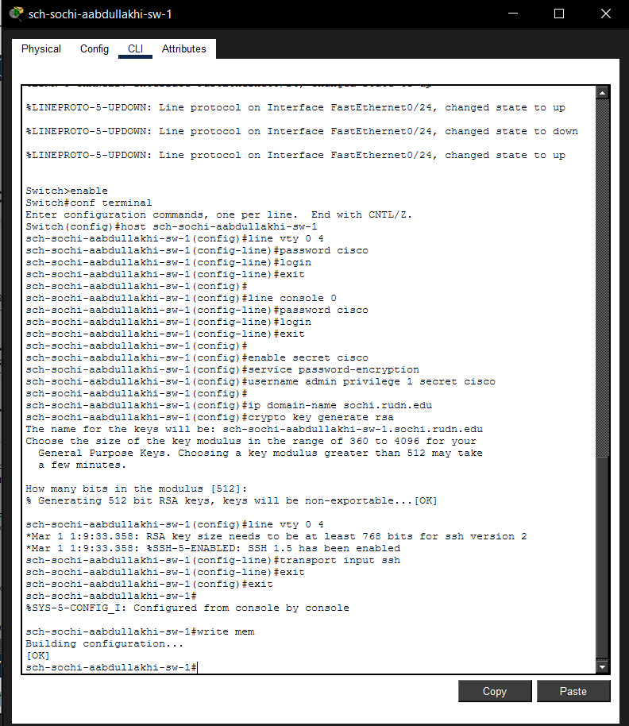

---
## Front matter
title: "Отчёт по лабораторной работе 13"
subtitle: "Статическая маршрутизация в Интернете. Планирование"
author: "Абдуллахи Абдул Вахид"

## Generic otions
lang: ru-RU
toc-title: "Содержание"

## Bibliography
bibliography: bib/cite.bib
csl: pandoc/csl/gost-r-7-0-5-2008-numeric.csl

## Pdf output format
toc: true # Table of contents
toc-depth: 2
lof: true # List of figures
lot: true # List of tables
fontsize: 12pt
linestretch: 1.5
papersize: a
documentclass: scrreprt
## I18n polyglossia
polyglossia-lang:
  name: russian
  options:
	- spelling=modern
	- babelshorthands=true
polyglossia-otherlangs:
  name: english
## I18n babel
babel-lang: russian
babel-otherlangs: english
## Fonts
mainfont: IBM Plex Serif
romanfont: IBM Plex Serif
sansfont: IBM Plex Sans
monofont: IBM Plex Mono
mathfont: STIX Two Math
mainfontoptions: Ligatures=Common,Ligatures=TeX,Scale=0.94
romanfontoptions: Ligatures=Common,Ligatures=TeX,Scale=0.94
sansfontoptions: Ligatures=Common,Ligatures=TeX,Scale=MatchLowercase,Scale=0.94
monofontoptions: Scale=MatchLowercase,Scale=0.94,FakeStretch=0.9
mathfontoptions:
## Biblatex
biblatex: true
biblio-style: "gost-numeric"
biblatexoptions:
  - parentracker=true
  - backend=biber
  - hyperref=auto
  - language=auto
  - autolang=other*
  - citestyle=gost-numeric
## Pandoc-crossref LaTeX customization
figureTitle: "Рис."
tableTitle: "Таблица"
listingTitle: "Листинг"
lofTitle: "Список иллюстраций"
lotTitle: "Список таблиц"
lolTitle: "Листинги"
## Misc options
indent: true
header-includes:
  - \usepackage{indentfirst}
  - \usepackage{float} # keep figures where there are in the text
  - \floatplacement{figure}{H} # keep figures where there are in the text
---

#  Цель работы

Выполнение организационно-подготовительных мероприятий по обеспечению взаимодействия через сеть провайдера посредством статической маршрутизации локальной сети с сетью основного здания, расположенного в 42-м квартале в Москве, и сетью филиала, расположенного в г. Сочи.

#  Выполнение лабораторной работы

## Расстановка оборудования

1. 1. В соответствии с заданием раздела 13.4.1 схема проекта в логической рабочей области Cisco Packet Tracer была дополнена двумя новыми сегментами сети:
   - подсетью основной территории организации 42-го квартала в Москве;
   - подсетью филиала в г. Сочи.

   После добавления новых узлов была сформирована обновлённая логическая топология проекта, в которой новые площадки включены в существующую корпоративную сеть и связаны с провайдерской инфраструктурой.

2. На физической рабочей области была отображена территориальная связь между площадками. На схеме показано размещение объектов и канал связи между московской площадкой и филиалом в г. Сочи.

3. Далее была детализирована физическая схема размещения площадок в Москве. На ней отображены существующие и добавленные сегменты сети, а также их соединения с провайдерской инфраструктурой.

4. Для основной территории организации 42-го квартала в Москве была создана отдельная подсеть. В её состав включены:
   - маршрутизатор **msk-q42-aabdullakhi-gw-1**;
   - коммутатор доступа **msk-q42-aabdullakhi-sw-1**;
   - рабочая станция **msk-q42-aabdullakhi-po-1**;
   - устройство подключения к магистральному сегменту сети.
   

5. Аналогично была добавлена подсеть филиала в г. Сочи:
   - маршрутизатор **sch-sochi-aabdullakhi-gw-1**;
   - коммутатор **sch-sochi-aabdullakhi-sw-1**;
   - рабочая станция **sch-sochi-aabdullakhi-po-1**;
   - устройство подключения к внешнему каналу связи.
   

## Базовая настройка

1. 1. Для добавленного оборудования выполнена первоначальная настройка через CLI в Cisco Packet Tracer. На каждом устройстве заданы:
   - имя устройства;
   - пароль на линии VTY;
   - пароль на консольный доступ;
   - пароль привилегированного режима;
   - шифрование паролей;
   - локальный пользователь admin;
   - доменное имя;
   - RSA-ключи;
   - разрешение удалённого доступа по SSH;
   - сохранение конфигурации.
   

##  Схемы сети уровней L1, L2 и L3

1. **Схема L1** — физическая структура сети с указанием устройств, соединений и интерфейсов. Отражены новые сегменты:
   - подсеть 42-го квартала (msk-q42-aabdullakhi-gw-1, msk-q42-aabdullakhi-sw-1);
   - подсеть филиала в Сочи (sch-sochi-aabdullakhi-gw-1, sch-sochi-aabdullakhi-sw-1).
   
2. **Схема L2** — логическая структура на канальном уровне с VLAN:
   - для 42-го квартала: VLAN 201, 202;
   - для Сочи: VLAN 401, 402;
   - для остальных участков: 101–104 (Донская), 301 (общежитие).
   
3. **Схема L3** — адресная структура:
   - 42-й квартал: сеть пользователей 10.129.0.0/24, сеть управления 10.129.1.0/24, линк 10.128.255.0/30;
   - Сочи: пользователи 10.130.0.0/24, управление 10.130.1.0/24, линк 10.128.255.4/30.
   
# Вывод

В ходе лабораторной работы схема проекта в Cisco Packet Tracer была дополнена: в корпоративную сеть добавлены подсеть основной территории организации 42-го квартала в Москве и подсеть филиала в г. Сочи. Для новых площадок размещены маршрутизаторы, коммутаторы и оконечные устройства, выполнено подключение к провайдерскому сегменту.

Для добавленного оборудования выполнена первоначальная настройка: имена устройств, пароли, шифрование, локальные пользователи, доменные имена, RSA-ключи, SSH. Конфигурации сохранены.

# Контрольные вопросы

1. В каких случаях следует использовать статическую маршрутизацию? Приведите примеры.

Статическую маршрутизацию используют при небольшой, стабильной и редко меняющейся структуре сети. Примеры:
- небольшие локальные сети;
- подключение удалённого филиала по одному каналу;
- маршрут по умолчанию к провайдеру (`ip route 0.0.0.0 0.0.0.0 198.51.100.1`);
- маршрут к сети филиала (`ip route 10.130.0.0 255.255.255.0 10.128.255.6`);
- сеть 42-го квартала к центральной сети (`ip route 10.128.0.0 255.255.0.0 10.128.255.1`).

    2. Укажите основные принципы статической маршрутизации между VLANs.

- Для каждой VLAN — отдельная IP-подсеть.
- У каждой VLAN — свой шлюз по умолчанию (интерфейс маршрутизатора, подинтерфейс или SVI).
- Порты коммутатора назначаются в соответствующие VLAN.
- Канал между коммутатором и маршрутизатором передаёт трафик нужных VLAN.
- На маршрутизаторе настраиваются интерфейсы для каждой VLAN.
- Для трафика в удалённые сети прописываются статические маршруты.
- На конечных устройствах указан правильный шлюз по умолчанию.

Пример: VLAN 201 (10.129.0.0/24) и VLAN 202 (10.129.1.0/24). Маршрутизатор имеет интерфейсы в обеих сетях. Для связи с центральной сетью добавляется маршрут:  
`ip route 10.128.0.0 255.255.0.0 10.128.255.1`

