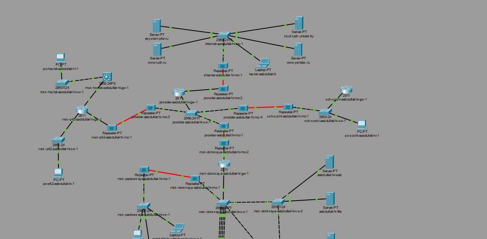
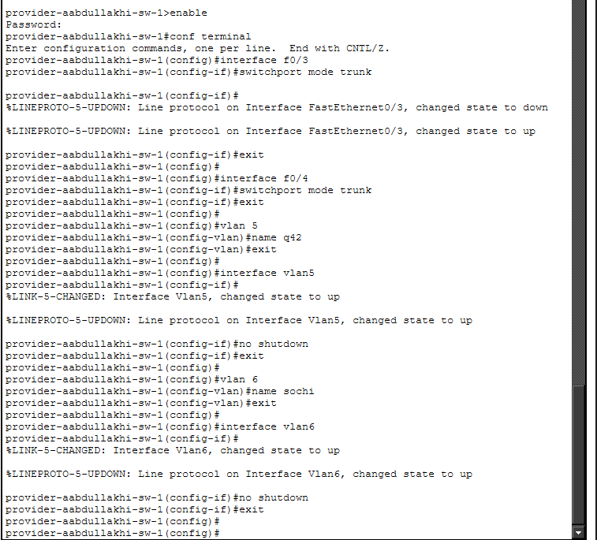
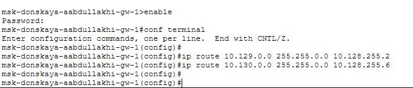
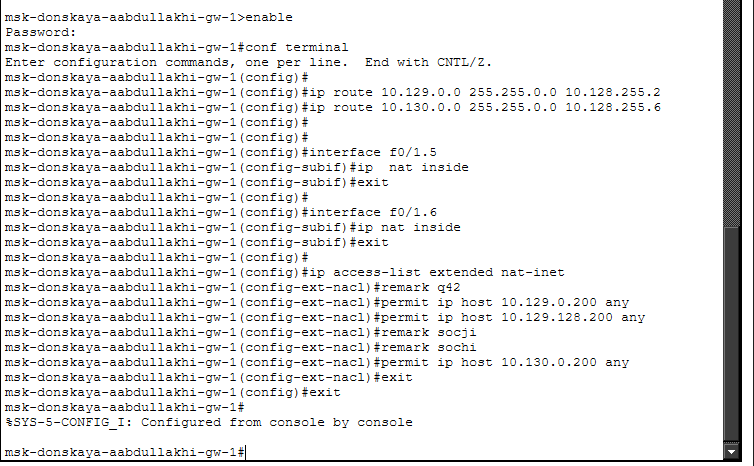
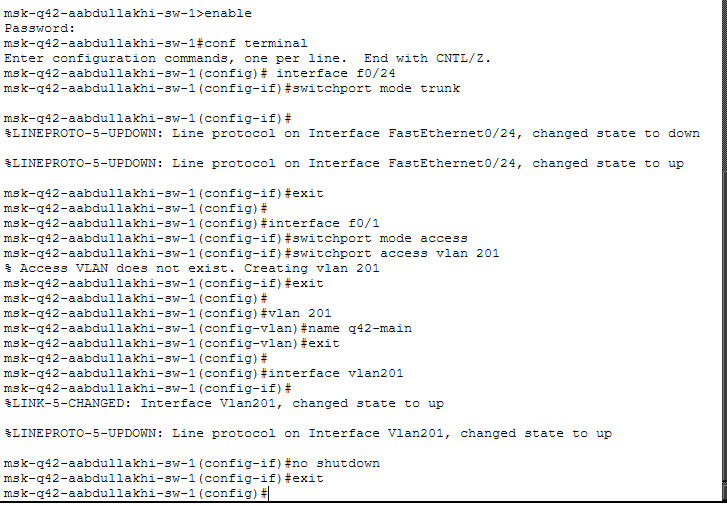
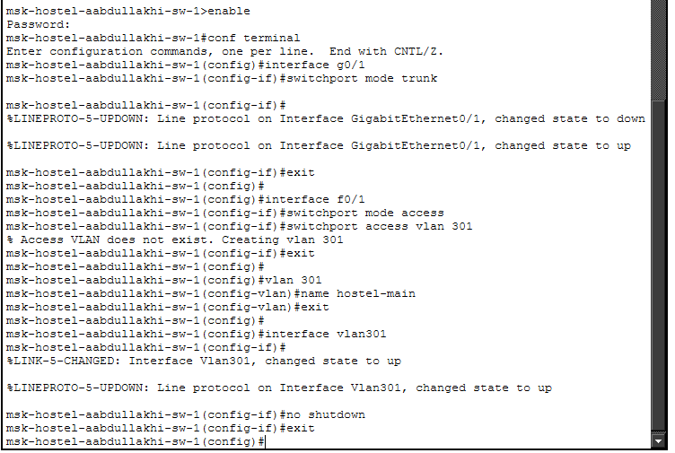
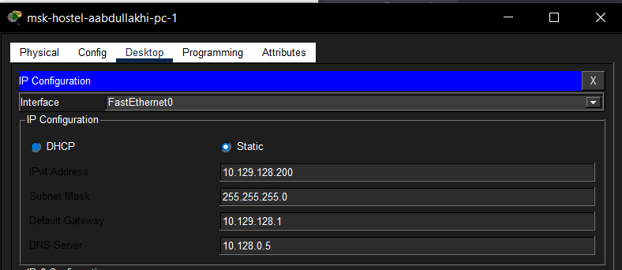
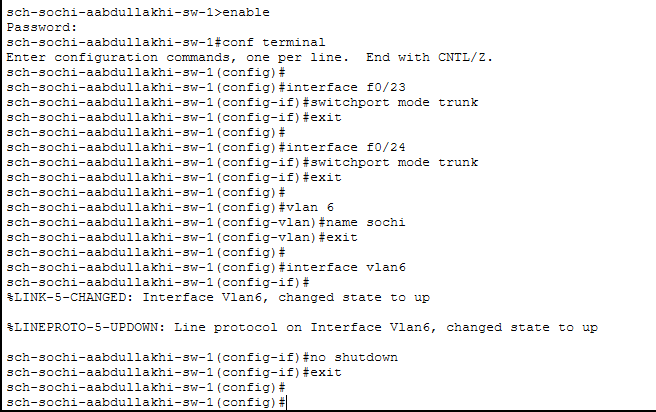

---
## Front matter
lang: ru-RU
title: Администрирование локальных сетей
subtitle: Лабораторная работа №14
author:
  - Абдуллахи Абдул Вахид
institute:
  - Российский университет дружбы народов, Москва, Россия
date: 16 Мая 2026

## i18n babel
babel-lang: russian
babel-otherlangs: english

## Formatting pdf
toc: false
toc-title: Содержание
slide_level: 2
aspectratio: 169
section-titles: true
theme: metropolis
header-includes:
 - \metroset{progressbar=frametitle,sectionpage=progressbar,numbering=fraction}
---

# Цель 

## Цель лабораторной работы 

Настроить взаимодействие через сеть провайдера посредством статической маршрутизации локальной сети организации с сетью основного здания, расположенного в 42-м квартале в Москве, и сетью филиала, расположенного в г. Сочи.

# Выполнение лабораторной работы

## Общая топология сети

{ width=75% }

## Настройка VLAN и trunk-портов на коммутаторе провайдера

{ width=75% }

## Настройка подинтерфейсов на маршрутизаторе центральной площадки

{ width=75% }

## Настройка статических маршрутов и ACL на маршрутизаторе центральной площадки

{ width=75% }

{ width=75% }

## Настройка маршрутизатора сети 42-го квартала

{ width=75% }

## Настройка коммутатора сети 42-го квартала

{ width=75% }

## Настройка IP-адреса на ПК сети 42-го квартала

{ width=75% }

## Настройка шлюза сети общежития

{ width=75% }

## Настройка коммутатора сети общежития

{ width=75% }

## Настройка IP-адреса на ПК сети общежития

{ width=75% }

## Настройка маршрутизатора филиала в Сочи

{ width=75% }

## Настройка коммутатора филиала в Сочи

{ width=75% }

## Настройка IP-адреса на ПК филиала в Сочи

{ width=75% }

## Проверка маршрутов командой tracert

{ width=75% }

# Вывод

## Вывод работы

В ходе лабораторной работы была настроена передача данных между несколькими удалёнными сетями организации через сеть провайдера. В топологии Cisco Packet Tracer были использованы маршрутизаторы, коммутаторы, пользовательские ПК и серверы, объединённые в разные сетевые сегменты.

Была выполнена настройка статической маршрутизации между центральной площадкой **msk-donskaya**, основным зданием в **42-м квартале г. Москвы**, сетью общежития и филиалом в **г. Сочи**. Для разделения трафика использовались VLAN и trunk-соединения. На маршрутизаторах были созданы подинтерфейсы с инкапсуляцией **dot1Q**, назначены IP-адреса и добавлены статические маршруты до удалённых подсетей.

Также была выполнена настройка пользовательских устройств: им были назначены статические IP-адреса, маски подсети, шлюзы по умолчанию и DNS-сервер. Работоспособность сети была проверена с помощью команды **tracert**, которая показала успешное прохождение маршрутов до узлов в сети 42-го квартала, сети общежития и филиала в Сочи.

Проверка таблиц маршрутизации командой **show ip route** подтвердила наличие необходимых статических маршрутов и маршрутов по умолчанию. Это показывает, что маршрутизаторы корректно определяют направление передачи трафика между удалёнными сетями организации.

