---
## Front matter
title: "Отчёт по лабораторной работе 14"
subtitle: "Статическая маршрутизация в Интернете. Настройка"
author: "Абдуллахи Абдул Вахид"

## Generic otions
lang: ru-RU
toc-title: "Содержание"

## Bibliography
bibliography: bib/cite.bib
csl: pandoc/csl/gost-r-7-0-5-2008-numeric.csl

## Pdf output format
toc: true # Table of contents
toc-depth: 2
lof: true # List of figures
lot: true # List of tables
fontsize: 12pt
linestretch: 1.5
papersize: a
documentclass: scrreprt
## I18n polyglossia
polyglossia-lang:
  name: russian
  options:
	- spelling=modern
	- babelshorthands=true
polyglossia-otherlangs:
  name: english
## I18n babel
babel-lang: russian
babel-otherlangs: english
## Fonts
mainfont: IBM Plex Serif
romanfont: IBM Plex Serif
sansfont: IBM Plex Sans
monofont: IBM Plex Mono
mathfont: STIX Two Math
mainfontoptions: Ligatures=Common,Ligatures=TeX,Scale=0.94
romanfontoptions: Ligatures=Common,Ligatures=TeX,Scale=0.94
sansfontoptions: Ligatures=Common,Ligatures=TeX,Scale=MatchLowercase,Scale=0.94
monofontoptions: Scale=MatchLowercase,Scale=0.94,FakeStretch=0.9
mathfontoptions:
## Biblatex
biblatex: true
biblio-style: "gost-numeric"
biblatexoptions:
  - parentracker=true
  - backend=biber
  - hyperref=auto
  - language=auto
  - autolang=other*
  - citestyle=gost-numeric
## Pandoc-crossref LaTeX customization
figureTitle: "Рис."
tableTitle: "Таблица"
listingTitle: "Листинг"
lofTitle: "Список иллюстраций"
lotTitle: "Список таблиц"
lolTitle: "Листинги"
## Misc options
indent: true
header-includes:
  - \usepackage{indentfirst}
  - \usepackage{float} # keep figures where there are in the text
  - \floatplacement{figure}{H} # keep figures where there are in the text
---

# Цель работы

Настроить взаимодействие через сеть провайдера посредством статической маршрутизации локальной сети организации с сетью основного здания, расположенного в 42-м квартале в Москве, и сетью филиала, расположенного в г. Сочи.

# Выполнение лабораторной работы

1. В логической рабочей области **Cisco Packet Tracer** была подготовлена общая топология сети организации. В схему были включены маршрутизаторы, коммутаторы, серверы, ПК, ноутбуки и промежуточные устройства сети провайдера.

   В рамках данной части лабораторной работы настраивалось взаимодействие локальной сети организации через сеть провайдера со следующими удалёнными сетями:

   – сеть основного здания в **42-м квартале г. Москвы**;  
   – сеть филиала в **г. Сочи**;  
   – центральная сеть организации на площадке **msk-donskaya**.

   Для связи между сетями использовалась статическая маршрутизация. Передача трафика через сеть провайдера была организована с использованием VLAN и trunk-соединений.

2. На коммутаторе провайдера **provider-aabdullakhi-sw-1** были настроены trunk-порты для передачи трафика нескольких VLAN между сетевыми устройствами.

   В режим trunk были переведены интерфейсы:

   – **FastEthernet0/3**;  
   – **FastEthernet0/4**.

   После этого на коммутаторе были созданы VLAN для организации связи с удалёнными площадками:

   – **VLAN 5** — `q42`;  
   – **VLAN 6** — `sochi`.

   Для созданных VLAN были включены виртуальные интерфейсы управления. После завершения настройки конфигурация была сохранена в память устройства командой **write memory**.

3. На маршрутизаторе центральной площадки **msk-donskaya-aabdullakhi-gw-1** были созданы подинтерфейсы для подключения к сетям через провайдера.

   На интерфейсе **FastEthernet0/1** были настроены подинтерфейсы:

   – **FastEthernet0/1.5** для VLAN 5;  
   – **FastEthernet0/1.6** для VLAN 6.

   Для подинтерфейса **FastEthernet0/1.5** была задана инкапсуляция **dot1Q 5** и назначен IP-адрес:

   – IP-адрес: **10.128.255.1**;  
   – Маска подсети: **255.255.255.252**;  
   – Описание: **q42**.

   Для подинтерфейса **FastEthernet0/1.6** была задана инкапсуляция **dot1Q 6** и назначен IP-адрес:

   – IP-адрес: **10.128.255.5**;  
   – Маска подсети: **255.255.255.252**;  
   – Описание: **sochi**.

   Таким образом, на маршрутизаторе центральной площадки были созданы два отдельных логических канала для связи с сетью 42-го квартала и сетью филиала в Сочи.

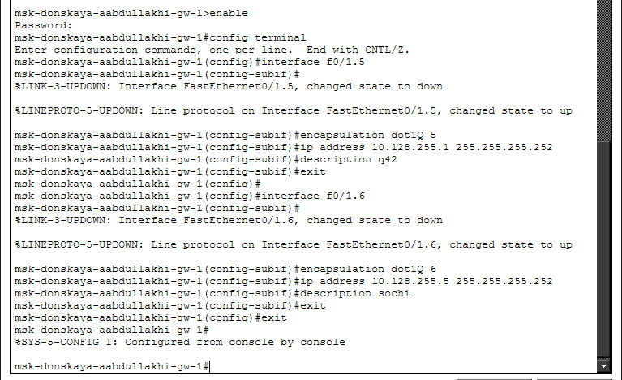

4. На маршрутизаторе **msk-donskaya-aabdullakhi-gw-1** были добавлены статические маршруты до удалённых сетей.

   Для сети 42-го квартала был настроен маршрут:

   – сеть назначения: **10.129.0.0**;  
   – маска: **255.255.0.0**;  
   – следующий узел: **10.128.255.2**.

   Для сети филиала в Сочи был настроен маршрут:

   – сеть назначения: **10.130.0.0**;  
   – маска: **255.255.0.0**;  
   – следующий узел: **10.128.255.6**.

   Также на подинтерфейсах **FastEthernet0/1.5** и **FastEthernet0/1.6** был задан параметр **ip nat inside**.

   Дополнительно был создан расширенный список доступа **nat-inet**, в который были добавлены разрешения для отдельных узлов удалённых сетей:

   – узел сети 42-го квартала: **10.129.0.200**;  
   – узел сети Сочи: **10.130.0.200**.

   После выполнения настройки конфигурация маршрутизатора была сохранена в память.

5. На маршрутизаторе основного здания в 42-м квартале **msk-q42-aabdullakhi-gw-1** были настроены подинтерфейсы для локальных VLAN.

   Для основной пользовательской сети был создан подинтерфейс **FastEthernet0/0.201** со следующими параметрами:

   – VLAN: **201**;  
   – IP-адрес: **10.129.0.1**;  
   – Маска подсети: **255.255.255.0**;  
   – Описание: **q42-main**.

   Также был включён физический интерфейс **FastEthernet1/0**, после чего на нём был создан подинтерфейс **FastEthernet1/0.202** для сети управления:

   – VLAN: **202**;  
   – IP-адрес: **10.129.1.1**;  
   – Маска подсети: **255.255.255.0**;  
   – Описание: **q42-management**.

   Для передачи трафика из сети 42-го квартала в сторону центральной площадки был добавлен маршрут по умолчанию:

   – сеть назначения: **0.0.0.0**;  
   – маска: **0.0.0.0**;  
   – следующий узел: **10.128.255.1**.

   Дополнительно был настроен маршрут до сети:

   – сеть назначения: **10.129.128.0**;  
   – маска: **255.255.128.0**;  
   – следующий узел: **10.129.1.2**.

   После настройки конфигурация была сохранена.

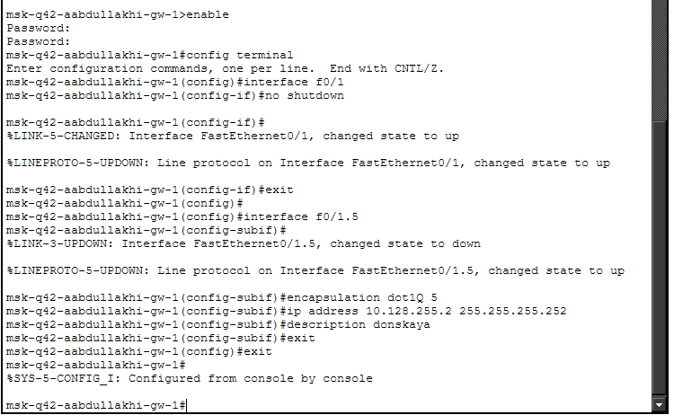

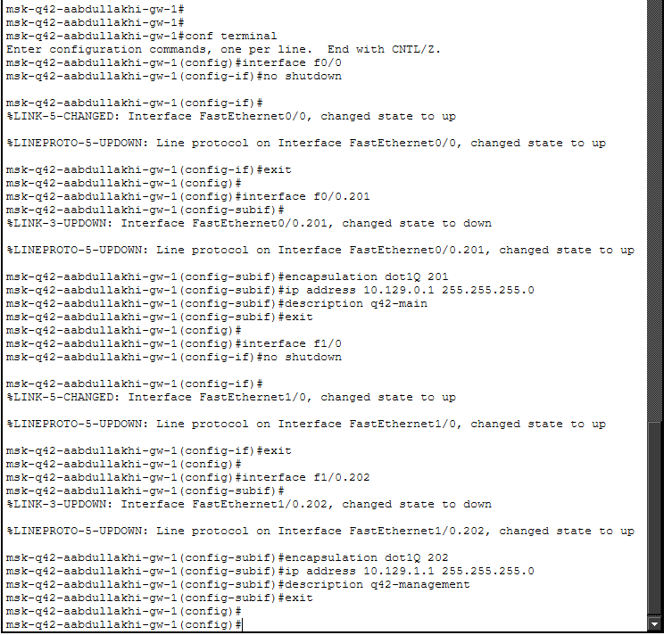

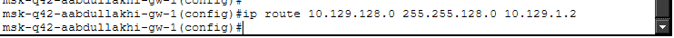

6. На коммутаторе **msk-q42-aabdullakhi-sw-1** была выполнена настройка подключения к маршрутизатору и пользовательскому ПК.

   Интерфейс **FastEthernet0/24** был переведён в режим trunk для передачи VLAN-трафика между коммутатором и маршрутизатором.

   Интерфейс **FastEthernet0/1**, к которому подключён пользовательский ПК, был переведён в режим access и назначен в VLAN 201:

   – режим порта: **access**;  
   – VLAN: **201**.

   На коммутаторе была создана VLAN:

   – **VLAN 201** — `q42-main`.

   Также был включён виртуальный интерфейс **Vlan201**. После завершения настройки конфигурация была сохранена в память устройства.

7. На оконечном устройстве **msk-q42-aabdullakhi-pc-1** была выполнена статическая настройка сетевых параметров.

   Для ПК были заданы следующие параметры:

   – IP-адрес: **10.129.0.200**;  
   – Маска подсети: **255.255.255.0**;  
   – Шлюз по умолчанию: **10.129.0.1**;  
   – DNS-сервер: **10.128.0.5**.

   Указанный шлюз соответствует адресу подинтерфейса маршрутизатора **msk-q42-aabdullakhi-gw-1** в пользовательской сети VLAN 201. Это позволяет ПК передавать трафик в другие сети через маршрутизатор.

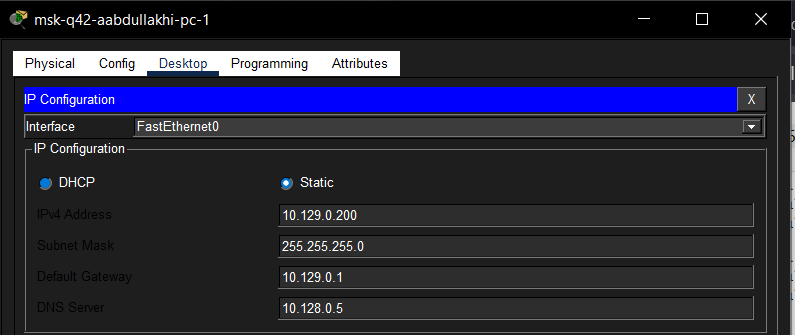
   
8. На устройстве **msk-hostel-aabdullakhi-gw-1** была выполнена настройка связи между сетью управления 42-го квартала и локальной сетью общежития.

   Интерфейсы **GigabitEthernet0/1** и **FastEthernet0/1** были переведены в режим trunk. Для них была задана инкапсуляция **dot1Q**, что позволяет передавать трафик нескольких VLAN через один физический канал.

   Далее была создана VLAN для сети управления 42-го квартала:

   – **VLAN 202** — **q42-management**.

   Для VLAN 202 был включён виртуальный интерфейс **Vlan202** и назначены следующие параметры:

   – IP-адрес: **10.129.1.2**;  
   – Маска подсети: **255.255.255.0**.

   Затем была создана VLAN для основной сети общежития:

   – **VLAN 301** — **hostel-main**.

   Для VLAN 301 был включён виртуальный интерфейс **Vlan301** и назначены следующие параметры:

   – IP-адрес: **10.129.128.1**;  
   – Маска подсети: **255.255.255.0**.

   Также на устройстве была включена маршрутизация командой **ip routing**. Для передачи трафика из сети общежития в сторону маршрутизатора 42-го квартала был настроен маршрут по умолчанию:

   – сеть назначения: **0.0.0.0**;  
   – маска: **0.0.0.0**;  
   – следующий узел: **10.129.1.1**.

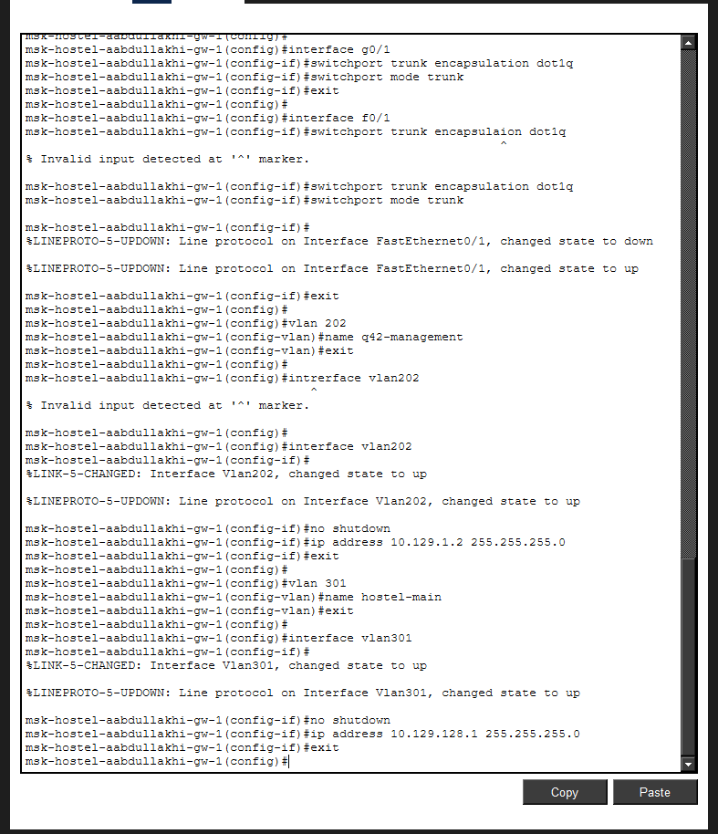

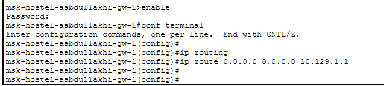

9. На коммутаторе **msk-hostel-aabdullakhi-sw-1** была выполнена настройка подключения к шлюзу сети общежития и пользовательскому ПК.

   Интерфейс **GigabitEthernet0/1** был переведён в режим trunk для передачи VLAN-трафика между коммутатором и шлюзом.

   Интерфейс **FastEthernet0/1**, к которому подключён пользовательский компьютер, был переведён в режим access и назначен в VLAN 301:

   – режим порта: **access**;  
   – VLAN: **301**.

   На коммутаторе была создана VLAN:

   – **VLAN 301** — **hostel-main**.

   Также был включён виртуальный интерфейс **Vlan301**. После завершения настройки конфигурация была сохранена в память устройства командой **write memory**.

10. На оконечном устройстве **msk-hostel-aabdullakhi-pc-1** была выполнена статическая настройка сетевых параметров.

    Для ПК были заданы следующие параметры:

    – IP-адрес: **10.129.128.200**;  
    – Маска подсети: **255.255.255.0**;  
    – Шлюз по умолчанию: **10.129.128.1**;  
    – DNS-сервер: **10.128.0.5**.

    Адрес шлюза **10.129.128.1** соответствует виртуальному интерфейсу **Vlan301** на устройстве **msk-hostel-aabdullakhi-gw-1**. Благодаря этому компьютер сети общежития может передавать трафик в другие сети через настроенный шлюз.

11. На маршрутизаторе филиала в Сочи **sch-sochi-aabdullakhi-gw-1** была выполнена настройка подключения к сети провайдера и локальным сетям филиала.

    Сначала был включён физический интерфейс **FastEthernet0/0**. Затем на нём были созданы подинтерфейсы для разных VLAN.

    Для связи с центральной площадкой через сеть провайдера был настроен подинтерфейс **FastEthernet0/0.6**:

    – VLAN: **6**;  
    – IP-адрес: **10.128.255.6**;  
    – Маска подсети: **255.255.255.252**;  
    – Описание: **donskaya**.

    Для основной пользовательской сети филиала был настроен подинтерфейс **FastEthernet0/0.401**:

    – VLAN: **401**;  
    – IP-адрес: **10.130.0.1**;  
    – Маска подсети: **255.255.255.0**;  
    – Описание: **sochi-main**.

    Для сети управления филиала был настроен подинтерфейс **FastEthernet0/0.402**:

    – VLAN: **402**;  
    – IP-адрес: **10.130.1.1**;  
    – Маска подсети: **255.255.255.0**;  
    – Описание: **sochi-management**.

    Для передачи трафика из сети Сочи в сторону центральной площадки был добавлен маршрут по умолчанию:

    – сеть назначения: **0.0.0.0**;  
    – маска: **0.0.0.0**;  
    – следующий узел: **10.128.255.5**.

    После выполнения настройки маршрутизатор получил возможность передавать трафик из локальной сети филиала в сеть организации через провайдера.

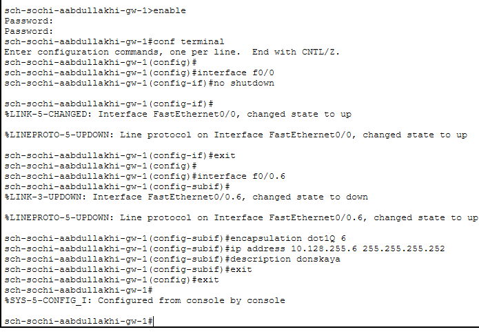

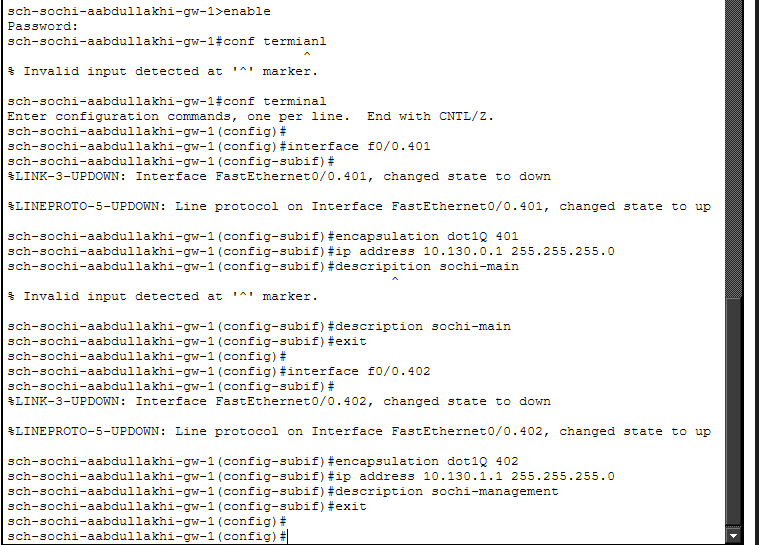

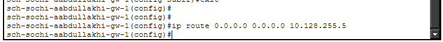

12. На коммутаторе **sch-sochi-aabdullakhi-sw-1** была выполнена настройка trunk-соединений и пользовательской VLAN.

    Интерфейсы **FastEthernet0/23** и **FastEthernet0/24** были переведены в режим trunk. Эти порты используются для передачи VLAN-трафика между коммутатором, маршрутизатором и другими сетевыми устройствами.

    На коммутаторе была создана VLAN для связи с центральной площадкой:

    – **VLAN 6** — **sochi**.

    Для VLAN 6 был включён виртуальный интерфейс **Vlan6**.

    Затем был настроен пользовательский порт **FastEthernet0/1**. Он был переведён в режим access и назначен в VLAN 401:

    – режим порта: **access**;  
    – VLAN: **401**.

    Также была создана основная VLAN филиала:

    – **VLAN 401** — **sochi-main**.

    Для VLAN 401 был включён виртуальный интерфейс **Vlan401**. После завершения настройки конфигурация была сохранена в память устройства.

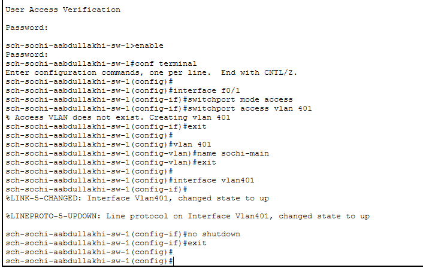

13. На оконечном устройстве **sch-sochi-aabdullakhi-pc-1** была выполнена статическая настройка сетевых параметров.

    Для ПК были заданы следующие параметры:

    – IP-адрес: **10.130.0.200**;  
    – Маска подсети: **255.255.255.0**;  
    – Шлюз по умолчанию: **10.130.0.1**;  
    – DNS-сервер: **10.128.0.5**.

    Шлюз **10.130.0.1** соответствует подинтерфейсу **FastEthernet0/0.401** маршрутизатора **sch-sochi-aabdullakhi-gw-1**. Это позволяет компьютеру филиала обращаться к удалённым сетям через маршрутизатор Сочи и сеть провайдера.

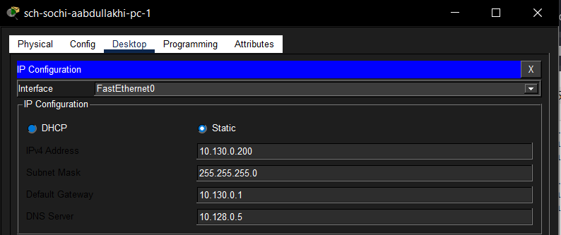
	
14. Была выполнена проверка прохождения маршрутов с административного компьютера **aabdullakhi-admin-donskaya-1** до удалённых узлов.

    С помощью команды **tracert** были проверены маршруты до следующих адресов:

    – **10.129.0.200** — ПК основной сети 42-го квартала;  
    – **10.129.128.200** — ПК сети общежития;  
    – **10.130.0.200** — ПК филиала в Сочи.

    При проверке маршрута до узла **10.129.0.200** трафик прошёл через следующие промежуточные устройства:

    – **10.128.6.1**;  
    – **10.128.255.2**;  
    – **10.129.0.200**.

    При проверке маршрута до узла **10.129.128.200** были отображены следующие переходы:

    – **10.128.6.1**;  
    – **10.128.255.2**;  
    – **10.129.1.2**;  
    – **10.129.128.200**.

    При проверке маршрута до узла **10.130.0.200** трафик прошёл через следующие устройства:

    – **10.128.6.1**;  
    – **10.128.255.6**;  
    – **10.130.0.200**.

    Во всех трёх случаях трассировка завершилась успешно, что подтверждает корректную работу статической маршрутизации между центральной сетью, сетью 42-го квартала, сетью общежития и филиалом в Сочи.

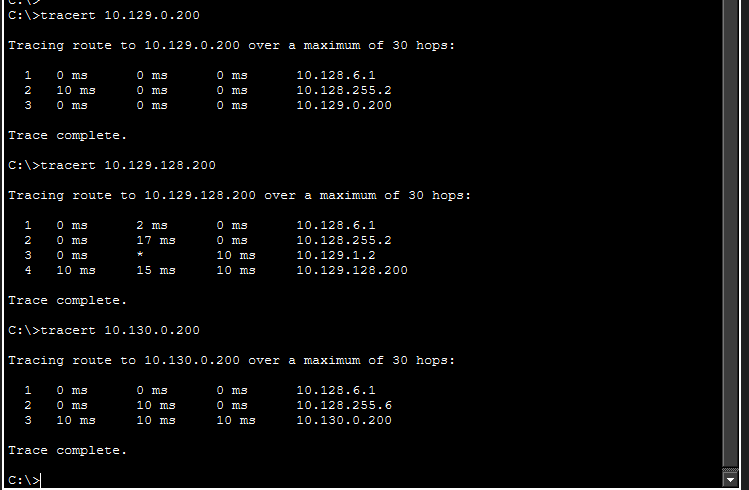

15. На маршрутизаторе центральной площадки **msk-donskaya-aabdullakhi-gw-1** была проверена таблица маршрутизации командой **show ip route**.

    В таблице маршрутизации отображаются напрямую подключённые сети центральной площадки, а также статические маршруты до удалённых сетей.

    Для сети 42-го квартала присутствует статический маршрут:

    – сеть назначения: **10.129.0.0/16**;  
    – следующий узел: **10.128.255.2**.

    Для сети филиала в Сочи присутствует статический маршрут:

    – сеть назначения: **10.130.0.0/16**;  
    – следующий узел: **10.128.255.6**.

    Также в таблице указан маршрут по умолчанию:

    – сеть назначения: **0.0.0.0/0**;  
    – следующий узел: **198.51.100.1**.

    Наличие данных маршрутов подтверждает, что маршрутизатор центральной площадки знает, через какие адреса необходимо отправлять трафик в сторону удалённых сетей организации.

16. На маршрутизаторе **msk-q42-aabdullakhi-gw-1** была проверена таблица маршрутизации.

    В таблице отображаются напрямую подключённые сети 42-го квартала:

    – **10.128.255.0/30** — сеть соединения с центральной площадкой;  
    – **10.129.0.0/24** — основная пользовательская сеть 42-го квартала;  
    – **10.129.1.0/24** — сеть управления.

    Также присутствует статический маршрут до сети общежития:

    – сеть назначения: **10.129.128.0/17**;  
    – следующий узел: **10.129.1.2**.

    Кроме того, в таблице указан маршрут по умолчанию:

    – сеть назначения: **0.0.0.0/0**;  
    – следующий узел: **10.128.255.1**.

    Таким образом, маршрутизатор 42-го квартала передаёт трафик в центральную сеть через адрес **10.128.255.1**, а трафик в сеть общежития направляет через шлюз **10.129.1.2**.

17. На устройстве **msk-hostel-aabdullakhi-gw-1** была проверена таблица маршрутизации.

    В таблице отображаются две напрямую подключённые сети:

    – **10.129.1.0** — сеть управления, подключённая через **Vlan202**;  
    – **10.129.128.0** — основная сеть общежития, подключённая через **Vlan301**.

    Также настроен маршрут по умолчанию:

    – сеть назначения: **0.0.0.0/0**;  
    – следующий узел: **10.129.1.1**.

    Этот маршрут используется для передачи трафика из сети общежития в сторону маршрутизатора 42-го квартала, а далее — в центральную сеть и другие удалённые сегменты организации.

18. На маршрутизаторе филиала в Сочи **sch-sochi-aabdullakhi-gw-1** была проверена таблица маршрутизации.

    В таблице отображаются напрямую подключённые сети филиала:

    – **10.128.255.4/30** — сеть соединения с центральной площадкой;  
    – **10.130.0.0/24** — основная пользовательская сеть филиала;  
    – **10.130.1.0/24** — сеть управления филиала.

    Также присутствует маршрут по умолчанию:

    – сеть назначения: **0.0.0.0/0**;  
    – следующий узел: **10.128.255.5**.

    Данный маршрут используется для отправки трафика из филиала в Сочи в сторону центральной площадки через сеть провайдера.

    Наличие маршрута по умолчанию и напрямую подключённых сетей подтверждает корректную настройку маршрутизатора филиала и его готовность к обмену данными с остальными сетями организации.
	
# Вывод

В ходе лабораторной работы была настроена передача данных между несколькими удалёнными сетями организации через сеть провайдера. В топологии Cisco Packet Tracer были использованы маршрутизаторы, коммутаторы, пользовательские ПК и серверы, объединённые в разные сетевые сегменты.

Была выполнена настройка статической маршрутизации между центральной площадкой **msk-donskaya**, основным зданием в **42-м квартале г. Москвы**, сетью общежития и филиалом в **г. Сочи**. Для разделения трафика использовались VLAN и trunk-соединения. На маршрутизаторах были созданы подинтерфейсы с инкапсуляцией **dot1Q**, назначены IP-адреса и добавлены статические маршруты до удалённых подсетей.

Также была выполнена настройка пользовательских устройств: им были назначены статические IP-адреса, маски подсети, шлюзы по умолчанию и DNS-сервер. Работоспособность сети была проверена с помощью команды **tracert**, которая показала успешное прохождение маршрутов до узлов в сети 42-го квартала, сети общежития и филиала в Сочи.

Проверка таблиц маршрутизации командой **show ip route** подтвердила наличие необходимых статических маршрутов и маршрутов по умолчанию. Это показывает, что маршрутизаторы корректно определяют направление передачи трафика между удалёнными сетями организации.

# Контрольные вопросы

**1. Приведите пример настройки статической маршрутизации между двумя подсетями организации.**  
Статическая маршрутизация настраивается вручную на маршрутизаторе с помощью команды **ip route**. В команде указывается сеть назначения, маска подсети и IP-адрес следующего маршрутизатора, через который должен передаваться трафик.

Пример настройки маршрута из центральной сети организации до сети 42-го квартала:

**ip route 10.129.0.0 255.255.0.0 10.128.255.2**

В данном случае:

– **10.129.0.0** — удалённая сеть назначения;  
– **255.255.0.0** — маска удалённой сети;  
– **10.128.255.2** — адрес следующего маршрутизатора, через который доступна эта сеть.

Также может использоваться маршрут по умолчанию:

**ip route 0.0.0.0 0.0.0.0 10.128.255.1**

Такой маршрут применяется, если для пакета не найден более точный маршрут в таблице маршрутизации.

**2. Опишите процесс обращения устройства из одного VLAN к устройству из другого VLAN.**  
Устройства, находящиеся в разных VLAN, относятся к разным логическим сетям. Напрямую обмениваться данными они не могут, поэтому для связи между ними требуется маршрутизатор или коммутатор третьего уровня.

Процесс обращения происходит следующим образом:

– устройство-отправитель определяет, что адрес получателя находится в другой подсети;  
– пакет передаётся на шлюз по умолчанию;  
– шлюзом обычно является интерфейс маршрутизатора или SVI-интерфейс коммутатора третьего уровня;  
– если используется trunk-соединение, кадр передаётся с VLAN-меткой **802.1Q**;  
– маршрутизатор принимает пакет на одном VLAN-интерфейсе и перенаправляет его в другой VLAN;  
– далее пакет доставляется получателю через соответствующий коммутатор и access-порт.

Например, если ПК находится в VLAN 301, а другой узел находится в VLAN 201, то трафик сначала отправляется на шлюз VLAN 301, затем маршрутизируется в сторону VLAN 201 и после этого доставляется конечному устройству.

**3. Как проверить работоспособность маршрута?**  
Работоспособность маршрута можно проверить несколькими способами.

Основные команды проверки:

– **ping** — проверяет доступность удалённого узла по IP-адресу;  
– **tracert** на ПК или **traceroute** на маршрутизаторе — показывает путь прохождения пакетов до удалённого узла;  
– **show ip route** — позволяет проверить, есть ли маршрут до нужной сети в таблице маршрутизации;  
– **show ip interface brief** — показывает состояние интерфейсов и назначенные IP-адреса.

Например, для проверки доступности ПК в сети 42-го квартала можно выполнить команду:

**ping 10.129.0.200**

Для проверки пути прохождения пакетов можно выполнить:

**tracert 10.129.0.200**

Если трассировка завершается успешно, а конечный узел отвечает, значит маршрут настроен корректно.

**4. Как посмотреть таблицу маршрутизации?**  
Таблицу маршрутизации на маршрутизаторе Cisco можно посмотреть с помощью команды:

**show ip route**

Эта команда выполняется в привилегированном режиме. В таблице маршрутизации отображаются:

– напрямую подключённые сети;  
– локальные адреса интерфейсов;  
– статические маршруты;  
– динамические маршруты, если используется протокол динамической маршрутизации;  
– маршрут по умолчанию.

Обозначения в таблице маршрутизации помогают определить тип маршрута:

– **C** — directly connected, напрямую подключённая сеть;  
– **L** — local, локальный адрес интерфейса;  
– **S** — static, статический маршрут;  
– **S*** — статический маршрут по умолчанию.

Например, запись вида:

**S 10.129.0.0/16 [1/0] via 10.128.255.2**

означает, что сеть **10.129.0.0/16** доступна через следующий узел **10.128.255.2**, а сам маршрут был добавлен статически.

