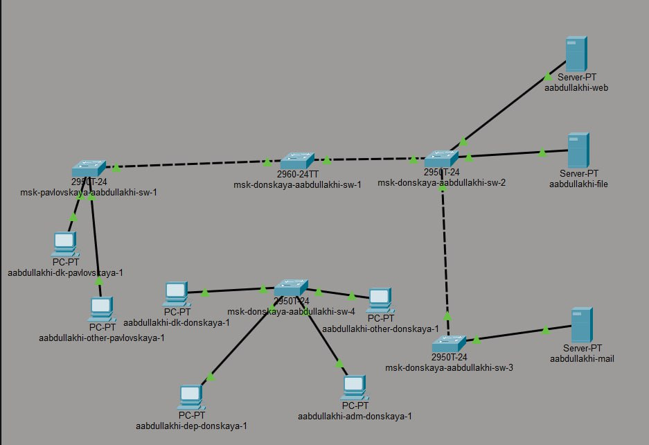
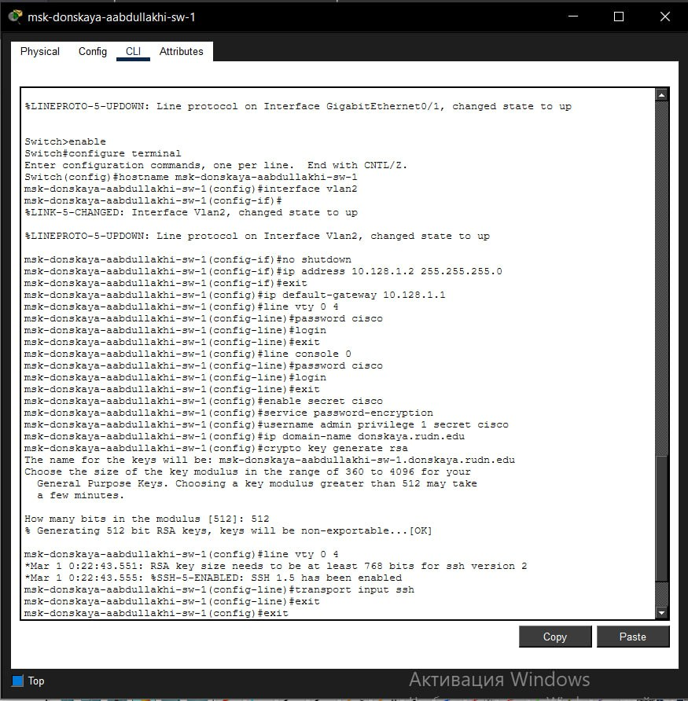
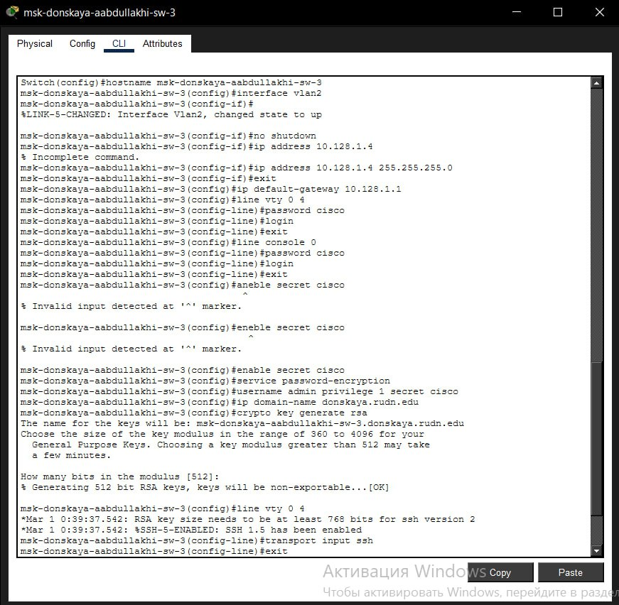
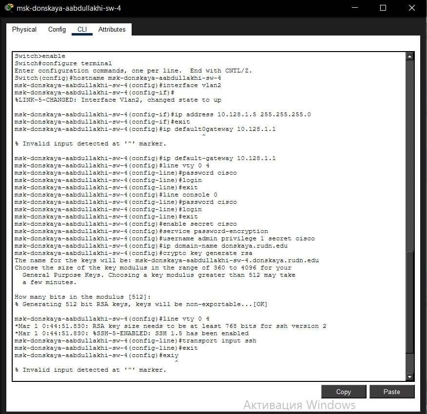

---
## Front matter
lang: ru-RU
title: Администрирование локальных сетей
subtitle: Лабораторная работа №4
author:
  - Абдуллахи Абдул Вахид
institute:
  - Российский университет дружбы народов, Москва, Россия
date: 27 февраля 2026

## i18n babel
babel-lang: russian
babel-otherlangs: english

## Formatting pdf
toc: false
toc-title: Содержание
slide_level: 2
aspectratio: 169
section-titles: true
theme: metropolis
header-includes:
 - \metroset{progressbar=frametitle,sectionpage=progressbar,numbering=fraction}
---

# Цель 

## Цель лабораторной работы 

Выполнить базовую настройку сетевого оборудования: присвоение имён, настройка IP-адресов на VLAN, организация защищённого удалённого доступа по протоколу SSH и подготовка коммутаторов к работе в корпоративной сети.

# Выполнение лабораторной работы

## Построение топологии сети

В среде Cisco Packet Tracer была смоделирована сеть в соответствии с топологией L1. В состав схемы вошли следующие коммутаторы:

- `msk-pavlovskaya-aabdullakhi-sw-1`
- `msk-donskaya-aabdullakhi-sw-1`
- `msk-donskaya-aabdullakhi-sw-2`
- `msk-donskaya-aabdullakhi-sw-3`
- `msk-donskaya-aabdullakhi-sw-4`

Кроме того, в сети присутствуют оконечные устройства: рабочие станции (dk, dep, adm, other), а также серверы web, file и mail. Соединения выполнены через интерфейсы FastEthernet в соответствии с заданием.

## топология сети

{ width=75% }

## Первоначальная настройка коммутаторов

На каждом устройстве были выполнены следующие действия:
- создан и активирован интерфейс VLAN 2;
- назначен IP-адрес из диапазона управления;
- прописан шлюз по умолчанию;
- настроены пароли на console и VTY;
- установлен пароль enable secret;
- включено шифрование всех паролей (service password-encryption);
- создан локальный пользователь `admin`;
- задано доменное имя `donskaya.rudn.edu`;
- сгенерированы RSA-ключи;
- разрешён доступ только по SSH на виртуальных терминалах;
- выполнено сохранение конфигурации.

## Настройка msk-donskaya-aabdullakhi-sw-1

{ width=75% }

## Настройка msk-donskaya-aabdullakhi-sw-2

{ width=75% }

## Настройка msk-donskaya-aabdullakhi-sw-3

{ width=75% }

## Настройка msk-donskaya-aabdullakhi-sw-4

{ width=75% }

## Настройка msk-pavlovskaya-aabdullakhi-sw-1

{ width=75% }

# Вывод

## Вывод

В ходе выполнения лабораторной работы:
- смоделирована топология сети в соответствии с заданием;
- выполнена начальная настройка пяти коммутаторов;
- каждому устройству присвоен уникальный управляющий IP-адрес;
- организована защита управляющего доступа с использованием локальных учётных записей и протокола SSH;
- все изменения сохранены в энергонезависимую память.

Все коммутаторы готовы к эксплуатации и удалённому администрированию в пределах подсети `10.128.1.0/24`.

