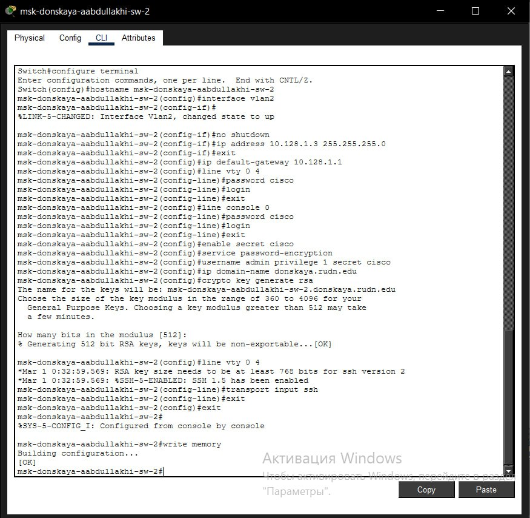
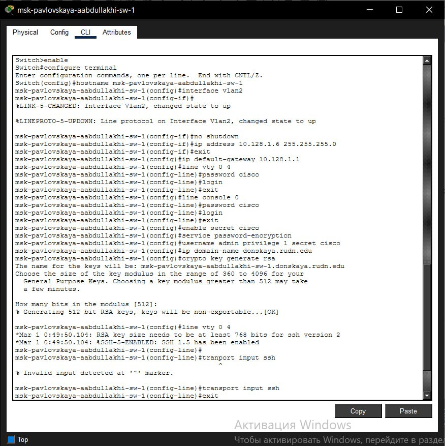

---
## Front matter
title: "Отчёт по лабораторной работе 4"
subtitle: "Первоначальное конфигурирование сети"
author: "Абдуллахи Абдул Вахид"

## Generic otions
lang: ru-RU
toc-title: "Содержание"

## Bibliography
bibliography: bib/cite.bib
csl: pandoc/csl/gost-r-7-0-5-2008-numeric.csl

## Pdf output format
toc: true # Table of contents
toc-depth: 2
lof: true # List of figures
lot: true # List of tables
fontsize: 12pt
linestretch: 1.5
papersize: a
documentclass: scrreprt
## I18n polyglossia
polyglossia-lang:
  name: russian
  options:
	- spelling=modern
	- babelshorthands=true
polyglossia-otherlangs:
  name: english
## I18n babel
babel-lang: russian
babel-otherlangs: english
## Fonts
mainfont: IBM Plex Serif
romanfont: IBM Plex Serif
sansfont: IBM Plex Sans
monofont: IBM Plex Mono
mathfont: STIX Two Math
mainfontoptions: Ligatures=Common,Ligatures=TeX,Scale=0.94
romanfontoptions: Ligatures=Common,Ligatures=TeX,Scale=0.94
sansfontoptions: Ligatures=Common,Ligatures=TeX,Scale=MatchLowercase,Scale=0.94
monofontoptions: Scale=MatchLowercase,Scale=0.94,FakeStretch=0.9
mathfontoptions:
## Biblatex
biblatex: true
biblio-style: "gost-numeric"
biblatexoptions:
  - parentracker=true
  - backend=biber
  - hyperref=auto
  - language=auto
  - autolang=other*
  - citestyle=gost-numeric
## Pandoc-crossref LaTeX customization
figureTitle: "Рис."
tableTitle: "Таблица"
listingTitle: "Листинг"
lofTitle: "Список иллюстраций"
lotTitle: "Список таблиц"
lolTitle: "Листинги"
## Misc options
indent: true
header-includes:
  - \usepackage{indentfirst}
  - \usepackage{float} # keep figures where there are in the text
  - \floatplacement{figure}{H} # keep figures where there are in the text
---

#  Цель работы

Выполнить базовую настройку сетевого оборудования: присвоение имён, настройка IP-адресов на VLAN, организация защищённого удалённого доступа по протоколу SSH и подготовка коммутаторов к работе в корпоративной сети.

#  Выполнение лабораторной работы

## Построение топологии сети

В среде Cisco Packet Tracer была смоделирована сеть в соответствии с топологией L1. В состав схемы вошли следующие коммутаторы:

- `msk-pavlovskaya-aabdullakhi-sw-1`
- `msk-donskaya-aabdullakhi-sw-1`
- `msk-donskaya-aabdullakhi-sw-2`
- `msk-donskaya-aabdullakhi-sw-3`
- `msk-donskaya-aabdullakhi-sw-4`

Кроме того, в сети присутствуют оконечные устройства: рабочие станции (dk, dep, adm, other), а также серверы web, file и mail. Соединения выполнены через интерфейсы FastEthernet в соответствии с заданием.

## Первоначальная настройка коммутаторов

Все коммутаторы настраивались по единому шаблону с индивидуальной корректировкой имени устройства и IP-адреса. Для управления использовалась подсеть `10.128.1.0/24` со шлюзом по умолчанию `10.128.1.1`.

На каждом устройстве были выполнены следующие действия:
- создан и активирован интерфейс VLAN 2;
- назначен IP-адрес из диапазона управления;
- прописан шлюз по умолчанию;
- настроены пароли на console и VTY;
- установлен пароль enable secret;
- включено шифрование всех паролей (service password-encryption);
- создан локальный пользователь `admin`;
- задано доменное имя `donskaya.rudn.edu`;
- сгенерированы RSA-ключи;
- разрешён доступ только по SSH на виртуальных терминалах;
- выполнено сохранение конфигурации.

## Настройка msk-donskaya-aabdullakhi-sw-1

Данному коммутатору был присвоен IP-адрес `10.128.1.2/24`. После генерации ключей шифрования на линиях VTY был оставлен доступ только по протоколу SSH.

## Настройка msk-donskaya-aabdullakhi-sw-2

Коммутатор получил адрес `10.128.1.3/24`. Параметры безопасности полностью повторяют конфигурацию первого устройства: настроен VLAN 2, заданы пароли, включён SSH.

## Настройка msk-donskaya-aabdullakhi-sw-3

IP-адрес устройства — `10.128.1.4/24`. Конфигурация включает все необходимые элементы для удалённого управления.

## Настройка msk-donskaya-aabdullakhi-sw-4

Коммутатору назначен IP `10.128.1.5/24`. В процессе настройки особое внимание уделено корректному сохранению конфигурации в NVRAM.

## Настройка msk-pavlovskaya-aabdullakhi-sw-1

Последний коммутатор получил адрес `10.128.1.6/24`. Все этапы настройки были выполнены в строгом соответствии с типовой процедурой: активация VLAN 2, назначение IP, шлюза, защита линий и включение SSH.

# Вывод

В ходе выполнения лабораторной работы:
- смоделирована топология сети в соответствии с заданием;
- выполнена начальная настройка пяти коммутаторов;
- каждому устройству присвоен уникальный управляющий IP-адрес;
- организована защита управляющего доступа с использованием локальных учётных записей и протокола SSH;
- все изменения сохранены в энергонезависимую память.

Все коммутаторы готовы к эксплуатации и удалённому администрированию в пределах подсети `10.128.1.0/24`.

# Контрольные вопросы

**1. Какие команды позволяют просмотреть текущую конфигурацию устройства?**
Текущую (рабочую) конфигурацию можно просмотреть следующими командами:
- `show running-config` — отображает активную конфигурацию в оперативной памяти;
- `show run` — сокращённый вариант предыдущей команды;
- `show startup-config` — позволяет сравнить текущую и сохранённую конфигурации;
- `show ip interface brief` — выводит состояние интерфейсов и назначенные IP-адреса;
- `show version` — отображает информацию о версии ПО и аппаратных характеристиках.

**2. Как посмотреть стартовый конфигурационный файл?**
Стартовая конфигурация хранится в NVRAM и загружается при включении устройства. Для её просмотра используется команда:
- `show startup-config` или `show start`.

**3. Каким образом можно экспортировать конфигурацию оборудования?**
Экспорт конфигурации выполняется путём копирования файла на внешний сервер по протоколам TFTP, FTP или SCP:
- `copy running-config tftp` — выгрузка текущей конфигурации;
- `copy startup-config tftp` — выгрузка стартовой конфигурации;
- `copy running-config ftp` — передача по FTP;
- `copy startup-config scp` — копирование по защищённому протоколу.

**4. Как импортировать конфигурационный файл на устройство?**
Импорт осуществляется обратным копированием с сервера на коммутатор:
- `copy tftp running-config` — загрузка конфигурации в оперативную память;
- `copy tftp startup-config` — запись конфигурации в NVRAM;
- `copy ftp running-config` — импорт с FTP-сервера;
- `copy scp startup-config` — загрузка по протоколу SCP.
После загрузки рекомендуется сохранить конфигурацию командой `write memory` или `copy running-config startup-config`.

