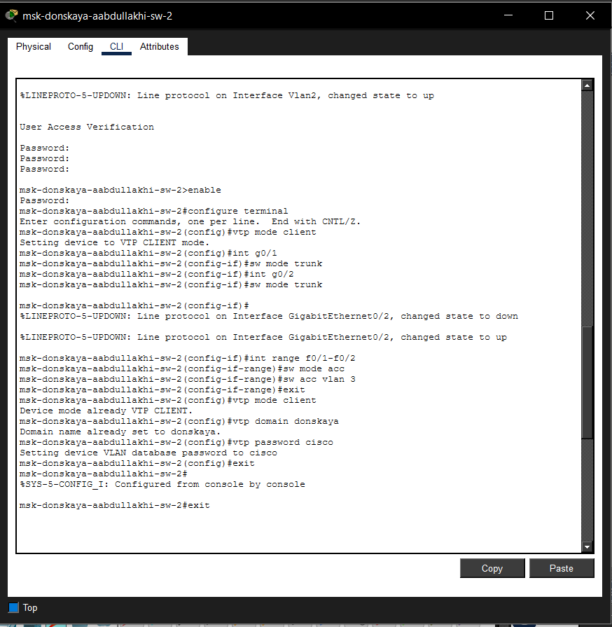
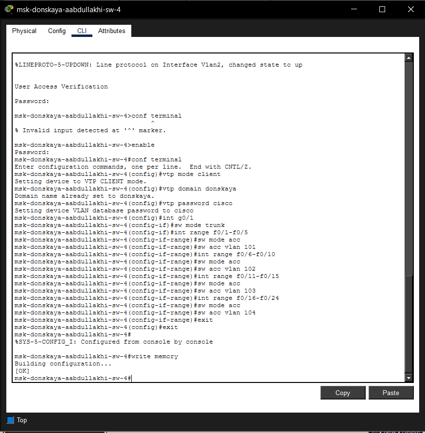
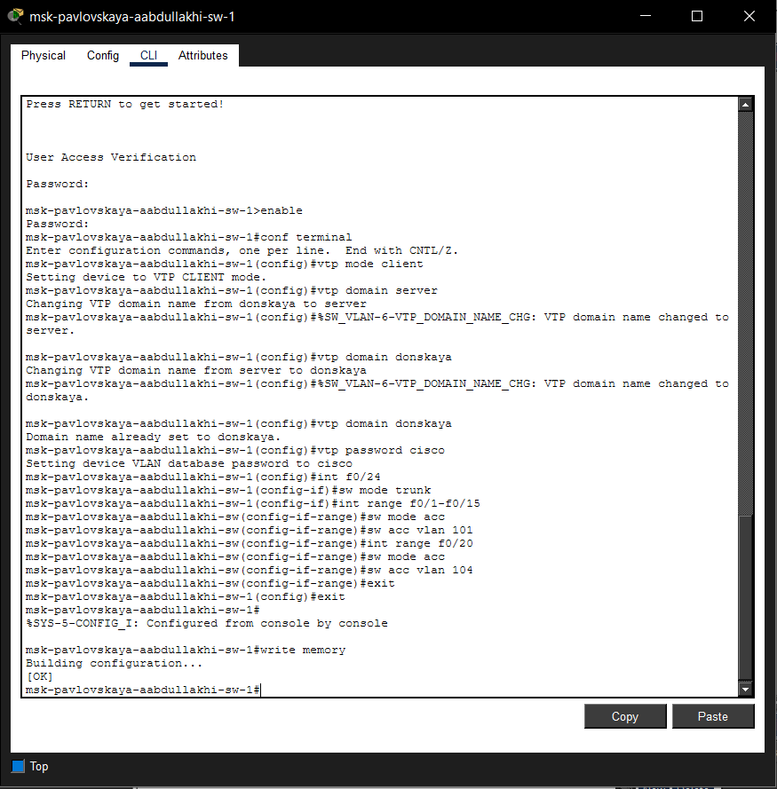
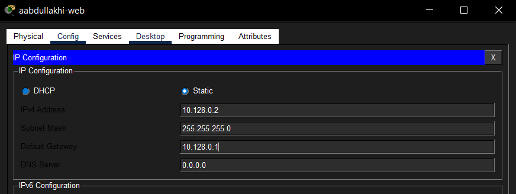
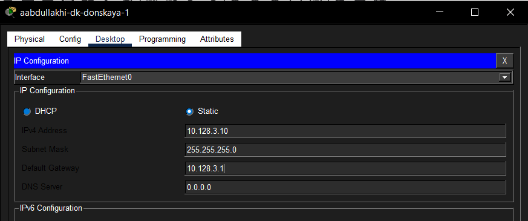
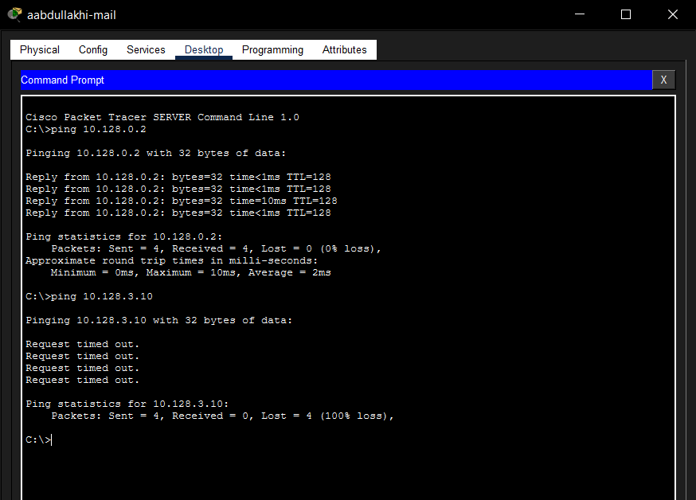
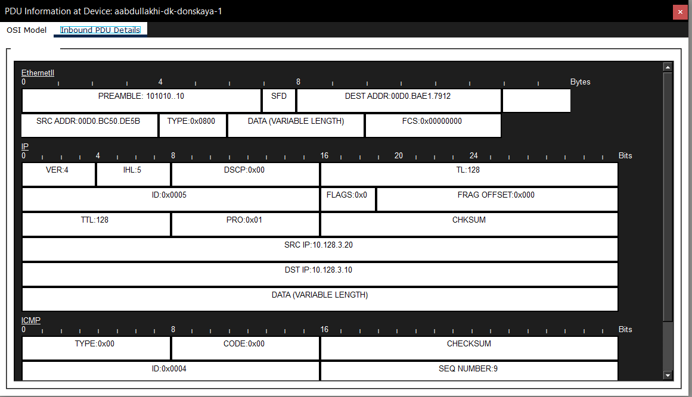

---
## Front matter
lang: ru-RU
title: Администрирование локальных сетей
subtitle: Лабораторная работа №5
author:
  - Абдуллахи Абдул Вахид
institute:
  - Российский университет дружбы народов, Москва, Россия
date: 27 февраля 2026

## i18n babel
babel-lang: russian
babel-otherlangs: english

## Formatting pdf
toc: false
toc-title: Содержание
slide_level: 2
aspectratio: 169
section-titles: true
theme: metropolis
header-includes:
 - \metroset{progressbar=frametitle,sectionpage=progressbar,numbering=fraction}
---

# Цель 

## Цель лабораторной работы 

Основная цель работы — получение практических навыков конфигурации виртуальных локальных сетей (VLAN) на управляемых коммутаторах.

# Выполнение лабораторной работы

## топология сети

{ width=75% }

## Настройка VTP-сервера и создание VLAN

{ width=75% }

# настройка ведомых коммутаторов (sw-2, sw-3, sw-4, pavlovskaya-sw-1)

## msk-donskaya-aabdullakhi-sw-2

{ width=75% }

## msk-donskaya-aabdullakhi-sw-3

{ width=75% }

## msk-donskaya-aabdullakhi-sw-4

{ width=75% }

## msk-pavlovskaya-aabdullakhi-sw-1

{ width=75% }

## Назначение IP-адресов серверам

{ width=75% }

## Назначение IP-адресов рабочим станциям

{ width=75% }

## Верификация сети (Диагностика Ping)

{ width=75% }

## Анализ трафика в режиме Simulation

{ width=75% }

## Детальный разбор структуры пакета

{ width=75% }

# Выводы

## Выводы

В ходе лабораторного практикума была полностью смоделирована и настроена локальная сеть предприятия. На центральном коммутаторе успешно развернут VTP-сервер, что позволило централизованно создать необходимые VLAN и автоматически распространить информацию о них на все клиентские коммутаторы. Проведена сегментация сети на логические домены (управление, серверы, отделы), на конечных узлах настроены IP-адреса.

# Вывод

