---
## Front matter
title: "Отчёт по лабораторной работе 5"
subtitle: "Конфигулирование VLAN"
author: "Абдуллахи Абдул Вахид"

## Generic otions
lang: ru-RU
toc-title: "Содержание"

## Bibliography
bibliography: bib/cite.bib
csl: pandoc/csl/gost-r-7-0-5-2008-numeric.csl

## Pdf output format
toc: true # Table of contents
toc-depth: 2
lof: true # List of figures
lot: true # List of tables
fontsize: 12pt
linestretch: 1.5
papersize: a
documentclass: scrreprt
## I18n polyglossia
polyglossia-lang:
  name: russian
  options:
	- spelling=modern
	- babelshorthands=true
polyglossia-otherlangs:
  name: english
## I18n babel
babel-lang: russian
babel-otherlangs: english
## Fonts
mainfont: IBM Plex Serif
romanfont: IBM Plex Serif
sansfont: IBM Plex Sans
monofont: IBM Plex Mono
mathfont: STIX Two Math
mainfontoptions: Ligatures=Common,Ligatures=TeX,Scale=0.94
romanfontoptions: Ligatures=Common,Ligatures=TeX,Scale=0.94
sansfontoptions: Ligatures=Common,Ligatures=TeX,Scale=MatchLowercase,Scale=0.94
monofontoptions: Scale=MatchLowercase,Scale=0.94,FakeStretch=0.9
mathfontoptions:
## Biblatex
biblatex: true
biblio-style: "gost-numeric"
biblatexoptions:
  - parentracker=true
  - backend=biber
  - hyperref=auto
  - language=auto
  - autolang=other*
  - citestyle=gost-numeric
## Pandoc-crossref LaTeX customization
figureTitle: "Рис."
tableTitle: "Таблица"
listingTitle: "Листинг"
lofTitle: "Список иллюстраций"
lotTitle: "Список таблиц"
lolTitle: "Листинги"
## Misc options
indent: true
header-includes:
  - \usepackage{indentfirst}
  - \usepackage{float} # keep figures where there are in the text
  - \floatplacement{figure}{H} # keep figures where there are in the text
---

#  Цель работы

Основная цель работы — получение практических навыков конфигурации виртуальных локальных сетей (VLAN) на управляемых коммутаторах.

#  Выполнение лабораторной работы

## Построение топологии сети

В симуляторе Cisco Packet Tracer была спроектирована и реализована сеть. В её состав вошли следующие типы устройств:
-   Коммутаторы Cisco 2960-24TT (`msk-donskaya-aabdullakhi-sw-1` — `sw-4`, `msk-pavlovskaya-aabdullakhi-sw-1`);
-   Финальные устройства (персональные компьютеры различных отделов);
-   Серверы (web, file, mail).

Связь между коммутаторами организована по магистральным линиям (Trunk), а компьютеры и серверы подключены к портам доступа (Access). Это позволило в дальнейшем внедрить технологию VLAN и централизованное управление через протокол VTP.

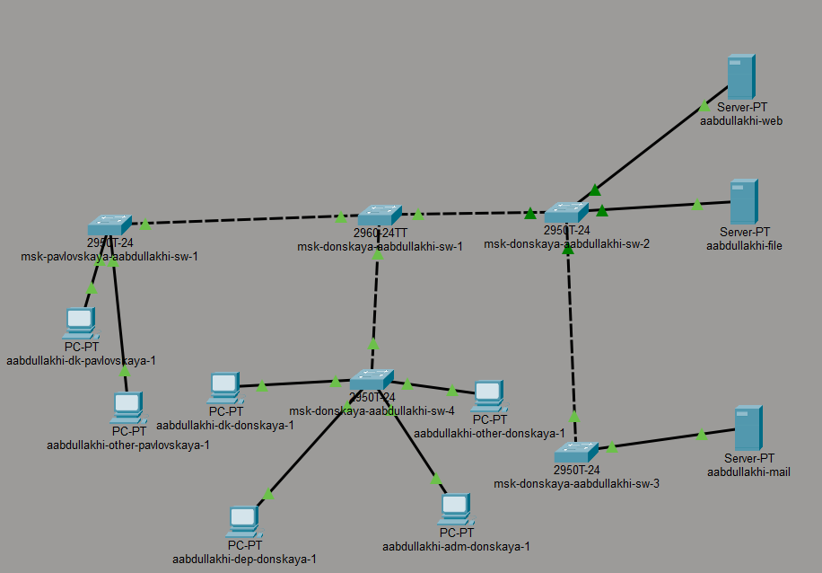

## Настройка VTP-сервера и создание VLAN

На коммутаторе, выполняющем роль основного (`msk-donskaya-aabdullakhi-sw-1`), была произведена инициализация VTP в роли сервера.
-   Установлен режим VTP Server.
-   Задан домен `donskaya`.
-   Установлен пароль `cisco` для синхронизации базы VLAN.

После активации VTP были созданы следующие виртуальные сети:
-   **VLAN 2** — management
-   **VLAN 3** — servers
-   **VLAN 101** — dk
-   **VLAN 102** — departments
-   **VLAN 103** — adm
-   **VLAN 104** — other

Интерфейсы, связывающие коммутаторы (`Fa0/24`, `Gi0/1`, `Gi0/2`), были переведены в режим Trunk для пропуска трафика всех созданных VLAN.

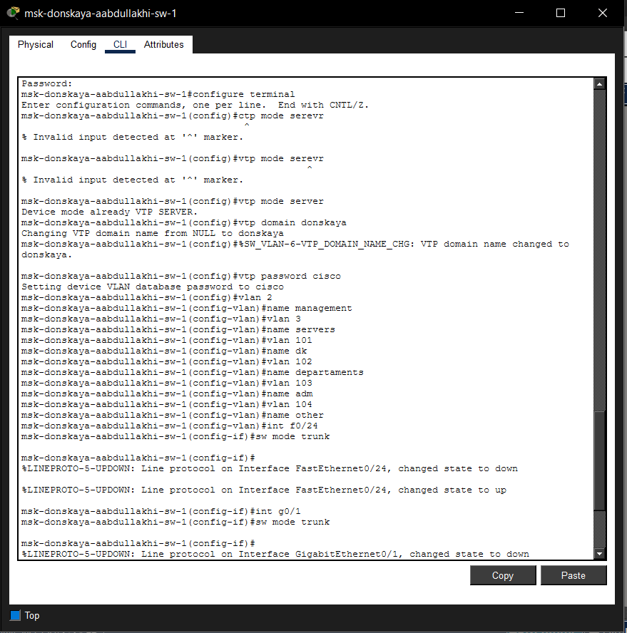

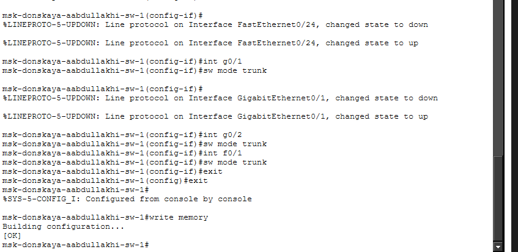

## настройка ведомых коммутаторов (sw-2, sw-3, sw-4, pavlovskaya-sw-1)

На всех остальных коммутаторах была выполнена типовая настройка:
-   Смена роли VTP на **Client**. Это позволило им автоматически получить информацию о всех VLAN от сервера.
-   Настройка Trunk-портов на соответствующих интерфейсах для связи с магистралью.
-   Назначение портов доступа (Access) в соответствующие VLAN для подключения оконечных устройств.

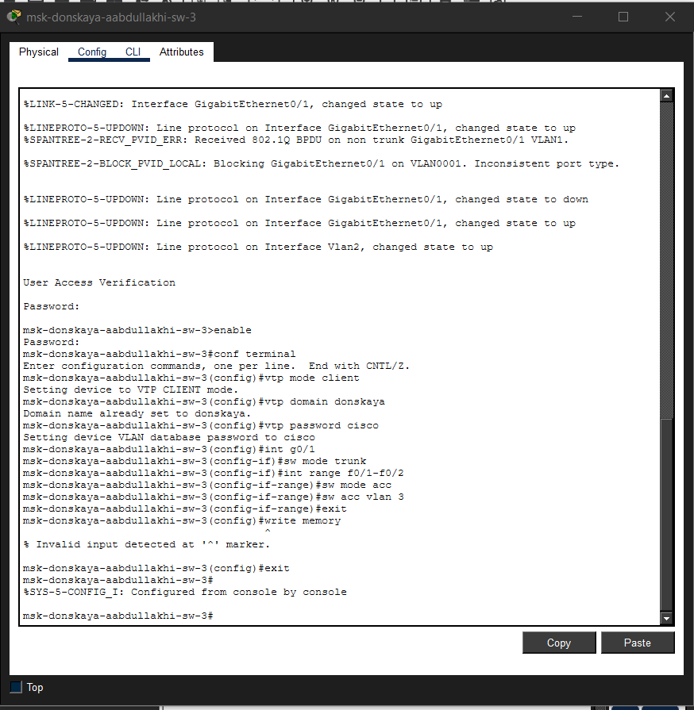

## Назначение IP-адресов серверам

Для обеспечения сетевого взаимодействия на серверах были прописаны статические адреса в подсети **VLAN 3**:
-   **Web-сервер (`aabdullakhi-web`):**
    -   IP-адрес: `10.128.0.2`
    -   Маска: `255.255.255.0`
    -   Шлюз: `10.128.0.1`
-   **File-сервер (`aabdullakhi-file`):**
    -   IP-адрес: `10.128.0.3`
    -   Маска: `255.255.255.0`
    -   Шлюз: `10.128.0.1`
-   **Mail-сервер (`aabdullakhi-mail`):**
    -   IP-адрес: `10.128.0.4`
    -   Маска: `255.255.255.0`
    -   Шлюз: `10.128.0.1`
    

    
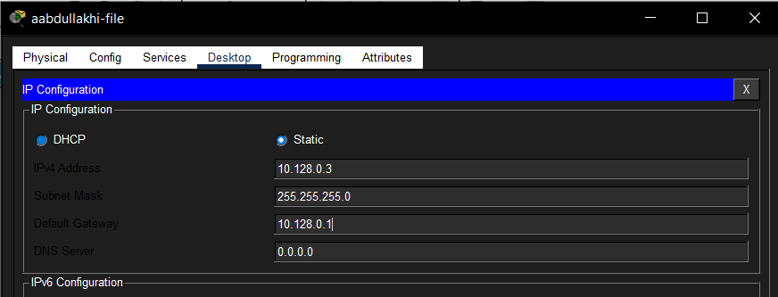
    
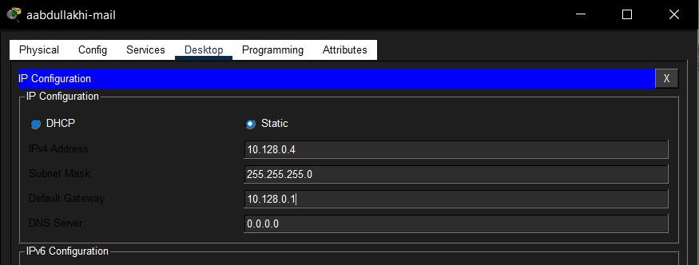
    
    
## Назначение IP-адресов рабочим станциям

Пользовательским ПК были присвоены адреса согласно их принадлежности к конкретному VLAN:

-   **`aabdullakhi-dk-donskaya-1` (VLAN 101):** `10.128.3.10/24`, шлюз `10.128.3.1`

-   **`aabdullakhi-dep-donskaya-1` (VLAN 102):** `10.128.4.10/24`, шлюз `10.128.4.1`

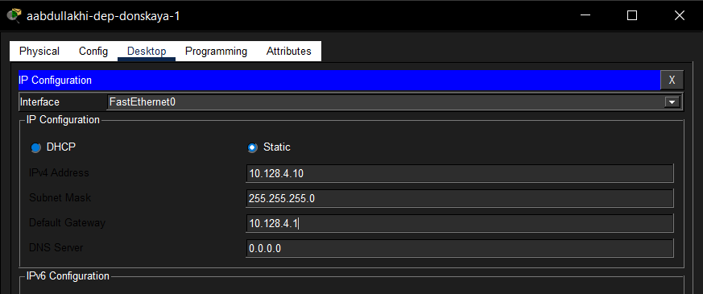

-   **`aabdullakhi-adm-donskaya-1` (VLAN 103):** `10.128.5.10/24`, шлюз `10.128.5.1`

-   **`aabdullakhi-other-donskaya-1` (VLAN 104):** `10.128.6.10/24`, шлюз `10.128.6.1`

-   **`aabdullakhi-dk-pavlovskaya-1` (VLAN 101):** `10.128.3.20/24`, шлюз `10.128.3.1`

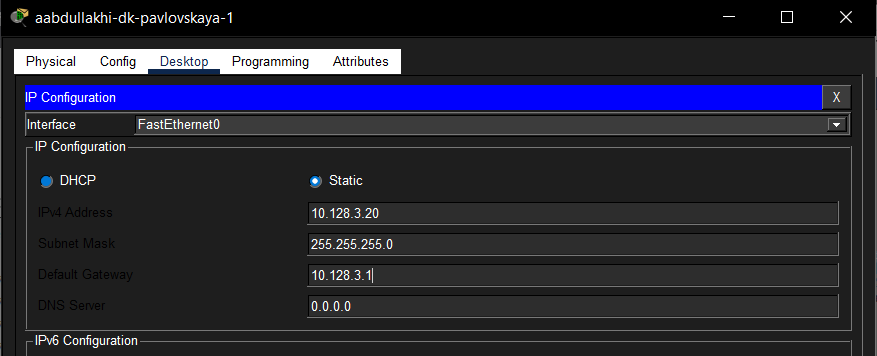

-   **`aabdullakhi-other-pavlovskaya-1` (VLAN 104):** `10.128.6.20/24`, шлюз `10.128.6.1`

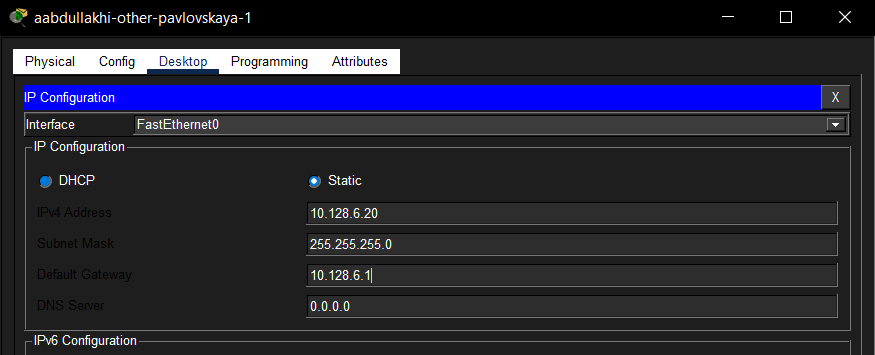

## Верификация сети (Диагностика Ping)

Для проверки корректности конфигурации была использована команда `ping`.

1.  **Связь серверов (VLAN 3):** При проверке доступности между серверами (например, с Mail на Web) все ICMP-пакеты были успешно доставлены. Это свидетельствует о том, что серверы корректно взаимодействуют в рамках своего широковещательного домена.

2.  **Связь внутри VLAN 101:** ПК `aabdullakhi-dk-donskaya-1` (10.128.3.10) успешно выполнил эхо-запрос до `aabdullakhi-dk-pavlovskaya-1` (10.128.3.20). Оба устройства принадлежат одной логической сети, что обеспечило их полную доступность друг для друга.

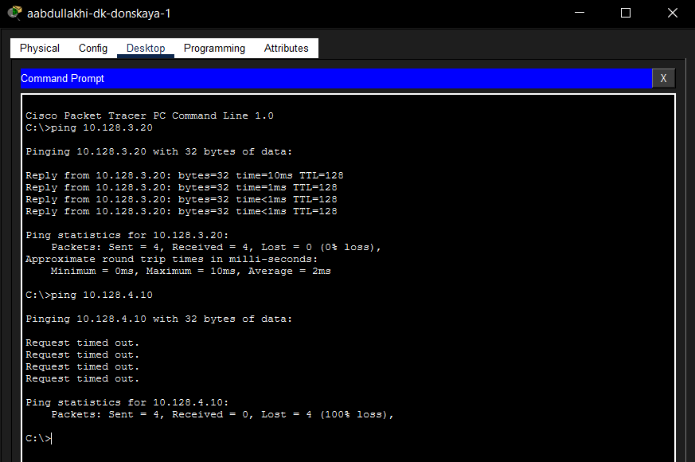

3.  **Связь внутри VLAN 104:** Аналогичный результат был получен при проверке связи между станциями `other-donskaya` и `other-pavlovskaya`, подтвердив корректность настроек портов в VLAN 104.

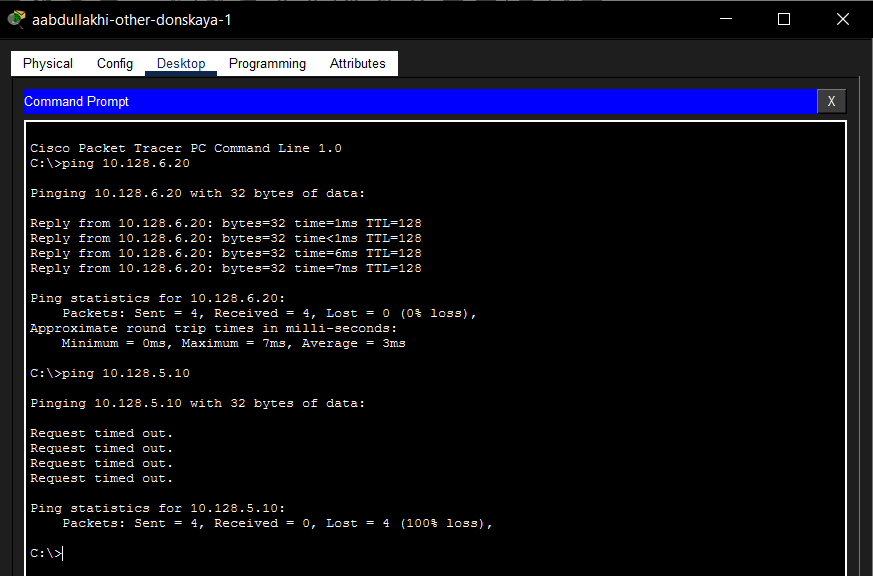

## Проверка межсетевого экранирования (Разделение трафика)

Попытки отправить ICMP-запросы между устройствами из разных VLAN (например, с Mail-сервера (VLAN 3) на ПК из VLAN 101, или с ПК из VLAN 104 на ПК из VLAN 103) оказались безуспешными. Отсутствие ответа полностью соответствует логике работы виртуальных сетей, которые изолируют трафик на канальном уровне, предотвращая несанкционированное взаимодействие между сегментами без использования маршрутизатора.

## Анализ трафика в режиме Simulation

С помощью режима **Simulation** был детально изучен процесс прохождения пакета.
-   Была отслежена траектория перемещения кадра от источника к приемнику через всю цепочку коммутаторов.
-   В событийном окне отображались все этапы обработки пакета каждым сетевым устройством.

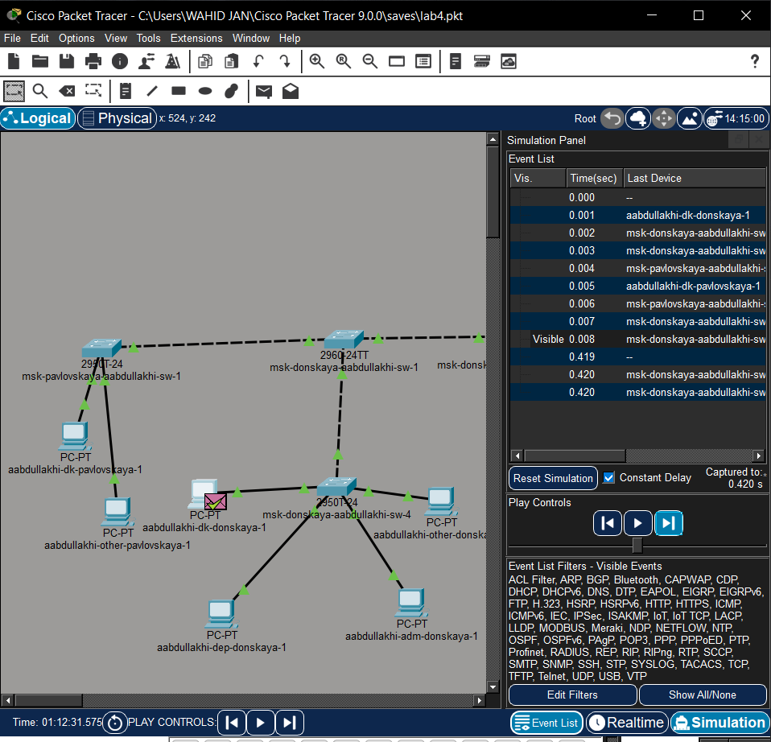

## Детальный разбор структуры пакета

В окне **PDU Information** был проведен анализ структуры передаваемых данных в соответствии с моделью OSI.
-   **Канальный уровень (Ethernet II):** Содержит MAC-адреса отправителя и получателя.
-   **Сетевой уровень (IP):** В заголовке протокола IP указаны логические адреса (в данном случае: отправитель `10.128.3.20`, получатель `10.128.3.10`).
-   **Транспортный/прикладной уровень (ICMP):** Заголовок протокола ICMP, несущий служебную информацию эхо-запроса.

# Выводы

В ходе лабораторного практикума была полностью смоделирована и настроена локальная сеть предприятия. На центральном коммутаторе успешно развернут VTP-сервер, что позволило централизованно создать необходимые VLAN и автоматически распространить информацию о них на все клиентские коммутаторы. Проведена сегментация сети на логические домены (управление, серверы, отделы), на конечных узлах настроены IP-адреса.

Практическая проверка командой `ping` подтвердила корректность сегментации: трафик свободно проходит внутри каждого VLAN, но полностью блокируется при попытке межсегментного взаимодействия. Анализ в режиме Simulation позволил визуализировать путь пакета и изучить структуру его заголовков (Ethernet, IP, ICMP). Все поставленные задачи выполнены, конфигурация сети является работоспособной и соответствует заданию.

# Контрольные вопросы

**1. Какая команда используется для просмотра списка VLAN на сетевом устройстве?**

Для отображения информации о существующих VLAN применяется команда `show vlan brief` (или `show vlan`). В выводе команды содержится таблица с номерами VLAN, их именами, статусами и закреплёнными за ними портами.

**2. Охарактеризуйте VLAN Trunking Protocol (VTP). Приведите перечень команд с пояснениями для настройки и просмотра информации о VLAN.**

VTP (VLAN Trunking Protocol) — это проприетарный протокол Cisco, предназначенный для синхронизации информации о VLAN между коммутаторами в одной сети. Он упрощает администрирование, так как изменения, внесённые на сервере, автоматически рассылаются клиентам.

Режимы работы VTP:
-   **Server:** Разрешено создание, изменение и удаление VLAN. Изменения публикуются в домене.
-   **Client:** Хранит информацию о VLAN в оперативной памяти, но не может её изменять. Синхронизируется с сервером.
-   **Transparent:** Имеет собственную локальную базу VLAN, не участвует в синхронизации, но транслирует VTP-объявления дальше.

**Основные команды настройки:**
-   `vtp mode {server | client | transparent}` — выбор режима работы.
-   `vtp domain <имя_домена>` — задание имени VTP-домена.
-   `vtp password <пароль>` — установка пароля для безопасности.
-   `vlan <номер>` — создание VLAN (выполняется в режиме конфигурации VLAN).
-   `name <имя>` — присвоение имени созданной VLAN.

**Команды просмотра информации:**
-   `show vtp status` — отображает текущие настройки и статистику VTP.
-   `show vlan brief` — выводит список VLAN и соответствующие им порты.

**3. Охарактеризуйте Internet Control Message Protocol (ICMP). Опишите формат пакета ICMP.**

ICMP (Internet Control Message Protocol) — это протокол сетевого уровня, используемый для передачи диагностической информации и сообщений об ошибках. Он лежит в основе таких утилит, как `ping` (эхо-запросы) и `traceroute`.

**Формат ICMP-пакета (заголовок):**
-   **Type (Тип):** Указывает тип сообщения (например, 0 — Echo Reply, 8 — Echo Request).
-   **Code (Код):** Конкретизирует назначение сообщения в рамках заданного типа.
-   **Checksum (Контрольная сумма):** Поле для проверки целостности всего пакета.
-   **Identifier и Sequence Number:** Используются для сопоставления запросов и ответов.
-   **Data (Данные):** Содержит полезную нагрузку (для эхо-запросов — произвольные данные).

**4. Охарактеризуйте Address Resolution Protocol (ARP). Опишите формат пакета ARP.**

ARP (Address Resolution Protocol) — это протокол канального уровня, предназначенный для сопоставления IP-адреса сетевого уровня с физическим MAC-адресом устройства в локальной сети. Если целевой MAC-адрес отсутствует в ARP-таблице, устройство отправляет широковещательный ARP-запрос. Узел с искомым IP-адресом отвечает ARP-ответом, сообщая свой MAC.

**Формат ARP-пакета:**
-   **HTYPE (Hardware Type):** Тип оборудования (обычно 1 для Ethernet).
-   **PTYPE (Protocol Type):** Тип протокола (0x0800 для IPv4).
-   **HLEN (Hardware Address Length):** Длина MAC-адреса (6 байт).
-   **PLEN (Protocol Address Length):** Длина IP-адреса (4 байта).
-   **OPER (Operation):** Код операции (1 — запрос, 2 — ответ).
-   **Sender MAC/IP Address:** Адреса отправителя.
-   **Target MAC/IP Address:** Адреса целевого устройства (в запросе MAC-адрес получателя заполнен нулями).

**5. Что такое MAC-адрес? Какова его структура?**

MAC-адрес (Media Access Control) — это уникальный идентификатор, «зашитый» в сетевое устройство на заводе-изготовителе. Он работает на канальном уровне и обеспечивает уникальную адресацию узлов в пределах одного сегмента сети.

**Структура (48 бит / 6 байт):**
-   **Первые 24 бита (OUI — Organizationally Unique Identifier):** Идентифицируют производителя оборудования (например, Cisco, Intel).
-   **Последние 24 бита (NIC Specific):** Уникальный серийный номер, присвоенный устройству производителем.

