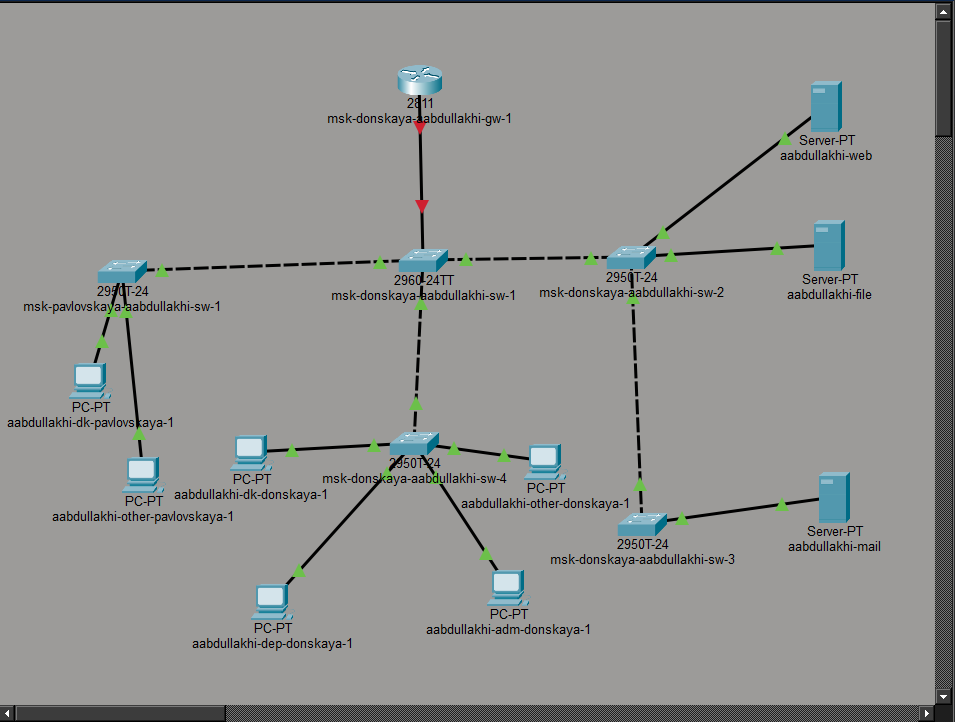
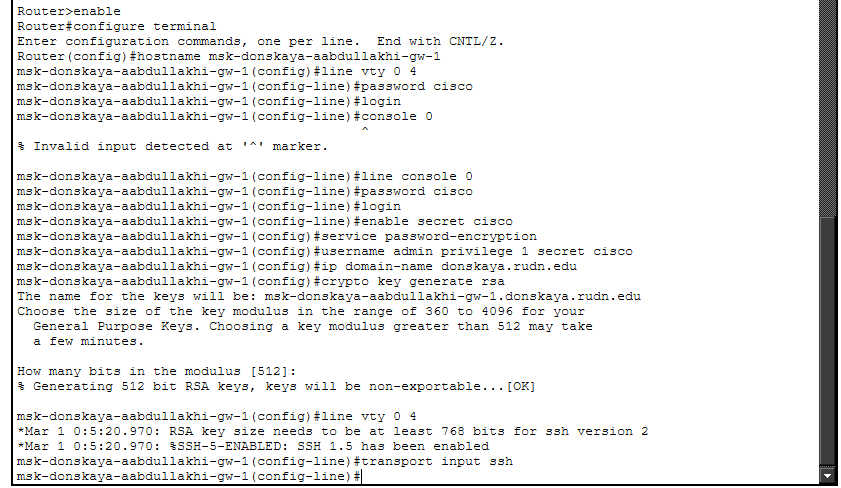
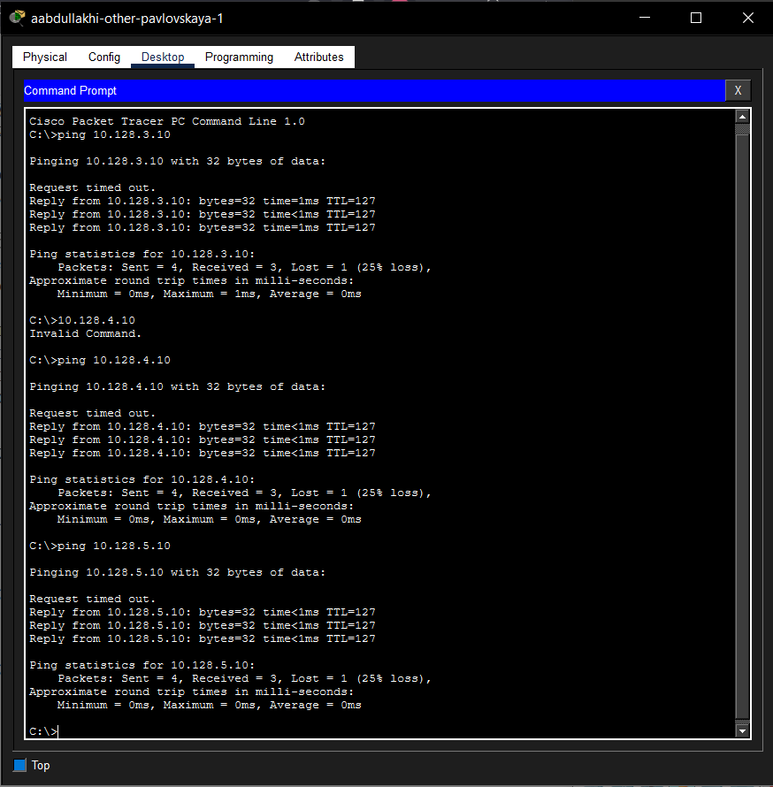
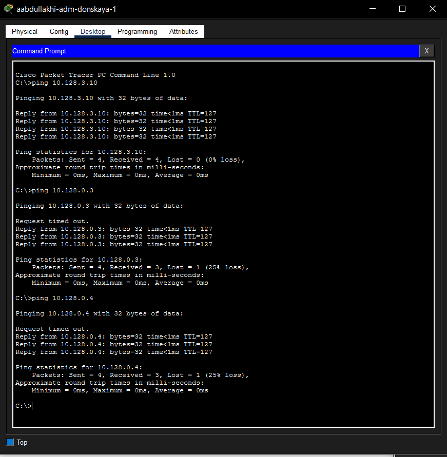
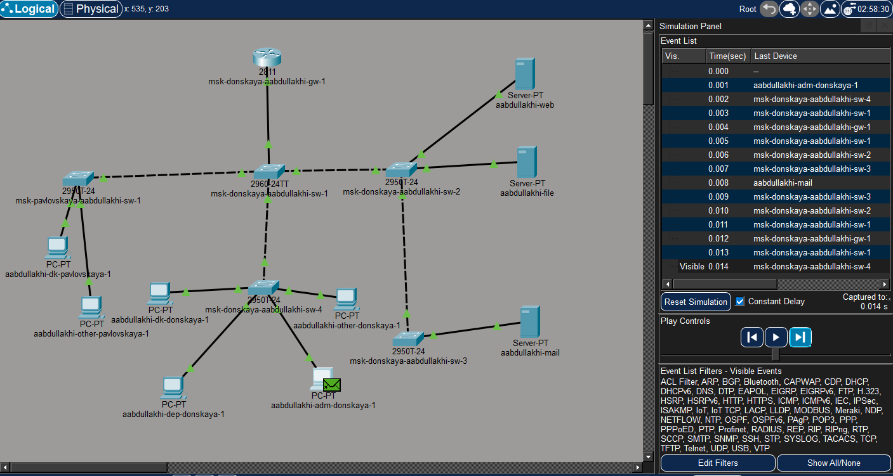

---
## Front matter
lang: ru-RU
title: Администрирование локальных сетей
subtitle: Лабораторная работа №6
author:
  - Абдуллахи Абдул Вахид
institute:
  - Российский университет дружбы народов, Москва, Россия
date: 27 февраля 2026

## i18n babel
babel-lang: russian
babel-otherlangs: english

## Formatting pdf
toc: false
toc-title: Содержание
slide_level: 2
aspectratio: 169
section-titles: true
theme: metropolis
header-includes:
 - \metroset{progressbar=frametitle,sectionpage=progressbar,numbering=fraction}
---

# Цель 

## Цель лабораторной работы 

Целью данной работы является изучение и практическая настройка статической межсетевой маршрутизации между виртуальными локальными сетями (VLAN) в среде эмуляции сети Cisco Packet Tracer.

# Выполнение лабораторной работы

## Схема сети 

{ width=75% }

## Первичная настройка маршрутизатора

{ width=75% }

## Настройка маршрутизации между VLAN

{ width=75% }

## Проверка связности

{ width=75% }

## Дополнительная проверка 

{ width=75% }

## Анализ трафика в режиме Simulation

{ width=75% }

## Изучение структуры пакета

{ width=75% }

# Выводы

## Выводы работы

Была выполнена первоначальная настройка маршрутизатора, настроен удалённый доступ по
SSH и создана межсетевая маршрутизация между VLAN с использованием подинтерфейсов.
Проверка соединения с помощью команды ping показала корректную работу маршрутизации
между VLAN. Также был изучен процесс передачи ICMP-пакета и структура сетевых
заголовков Ethernet, IP и ICMP.

