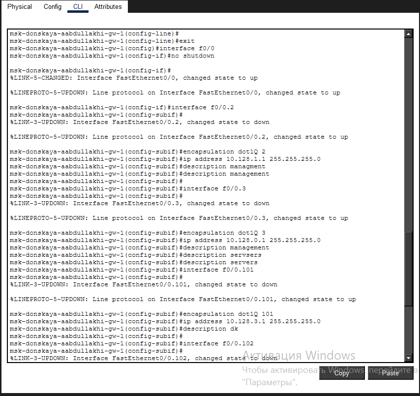
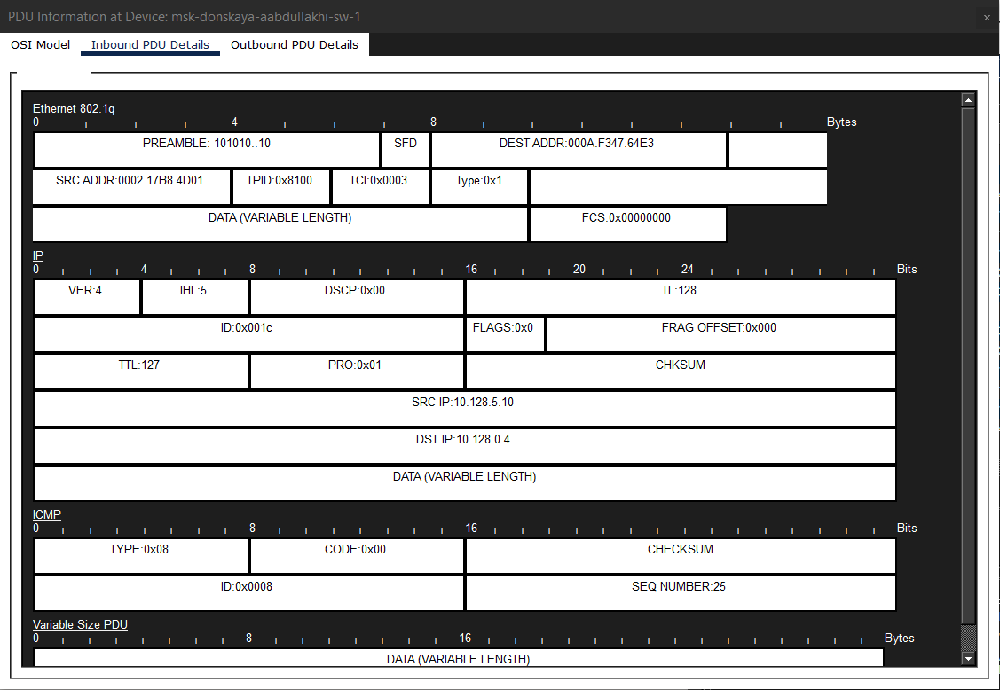

---
## Front matter
title: "Отчёт по лабораторной работе 6"
subtitle: "Статическая маршрутизация VLAN"
author: "Абдуллахи Абдул Вахид"

## Generic otions
lang: ru-RU
toc-title: "Содержание"

## Bibliography
bibliography: bib/cite.bib
csl: pandoc/csl/gost-r-7-0-5-2008-numeric.csl

## Pdf output format
toc: true # Table of contents
toc-depth: 2
lof: true # List of figures
lot: true # List of tables
fontsize: 12pt
linestretch: 1.5
papersize: a
documentclass: scrreprt
## I18n polyglossia
polyglossia-lang:
  name: russian
  options:
	- spelling=modern
	- babelshorthands=true
polyglossia-otherlangs:
  name: english
## I18n babel
babel-lang: russian
babel-otherlangs: english
## Fonts
mainfont: IBM Plex Serif
romanfont: IBM Plex Serif
sansfont: IBM Plex Sans
monofont: IBM Plex Mono
mathfont: STIX Two Math
mainfontoptions: Ligatures=Common,Ligatures=TeX,Scale=0.94
romanfontoptions: Ligatures=Common,Ligatures=TeX,Scale=0.94
sansfontoptions: Ligatures=Common,Ligatures=TeX,Scale=MatchLowercase,Scale=0.94
monofontoptions: Scale=MatchLowercase,Scale=0.94,FakeStretch=0.9
mathfontoptions:
## Biblatex
biblatex: true
biblio-style: "gost-numeric"
biblatexoptions:
  - parentracker=true
  - backend=biber
  - hyperref=auto
  - language=auto
  - autolang=other*
  - citestyle=gost-numeric
## Pandoc-crossref LaTeX customization
figureTitle: "Рис."
tableTitle: "Таблица"
listingTitle: "Листинг"
lofTitle: "Список иллюстраций"
lotTitle: "Список таблиц"
lolTitle: "Листинги"
## Misc options
indent: true
header-includes:
  - \usepackage{indentfirst}
  - \usepackage{float} # keep figures where there are in the text
  - \floatplacement{figure}{H} # keep figures where there are in the text
---

#  Цель работы

Целью данной работы является изучение и практическая настройка статической межсетевой маршрутизации между виртуальными локальными сетями (VLAN) в среде эмуляции сети Cisco Packet Tracer.

#  Выполнение лабораторной работы

## Построение топологии

В логической рабочей области Cisco Packet Tracer была спроектирована и построена сеть, включающая маршрутизатор Cisco 2811 (msk-donskaya-aabdullakhi-gw-1), @fig:topology несколько коммутаторов Cisco 2960, оконечные устройства (персональные компьютеры) и серверы. Соединение между маршрутизатором и главным коммутатором `msk-donskaya-aabdullakhi-sw-1` организовано через интерфейс FastEthernet0/0, подключенный к порту 24 коммутатора. Данная линия сконфигурирована для передачи трафика всех VLAN. Остальные коммутаторы служат для подключения различных сегментов, включая рабочие станции и серверы web, file и mail.

{#fig:topology}

## Первичная настройка маршрутизатора

На следующем этапе была выполнена базовая конфигурация маршрутизатора Cisco 2811 через интерфейс командной строки (CLI). В ходе настройки устройству было присвоено имя `msk-donskaya-aabdullakhi-gw-1`, установлены пароли для доступа по консоли и VTY-линиям, задан `enable secret` пароль. Также был создан локальный пользователь `admin`, включено шифрование паролей, задано доменное имя `donskaya.rudn.edu` и сгенерированы ключи RSA для обеспечения безопасного удаленного доступа по протоколу SSH.

## Настройка маршрутизации между VLAN

Для организации взаимодействия между VLAN была применена технология "Router-on-a-Stick". На физическом интерфейсе FastEthernet0/0 маршрутизатора была включена передача данных. Затем на нем были созданы логические подинтерфейсы (subinterfaces), соответствующие каждой из существующих VLAN. Для каждого подинтерфейса была задана инкапсуляция IEEE 802.1Q, указывающая к какой VLAN он принадлежит, и назначен IP-адрес, который выступает в роли шлюза по умолчанию для хостов в этой VLAN. Были созданы и настроены следующие подинтерфейсы:
         `f0/0.101` – VLAN 101, подсеть 10.128.3.0/24 (dk)
         `f0/0.102` – VLAN 102, подсеть 10.128.4.0/24 (departments)
         `f0/0.103` – VLAN 103, подсеть 10.128.5.0/24 (adm)
         `f0/0.104` – VLAN 104, подсеть 10.128.6.0/24 (other)
    Благодаря этой конфигурации маршрутизатор начал выполнять функции центрального узла, обеспечивающего маршрутизацию пакетов между всеми VLAN.
    

## Конфигурация коммутатора

На коммутаторе `msk-donskaya-aabdullakhi-sw-1` порт FastEthernet0/24, к которому подключен маршрутизатор, был переведен в режим trunk. Это позволило передавать по одному физическому каналу кадры, помеченные тегами 802.1Q, от всех VLAN, что является необходимым условием для работы схемы "Router-on-a-Stick".

## Проверка связности

После завершения всех этапов конфигурации была проведена проверка корректности работы межсетевой маршрутизации. С одного из компьютеров, находящегося в VLAN 103 (адм.), была отправлена команда ping на сервер из VLAN 104 (other). Успешное получение ответных сообщений подтвердило, что маршрутизация между VLAN функционирует правильно и пакеты успешно пересекают границы виртуальных сетей

Дополнительно была выполнена проверка с другого узла сети, расположенного в VLAN 102, на сервер в VLAN 101. Результаты тестирования также подтвердили успешный обмен данными между подсетями.

## Анализ трафика в режиме Simulation

Для детального изучения процесса передачи данных был активирован режим Simulation (симуляции) в Cisco Packet Tracer. В этом режиме была запущена отправка ICMP-пакета от одного компьютера к другому, расположенному в другой VLAN. Пошагово было прослежено движение пакета от узла-источника через коммутатор, затем через маршрутизатор, и далее к целевому узлу. Этот анализ позволил наглядно увидеть, как пакет обрабатывается на каждом сетевом устройстве.

## Изучение структуры пакета

На последнем этапе был детально проанализирован состав передаваемого ICMP-пакета. В окне анализа PDU были изучены заголовки различных уровней модели OSI. Был рассмотрен заголовок Ethernet с тегом 802.1Q, содержащий MAC-адреса и идентификатор VLAN, а также заголовки IP и ICMP. В IP-заголовке были идентифицированы адрес источника (10.128.5.10) и адрес назначения (10.128.0.4). Анализ подтвердил, что инкапсуляция 802.1Q и процесс маршрутизации были выполнены корректно.

# Вывод

В ходе выполнения данной лабораторной работы в программном эмуляторе Cisco Packet Tracer была построена многосегментная сеть, включающая маршрутизатор Cisco 2811, коммутаторы Cisco 2960 и конечные устройства. Ключевым элементом стала настройка маршрутизатора по схеме "Router-on-a-Stick", что позволило организовать взаимодействие между VLAN с использованием единственного физического канала, сконфигурированного как trunk.

Была выполнена как базовая настройка маршрутизатора (имя, пароли, SSH), так и специфическая конфигурация для поддержки VLAN (создание подинтерфейсов, назначение IP-адресов и инкапсуляции 802.1Q). Проверка с помощью утилиты ping успешно подтвердила работоспособность статической маршрутизации между всеми созданными виртуальными сетями. Использование режима Simulation позволило визуализировать и детально изучить путь прохождения ICMP-пакета, а также структуру передаваемых данных на канальном, сетевом и транспортном уровнях модели OSI.

# Контрольные вопросы

**1. Охарактеризуйте стандарт IEEE 802.1Q.**

Стандарт IEEE 802.1Q — это международный стандарт, описывающий механизм тегирования кадров Ethernet для организации виртуальных локальных сетей (VLAN). Его главная цель — позволить нескольким VLAN использовать одну и ту же физическую инфраструктуру сети. Он вводит специальный тег (метку) в заголовок Ethernet-кадра, который идентифицирует принадлежность кадра к определенной VLAN. Это ключевая технология для создания trunk-соединений, которые передают трафик множества VLAN между коммутаторами, а также между коммутаторами и маршрутизаторами, обеспечивая гибкость и эффективность использования сетевых ресурсов.

**2. Опишите формат кадра IEEE 802.1Q.**

Кадр IEEE 802.1Q основан на стандартном Ethernet-кадре, в который добавлено 4-байтовое поле тега VLAN. Этот тег вставляется после поля MAC-адреса источника. Структура кадра включает следующие ключевые поля:

- MAC-адрес назначения (Destination MAC Address):     Адрес устройства-получателя.
- MAC-адрес источника (Source MAC Address):     Адрес устройства-отправителя.
- TPID (Tag Protocol Identifier):     16-битное поле, которое идентифицирует кадр как тегированный. Обычно имеет значение 0x8100.

        TCI (Tag Control Information):     16-битное поле управления тегом, которое содержит:
        
- PCP (Priority Code Point):     3 бита для указания приоритета кадра (QoS).
- DEI (Drop Eligible Indicator):     1 бит, указывающий на возможность отбрасывания кадра при перегрузке.
- VID (VLAN Identifier):     12 бит для идентификатора VLAN (диапазон от 1 до 4094).
- Тип/EtherType (Type/Length):     2-байтовое поле, указывающее протокол следующего уровня (например, IPv4, IPv6).
- Данные (Data):     Полезная нагрузка кадра.
- FCS (Frame Check Sequence):     4-байтовая контрольная сумма для проверки целостности принятого кадра.

