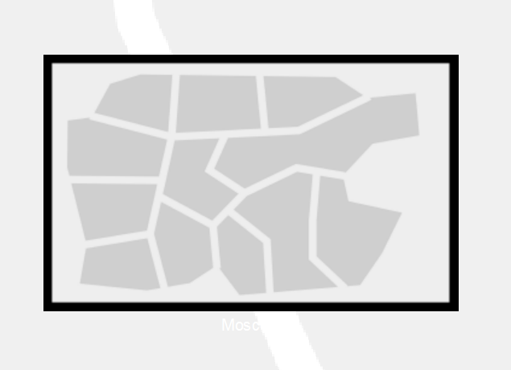
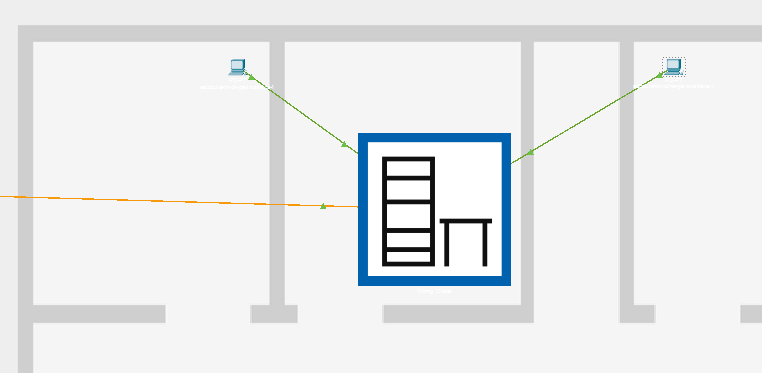
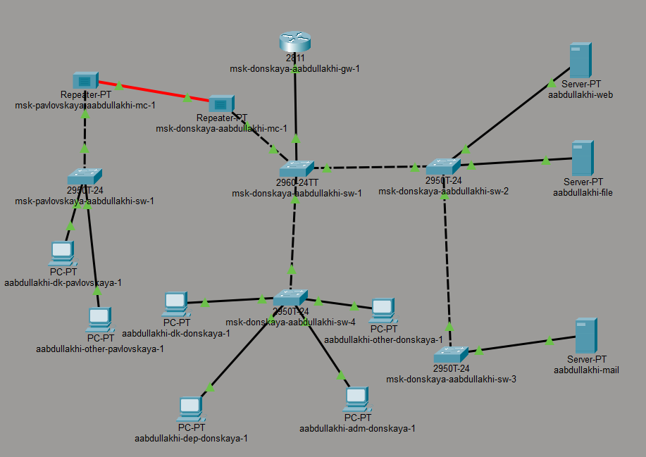

---
## Front matter
lang: ru-RU
title: Администрирование локальных сетей
subtitle: Лабораторная работа №7
author:
  - Абдуллахи Абдул Вахид
institute:
  - Российский университет дружбы народов, Москва, Россия
date: 27 февраля 2026

## i18n babel
babel-lang: russian
babel-otherlangs: english

## Formatting pdf
toc: false
toc-title: Содержание
slide_level: 2
aspectratio: 169
section-titles: true
theme: metropolis
header-includes:
 - \metroset{progressbar=frametitle,sectionpage=progressbar,numbering=fraction}
---

# Цель 

## Цель лабораторной работы 

Получение практических навыков работы с физической рабочей областью Cisco Packet Tracer, а также освоение методики учёта физических параметров сети (расстояния, типов кабелей) при проектировании.

# Выполнение лабораторной работы

## переход в физическую рабочую область

{ width=75% }

## Размещение серверной в здании Donskaya

{ width=75% }

## Размещение устройств в здании Pavlovskaya

{ width=75% }

## Проверка соединения между коммутаторами (ping)

{ width=75% }

## Включение учета длины кабеля

{ width=75% }

## Отсутствие соединения между коммутаторами

{ width=75% }

## Настройка повторителя

{ width=75% }

## Схема подключения с использованием повторителей

{ width=75% }

## Успешная проверка соединения после добавления повторителей

{ width=75% }

# Вывод 

## Вывод 

В процессе выполнения лабораторной работы были изучены физические аспекты построения сети в среде Cisco Packet Tracer. Было выполнено размещение объектов в физической рабочей области.

Была активирована функция учёта длины кабеля, что позволило смоделировать влияние физических параметров среды передачи на работоспособность сети. 

Для восстановления связи были использованы повторители (медиаконвертеры) и оптоволоконное соединение, что позволило компенсировать затухание сигнала и обеспечить стабильную передачу данных на больших расстояниях.

