---
## Front matter
title: "Отчёт по лабораторной работе 7"
subtitle: "Учёт физических параметров сети"
author: "Абдуллахи Абдул Вахид"

## Generic otions
lang: ru-RU
toc-title: "Содержание"

## Bibliography
bibliography: bib/cite.bib
csl: pandoc/csl/gost-r-7-0-5-2008-numeric.csl

## Pdf output format
toc: true # Table of contents
toc-depth: 2
lof: true # List of figures
lot: true # List of tables
fontsize: 12pt
linestretch: 1.5
papersize: a
documentclass: scrreprt
## I18n polyglossia
polyglossia-lang:
  name: russian
  options:
	- spelling=modern
	- babelshorthands=true
polyglossia-otherlangs:
  name: english
## I18n babel
babel-lang: russian
babel-otherlangs: english
## Fonts
mainfont: IBM Plex Serif
romanfont: IBM Plex Serif
sansfont: IBM Plex Sans
monofont: IBM Plex Mono
mathfont: STIX Two Math
mainfontoptions: Ligatures=Common,Ligatures=TeX,Scale=0.94
romanfontoptions: Ligatures=Common,Ligatures=TeX,Scale=0.94
sansfontoptions: Ligatures=Common,Ligatures=TeX,Scale=MatchLowercase,Scale=0.94
monofontoptions: Scale=MatchLowercase,Scale=0.94,FakeStretch=0.9
mathfontoptions:
## Biblatex
biblatex: true
biblio-style: "gost-numeric"
biblatexoptions:
  - parentracker=true
  - backend=biber
  - hyperref=auto
  - language=auto
  - autolang=other*
  - citestyle=gost-numeric
## Pandoc-crossref LaTeX customization
figureTitle: "Рис."
tableTitle: "Таблица"
listingTitle: "Листинг"
lofTitle: "Список иллюстраций"
lotTitle: "Список таблиц"
lolTitle: "Листинги"
## Misc options
indent: true
header-includes:
  - \usepackage{indentfirst}
  - \usepackage{float} # keep figures where there are in the text
  - \floatplacement{figure}{H} # keep figures where there are in the text
---

#  Цель работы

Получение практических навыков работы с физической рабочей областью Cisco Packet Tracer, а также освоение методики учёта физических параметров сети (расстояния, типов кабелей) при проектировании.

#  Выполнение лабораторной работы

## Назначение имени городу Moscow

Выполнен переход в физическую рабочую область Cisco Packet Tracer. Городу было присвоено имя Moscow.

## Создание и размещение зданий Donskaya и Pavlovskaya

При выборе города отображены здания. Одному из зданий присвоено имя Donskaya. Дополнительно на рабочей области добавлено ещё одно здание — Pavlovskaya.

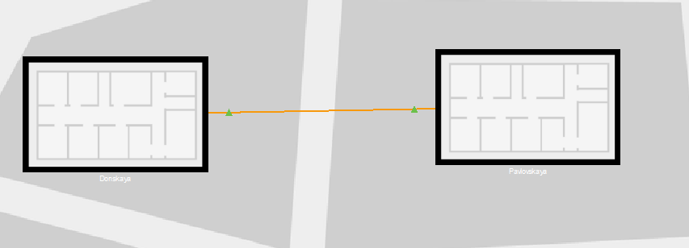

## Размещение серверной в здании Donskaya

Выполнен переход внутрь здания Donskaya. В него перемещено изображение серверного помещения (серверной комнаты).

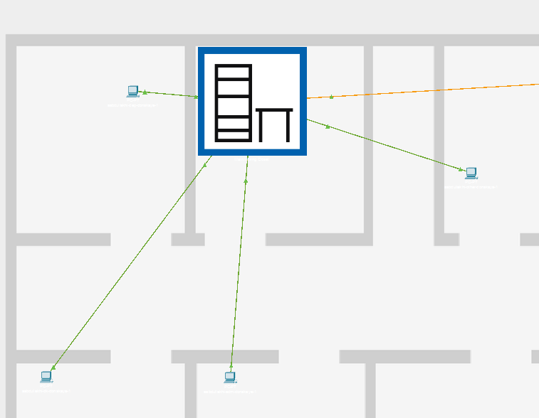

## Отображение серверных стоек и оборудования

При выборе серверного помещения отображены серверные стойки с установленным оборудованием, включая коммутаторы и серверы.

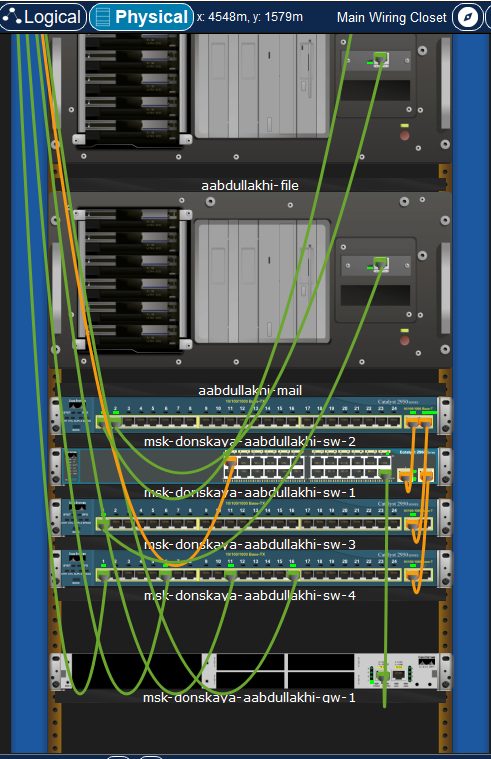

## Размещение устройств в здании Pavlovskaya

В физической рабочей области выполнено перемещение оборудования в здание Pavlovskaya с использованием инструмента Move:
   – коммутатор msk-pavlovskaya-sw-1;
   – оконечное устройство dk-pavlovskaya-1;
   – оконечное устройство other-pavlovskaya-1.
   

## Проверка соединения между коммутаторами (ping)

После завершения размещения оборудования выполнен возврат в логическую рабочую область Cisco Packet Tracer. С коммутатора msk-donskaya-aabdullakhi-sw-1 выполнена проверка соединения с коммутатором msk-pavlovskaya-sw-1 с использованием команды ping. Результат:
   – отправлено 5 ICMP-пакетов;
   – получено 5 ответов;
   – потерь пакетов не обнаружено (0% потерь);
   – соединение функционирует корректно.

   msk-donskaya-aabdullakhi-sw-1 ping 10.128.1.6
   Type escape sequence to abort.
   Sending 5, 100-byte ICMP Echos to 10.128.1.6, timeout is 2 seconds:
   !!!!!
   Success rate is 100 percent (5/5), round-trip min/avg/max = 0/0/0 ms
   msk-donskaya-aabdullakhi-sw-1 
   

## Включение учета длины кабеля

В меню Options → Preferences на вкладке Interface активирована опция Enable Cable Length Effects, позволяющая учитывать физическую длину кабеля при передаче данных.

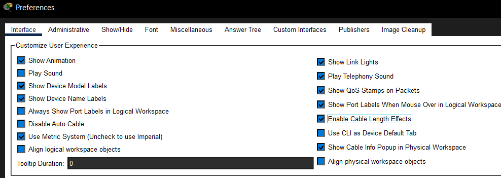

## Размещение территорий на большом расстоянии

В физической рабочей области Cisco Packet Tracer территории Donskaya и Pavlovskaya были размещены на значительном расстоянии друг от друга (более 100 м).

## Отсутствие соединения между коммутаторами

После возврата в логическую рабочую область выполнена проверка соединения между коммутаторами msk-donskaya-sw-1 и msk-pavlovskaya-sw-1 с помощью команды ping. Результат:
   – отправлено 5 пакетов;
   – получено 0 ответов;
   – наблюдаются потери 100%;
   – соединение отсутствует.
   
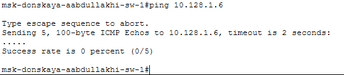

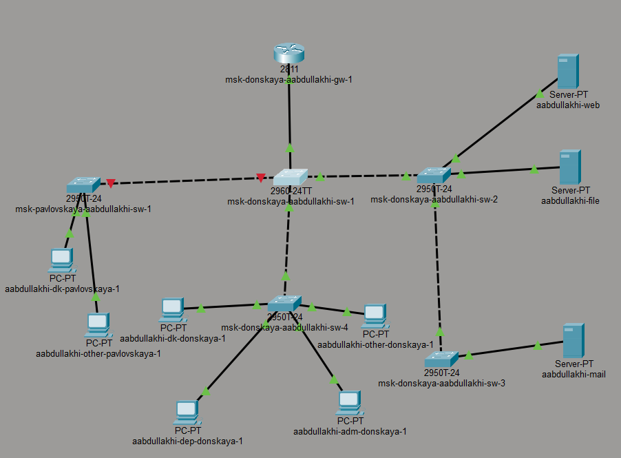

## Настройка повторителя и выбор модулей

Для восстановления связи удалено существующее соединение между коммутаторами. В логическую рабочую область добавлены два повторителя:
    – msk-donskaya-mc-1;
    – msk-pavlovskaya-mc-1.
    На устройствах заменены модули на:
    – PT-REPEATER-NM-1FFE;
    – PT-REPEATER-NM-1CFE,
что обеспечивает поддержку подключения по оптоволокну и витой паре.

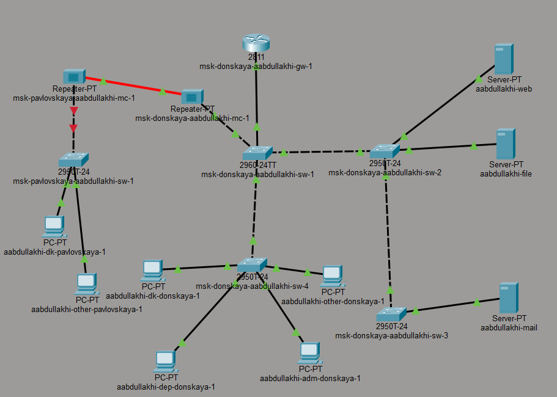

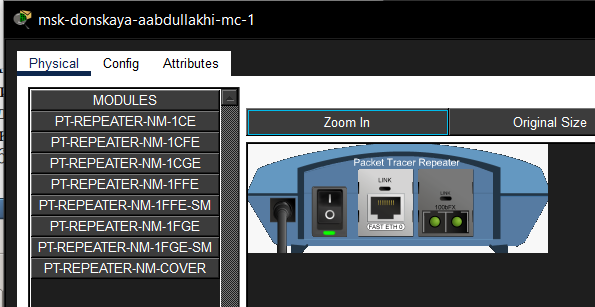

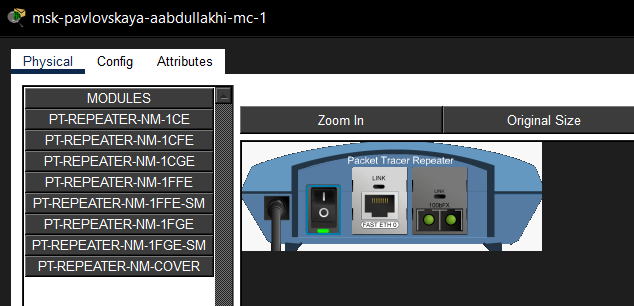

Повторитель msk-pavlovskaya-mc-1 перемещён в здание Pavlovskaya в физической рабочей области.

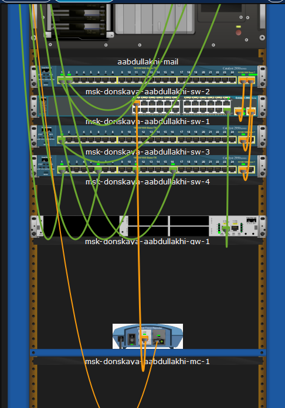

## Схема подключения с использованием повторителей

Выполнено подключение устройств:
    – msk-donskaya-sw-1 ↔ msk-donskaya-mc-1 — витая пара;
    – msk-donskaya-mc-1 ↔ msk-pavlovskaya-mc-1 — оптоволокно;
    – msk-pavlovskaya-sw-1 ↔ msk-pavlovskaya-mc-1 — витая пара.
    

## Успешная проверка соединения после добавления повторителей

Выполнена повторная проверка соединения между коммутаторами msk-donskaya-sw-1 и msk-pavlovskaya-sw-1 с помощью команды ping. Результат:
    – отправлено 5 пакетов;
    – получено 5 ответов;
    – потери отсутствуют (0%);
    – соединение успешно восстановлено.

    msk-donskaya-aabdullakhi-sw-1 ping 10.128.1.6
    Type escape sequence to abort.
    Sending 5, 100-byte ICMP Echos to 10.128.1.6, timeout is 2 seconds:
    !!!!!
    Success rate is 100 percent (5/5), round-trip min/avg/max = 0/0/1 ms
    msk-donskaya-aabdullakhi-sw-1 

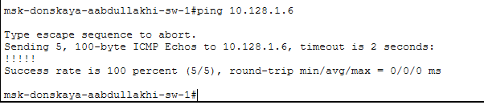

# Вывод

В процессе выполнения лабораторной работы были изучены физические аспекты построения сети в среде Cisco Packet Tracer. Было выполнено размещение объектов в физической рабочей области, включая город, здания и серверные помещения, а также произведено распределение сетевого оборудования между двумя территориальными зонами.

Была активирована функция учёта длины кабеля, что позволило смоделировать влияние физических параметров среды передачи на работоспособность сети. При увеличении расстояния между устройствами соединение стало недоступным, что подтвердило наличие ограничений для медных линий связи.

Для восстановления связи были использованы повторители (медиаконвертеры) и оптоволоконное соединение, что позволило компенсировать затухание сигнала и обеспечить стабильную передачу данных на больших расстояниях. Проверка с помощью команды ping показала корректную работу сети после внесённых изменений.

# Контрольные вопросы

1. **Перечислите возможные среды передачи данных. На какие характеристики среды передачи данных следует обращать внимание при планировании сети?**

   К основным средам передачи данных относятся:
   – витая пара (медный кабель);
   – коаксиальный кабель;
   – оптоволоконный кабель;
   – беспроводные среды (радиоканал, Wi-Fi).

   При планировании сети следует учитывать следующие характеристики:
   – максимальная длина сегмента;
   – пропускная способность;
   – устойчивость к помехам;
   – стоимость и сложность монтажа;
   – затухание сигнала;
   – надёжность и безопасность передачи данных.

2. **Перечислите категории витой пары. Чем они отличаются? Какая категория в каких условиях может применяться?**

   Основные категории витой пары:
   – Cat5 — до 100 Мбит/с, используется в устаревших сетях;
   – Cat5e — до 1 Гбит/с, широко применяется в локальных сетях;
   – Cat6 — до 1–10 Гбит/с, используется в современных сетях;
   – Cat6a — до 10 Гбит/с с улучшенной защитой от помех;
   – Cat7 и выше — применяются в высокоскоростных и специализированных сетях.

   Категории отличаются пропускной способностью, уровнем экранирования и частотным диапазоном. Выбор зависит от требуемой скорости передачи данных и условий эксплуатации (наличие помех, длина линии).

3. **В чем отличие одномодового и многомодового оптоволокна? Какой тип кабеля в каких условиях может применяться?**

   Одномодовое оптоволокно:
   – передаёт сигнал по одному лучу;
   – обеспечивает большую дальность передачи (десятки километров);
   – используется в магистральных линиях связи.

   Многомодовое оптоволокно:
   – передаёт сигнал по нескольким лучам;
   – имеет меньшую дальность (до нескольких сотен метров);
   – применяется в локальных сетях и внутри зданий.

   Основное отличие — в диаметре сердцевины и способе распространения сигнала, что влияет на дальность и стоимость.

4. **Какие разъёмы встречаются на патчах оптоволокна? Чем они отличаются?**

   Наиболее распространённые типы разъёмов:
   – SC — прямоугольный разъём с защёлкой;
   – LC — компактный разъём малого форм-фактора;
   – ST — круглый разъём с байонетным креплением;
   – FC — резьбовое соединение.

   Они отличаются формой, способом фиксации и областью применения. Например, LC используется в современных сетях благодаря компактности, а SC — за счёт простоты подключения.

   

