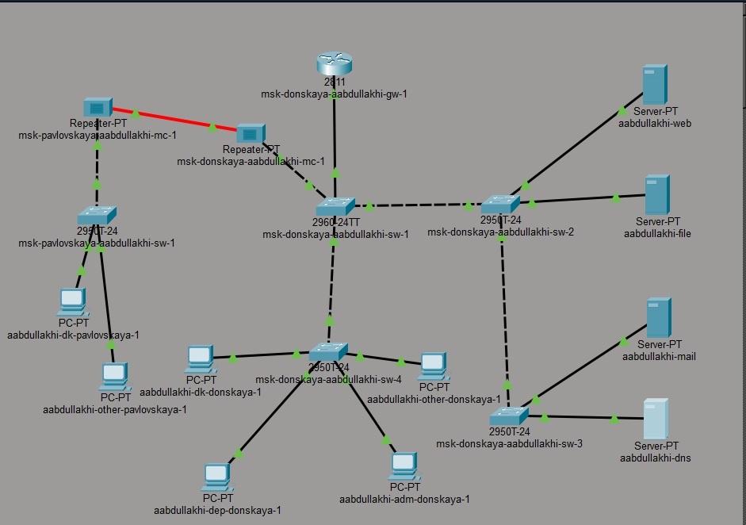
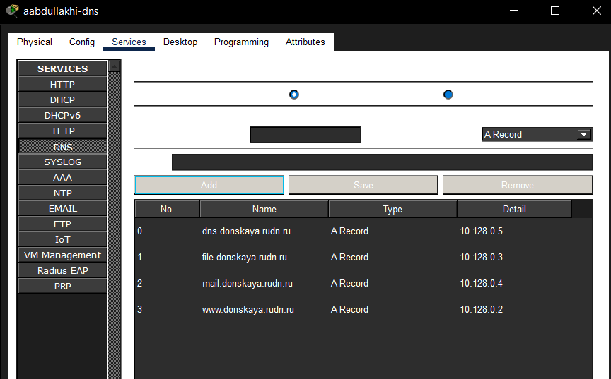
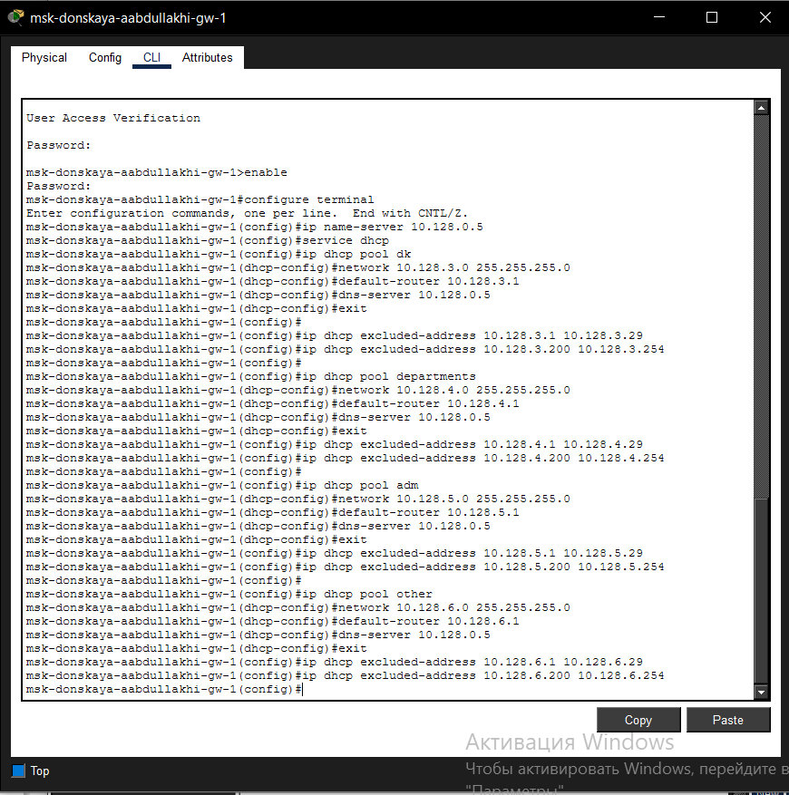
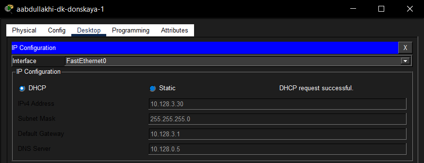
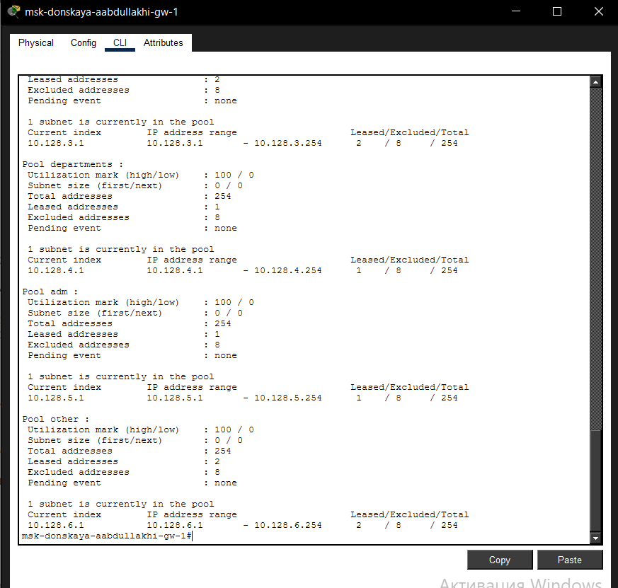
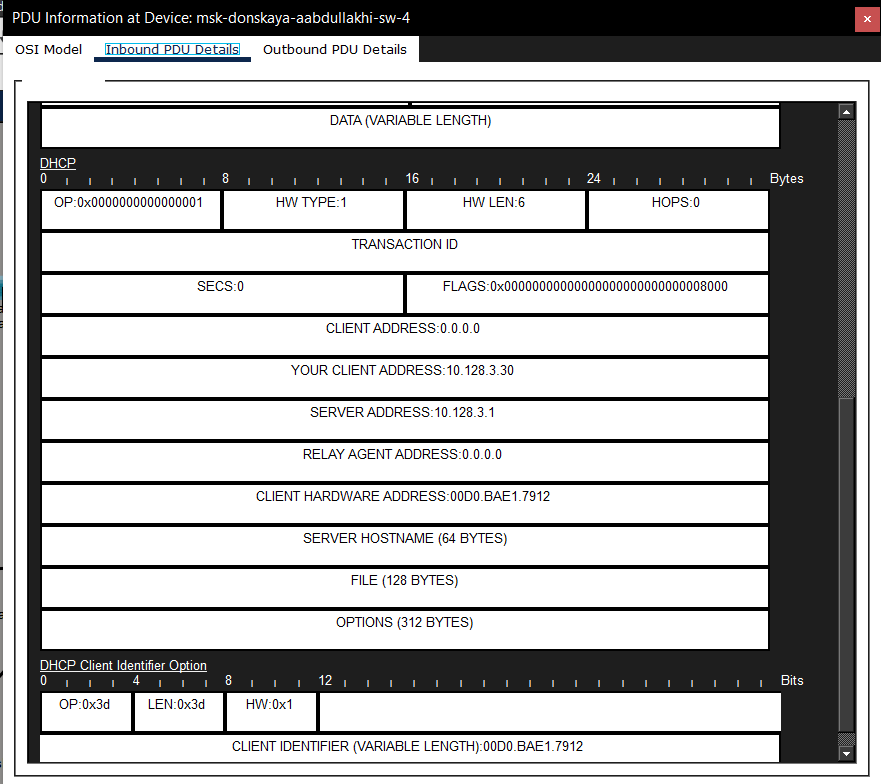
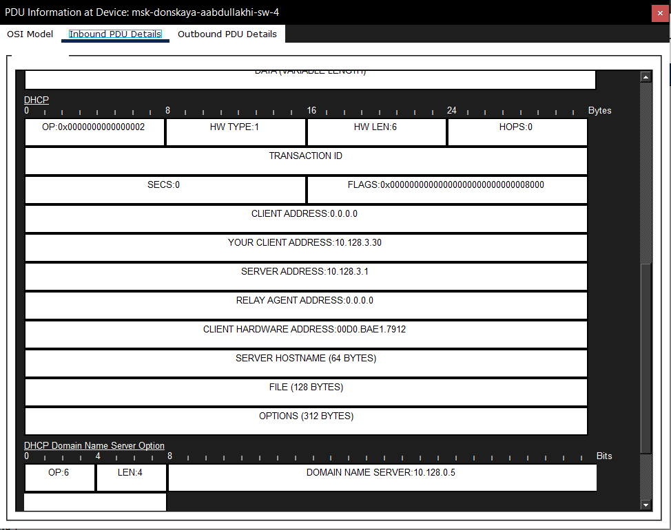
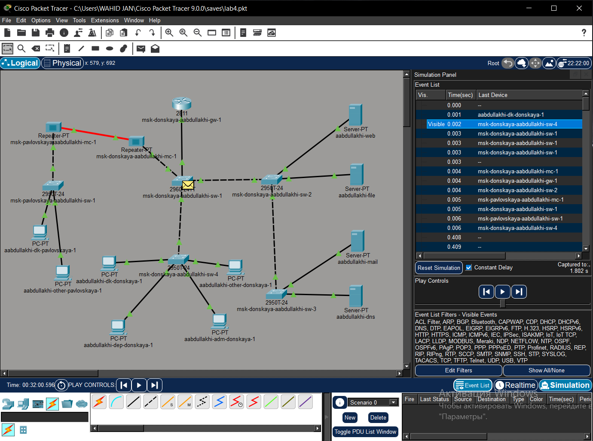

---
## Front matter
lang: ru-RU
title: Администрирование локальных сетей
subtitle: Лабораторная работа №8
author:
  - Абдуллахи Абдул Вахид
institute:
  - Российский университет дружбы народов, Москва, Россия
date: 27 февраля 2026

## i18n babel
babel-lang: russian
babel-otherlangs: english

## Formatting pdf
toc: false
toc-title: Содержание
slide_level: 2
aspectratio: 169
section-titles: true
theme: metropolis
header-includes:
 - \metroset{progressbar=frametitle,sectionpage=progressbar,numbering=fraction}
---

# Цель 

## Цель лабораторной работы 

Освоение практических навыков настройки динамического распределения IP-адресов с использованием протокола DHCP (Dynamic Host Configuration Protocol) в локальной вычислительной сети.

# Выполнение лабораторной работы

## Схема сети

{ width=75% }

## Настройка IP-адреса DNS-сервера

{ width=75% }

## Настройка DNS-сервиса

{ width=75% }

## Настройка DHCP на маршрутизаторе

{ width=75% }

## получение IP-адреса по DHCP

{ width=75% }

## Проверка сетевой доступности

{ width=75% }

## Информация о пулах DHCP

{ width=75% }

## Таблица выданных DHCP-адресов

{ width=75% }

## DHCP Discover

{ width=75% }

## DHCP Offer

{ width=75% }

## DHCP Request

{ width=75% }

## DHCP Acknowledgment (ACK)

{ width=75% }

## Процесс обмена DHCP-сообщениями в режиме симуляции

{ width=75% }

# Вывод 

## Вывод 

В ходе работы был настроен DHCP-сервер на маршрутизаторе msk-donskaya-aabdullakhi-gw-1, созданы пулы адресов для четырёх подсетей. Оконечные устройства успешно получили IP-адреса динамически, а проверка ping подтвердила связность между подсетями. Процесс обмена сообщениями DHCP (Discover, Offer, Request, ACK) изучен в режиме симуляции.

