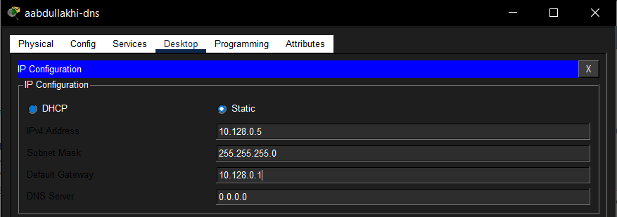
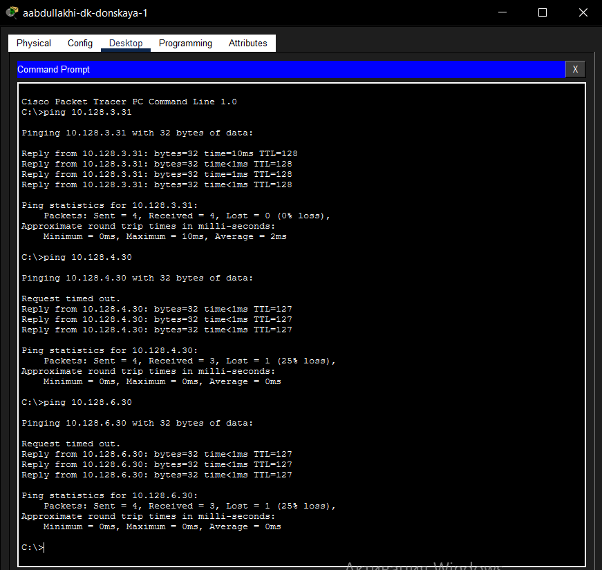
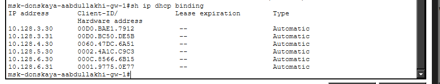
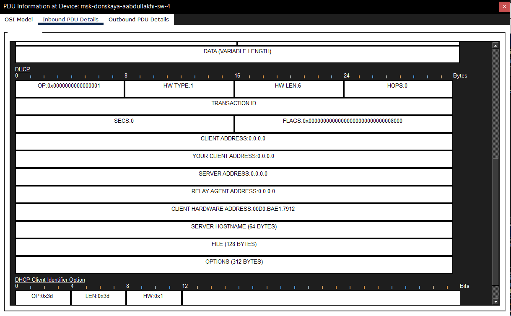
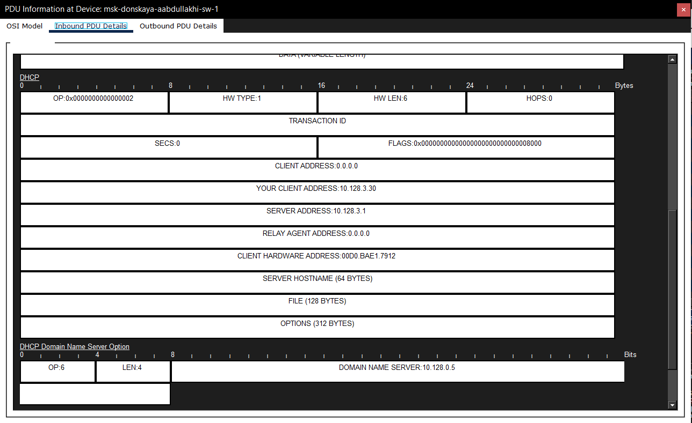

---
## Front matter
title: "Отчёт по лабораторной работе 8"
subtitle: "Настройка сетевых сервисов. DHCP"
author: "Абдуллахи Абдул Вахид"

## Generic otions
lang: ru-RU
toc-title: "Содержание"

## Bibliography
bibliography: bib/cite.bib
csl: pandoc/csl/gost-r-7-0-5-2008-numeric.csl

## Pdf output format
toc: true # Table of contents
toc-depth: 2
lof: true # List of figures
lot: true # List of tables
fontsize: 12pt
linestretch: 1.5
papersize: a
documentclass: scrreprt
## I18n polyglossia
polyglossia-lang:
  name: russian
  options:
	- spelling=modern
	- babelshorthands=true
polyglossia-otherlangs:
  name: english
## I18n babel
babel-lang: russian
babel-otherlangs: english
## Fonts
mainfont: IBM Plex Serif
romanfont: IBM Plex Serif
sansfont: IBM Plex Sans
monofont: IBM Plex Mono
mathfont: STIX Two Math
mainfontoptions: Ligatures=Common,Ligatures=TeX,Scale=0.94
romanfontoptions: Ligatures=Common,Ligatures=TeX,Scale=0.94
sansfontoptions: Ligatures=Common,Ligatures=TeX,Scale=MatchLowercase,Scale=0.94
monofontoptions: Scale=MatchLowercase,Scale=0.94,FakeStretch=0.9
mathfontoptions:
## Biblatex
biblatex: true
biblio-style: "gost-numeric"
biblatexoptions:
  - parentracker=true
  - backend=biber
  - hyperref=auto
  - language=auto
  - autolang=other*
  - citestyle=gost-numeric
## Pandoc-crossref LaTeX customization
figureTitle: "Рис."
tableTitle: "Таблица"
listingTitle: "Листинг"
lofTitle: "Список иллюстраций"
lotTitle: "Список таблиц"
lolTitle: "Листинги"
## Misc options
indent: true
header-includes:
  - \usepackage{indentfirst}
  - \usepackage{float} # keep figures where there are in the text
  - \floatplacement{figure}{H} # keep figures where there are in the text
---

#  Цель работы

Освоение практических навыков настройки динамического распределения IP-адресов с использованием протокола DHCP (Dynamic Host Configuration Protocol) в локальной вычислительной сети.

#  Выполнение лабораторной работы

## Топология сети

В рабочую область симулятора Cisco Packet Tracer был добавлен сервер Server-PT с именем **aabdullakhi-dns**, который будет выполнять функции DNS-сервера. Данный сервер подключён к коммутатору **msk-donskaya-aabdullakhi-sw-3** через порт FastEthernet0/2, при этом порт на коммутаторе активирован. В итоге сформирована распределённая топология, включающая маршрутизатор, несколько коммутаторов, серверы и оконечные устройства, объединённые в различные подсети.

## Настройка IP-адреса DNS-сервера

На сервере **aabdullakhi-dns** выполнена ручная настройка IP-адреса. В параметрах сетевого интерфейса указаны следующие значения:
   – IP-адрес: 10.128.0.5
   – Маска подсети: 255.255.255.0
   – Шлюз по умолчанию: 10.128.0.1
   

## Настройка DNS-сервиса

Произведена конфигурация DNS-службы на сервере. Сервис активирован, после чего добавлены A-записи для сопоставления доменных имён с IP-адресами:

   – dns.donskaya.rudn.ru → 10.128.0.5
   – file.donskaya.rudn.ru → 10.128.0.3
   – mail.donskaya.rudn.ru → 10.128.0.4
   – www.donskaya.rudn.ru → 10.128.0.2

   Все записи сохранены в конфигурации сервера.
   

## Настройка DHCP на маршрутизаторе

На маршрутизаторе **msk-donskaya-aabdullakhi-gw-1** выполнена настройка DHCP-сервиса. Сначала задан адрес DNS-сервера, затем активирован DHCP и созданы пулы адресов для разных подсетей.

   Для каждой сети определены:
   – адрес сети;
   – шлюз по умолчанию;
   – DNS-сервер (10.128.0.5).

   Также настроены диапазоны IP-адресов, исключаемые из динамической выдачи.

   Созданы следующие DHCP-пулы:
   – **dk** (сеть 10.128.3.0/24);
   – **departments** (сеть 10.128.4.0/24);
   – **adm** (сеть 10.128.5.0/24);
   – **other** (сеть 10.128.6.0/24).
   

## Переход на DHCP

На оконечных устройствах произведён переход со статической настройки IP на динамическое получение параметров по DHCP. После обновления конфигурации устройства автоматически получили следующие параметры:
   – IP-адрес: из соответствующего пула (например, 10.128.3.30);
   – Маска: 255.255.255.0;
   – Шлюз: 10.128.3.1;
   – DNS-сервер: 10.128.0.5.
   

## Проверка сетевой доступности

Выполнена проверка связности между устройствами из разных подсетей. С ПК были отправлены команды ping к узлам в других сетях. В большинстве случаев обмен пакетами проходит успешно, что свидетельствует о корректной работе маршрутизации и DHCP.

## Информация о пулах DHCP

Проверена работа DHCP-сервиса на маршрутизаторе. Команда **show ip dhcp pool** отобразила информацию о созданных пулах, включая количество выданных адресов и диапазоны.

## Таблица выданных DHCP-адресов

Дополнительно выполнена проверка выданных IP-адресов с помощью команды **show ip dhcp binding**, которая показывает соответствие IP-адресов и MAC-адресов клиентов.

## режим симуляции

 В режиме симуляции Cisco Packet Tracer детально изучен процесс получения IP-адреса по DHCP. Анализ проводился с использованием инструмента просмотра PDU, что позволило отследить все этапы обмена сообщениями.

   Процесс начинается с отправки клиентом широковещательного сообщения **DHCP Discover**, где устройство ещё не имеет IP-адреса (0.0.0.0) и пытается обнаружить DHCP-сервер в сети.
   

 Затем DHCP-сервер отвечает сообщением **DHCP Offer**, предлагая клиенту свободный IP-адрес из пула (например, 10.128.3.30), а также передавая дополнительные параметры (шлюз, DNS-сервер).
 

 Получив предложение, клиент отправляет **DHCP Request**, подтверждая выбор предложенного IP-адреса и запрашивая его закрепление.
 

Завершающий этап — сообщение **DHCP Acknowledgment (ACK)** от сервера, которым окончательно подтверждается выдача IP-адреса. В этом сообщении также передаются параметры сети, включая адрес DNS-сервера (10.128.0.5).

В результате клиент получает корректные сетевые настройки и может полноценно взаимодействовать с другими устройствами сети.

# Вывод

В процессе выполнения лабораторной работы были успешно настроены сетевые сервисы DNS и DHCP в среде Cisco Packet Tracer. В топологию добавлен DNS-сервер **aabdullakhi-dns** с назначенным статическим IP-адресом и настроенными доменными записями для различных серверов сети.

На маршрутизаторе **msk-donskaya-aabdullakhi-gw-1** сконфигурирован DHCP-сервис с несколькими пулами адресов для разных подсетей. Для каждой сети заданы параметры автоматической настройки, включая адрес шлюза и DNS-сервера, а также определены исключаемые из динамической раздачи диапазоны.

Оконечные устройства переведены на динамическое получение параметров по DHCP, что обеспечило автоматическое назначение IP-адресов и сопутствующих настроек. Проверка связности подтвердила корректную работу сети и доступность узлов из разных подсетей.

Дополнительно в режиме симуляции изучен процесс взаимодействия по DHCP, включая обмен сообщениями Discover, Offer, Request и ACK, что подтвердило корректность механизма динамической настройки сети.

# Контрольные вопросы

**1. За что отвечает протокол DHCP?**

Протокол DHCP (Dynamic Host Configuration Protocol) отвечает за автоматическое назначение сетевых параметров устройствам в сети. Он позволяет клиентам получать IP-адрес, маску подсети, шлюз по умолчанию, адрес DNS-сервера и другие настройки без ручного вмешательства.

**2. Какие типы DHCP-сообщений передаются по сети?**

Основные типы DHCP-сообщений:
– DHCP Discover — запрос клиента на получение конфигурации;
– DHCP Offer — предложение параметров от сервера;
– DHCP Request — подтверждение выбора адреса клиентом;
– DHCP Acknowledgment (ACK) — подтверждение выдачи адреса сервером;
– DHCP NAK — отказ в выдаче адреса;
– DHCP Release — освобождение адреса клиентом;
– DHCP Inform — запрос дополнительных параметров.

**3. Какие параметры могут быть переданы в сообщениях DHCP?**

В DHCP-сообщениях могут передаваться:
– IP-адрес клиента;
– маска подсети;
– шлюз по умолчанию;
– адрес DNS-сервера;
– доменное имя;
– время аренды IP-адреса;
– адрес TFTP-сервера и другие опции.

**4. Что такое DNS?**

DNS (Domain Name System) — это система доменных имён, предназначенная для преобразования символьных доменных имён (например, www.donskaya.rudn.ru) в IP-адреса, необходимые для взаимодействия устройств в сети.

**5. Какие типы записей ресурсов есть в DNS и для чего они используются?**

– **A** — сопоставляет доменное имя с IPv4-адресом;
– **AAAA** — сопоставляет доменное имя с IPv6-адресом;
– **CNAME** — создаёт псевдоним для другого доменного имени;
– **MX** — указывает почтовый сервер домена;
– **NS** — определяет серверы имён для зоны;
– **PTR** — выполняет обратное преобразование IP-адреса в имя;
– **TXT** — хранит текстовую информацию (например, для SPF-записей).
   

   

