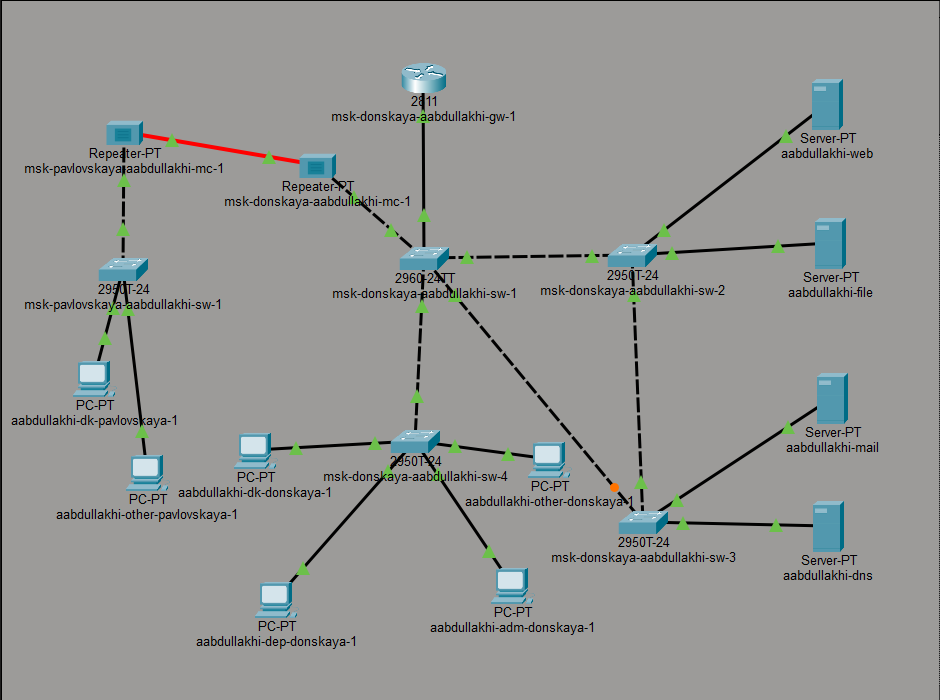
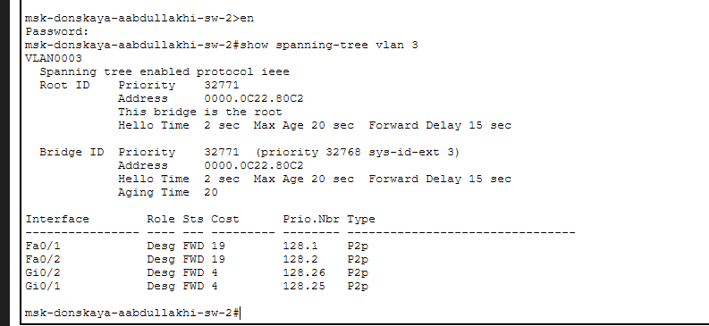
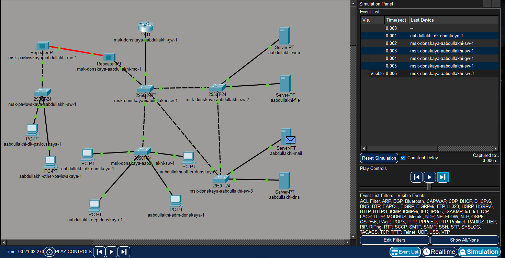
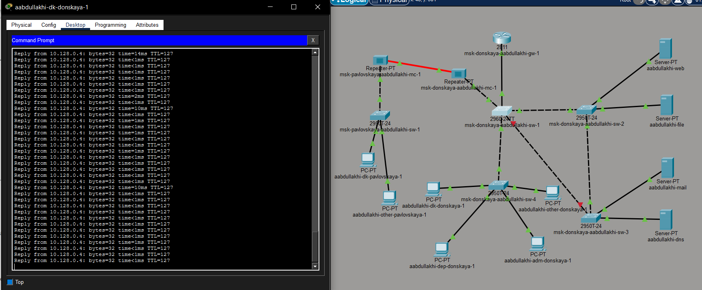
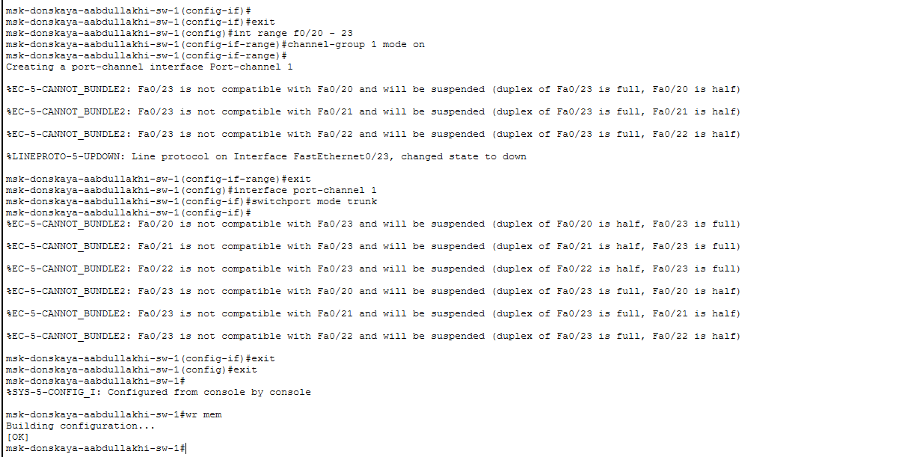

---
## Front matter
lang: ru-RU
title: Администрирование локальных сетей
subtitle: Лабораторная работа №9
author:
  - Абдуллахи Абдул Вахид
institute:
  - Российский университет дружбы народов, Москва, Россия
date: 27 февраля 2026

## i18n babel
babel-lang: russian
babel-otherlangs: english

## Formatting pdf
toc: false
toc-title: Содержание
slide_level: 2
aspectratio: 169
section-titles: true
theme: metropolis
header-includes:
 - \metroset{progressbar=frametitle,sectionpage=progressbar,numbering=fraction}
---

# Цель 

## Цель лабораторной работы 

Освоение механизмов работы протокола STP и его усовершенствованных версий для обеспечения отказоустойчивости сети, настройка агрегирования каналов и распределение трафика между ними.

# Выполнение лабораторной работы

## топология сети с резервным соединением

{ width=75% }

## Проверка прохождения ICMP-пакета

{ width=75% }

## Просмотр состояния STP

{ width=75% }

## Настройка коммутатора в качестве корневого STP-коммутатора

{ width=75% }

## Путь ICMP-пакета к серверу web после перенастройки STP

{ width=75% }

## Путь ICMP-пакета к серверу mail после перенастройки STP

{ width=75% }

## Настройка режима PortFast

{ width=75% }

## Проверка отказоустойчивости STP

{ width=75% }

## Перевод коммутатора в режим Rapid PVST+

{ width=75% }

## Проверка работы сети при использовании Rapid PVST+

{ width=75% }

## Настройка EtherChannel на коммутаторе msk-donskaya-aabdullakhi-sw-1

{ width=75% }

## Успешная проверка соединения после настройки EtherChannel

{ width=75% }

# Вывод

## Вывод

В ходе работы была построена отказоустойчивая коммутируемая сеть в Cisco Packet Tracer с применением STP и Rapid PVST+. Созданы резервные соединения, настроены транковые порты, выбран корневой коммутатор для VLAN 3.

Изучено поведение STP при изменении топологии. Переход на Rapid PVST+ позволил значительно сократить время восстановления сети после отказа.

На портах, подключённых к конечным устройствам, активирован режим PortFast для ускорения их перехода в рабочее состояние. Настроен EtherChannel, что повысило пропускную способность и отказоустойчивость.

Тестирование командой ping подтвердило корректную работу сети как в обычном режиме, так и при имитации отказов каналов.

