---
## Front matter
title: "Отчёт по лабораторной работе 9"
subtitle: "Использование протокола STP. Агрегирование каналов"
author: "Абдуллахи Абдул Вахид"

## Generic otions
lang: ru-RU
toc-title: "Содержание"

## Bibliography
bibliography: bib/cite.bib
csl: pandoc/csl/gost-r-7-0-5-2008-numeric.csl

## Pdf output format
toc: true # Table of contents
toc-depth: 2
lof: true # List of figures
lot: true # List of tables
fontsize: 12pt
linestretch: 1.5
papersize: a
documentclass: scrreprt
## I18n polyglossia
polyglossia-lang:
  name: russian
  options:
	- spelling=modern
	- babelshorthands=true
polyglossia-otherlangs:
  name: english
## I18n babel
babel-lang: russian
babel-otherlangs: english
## Fonts
mainfont: IBM Plex Serif
romanfont: IBM Plex Serif
sansfont: IBM Plex Sans
monofont: IBM Plex Mono
mathfont: STIX Two Math
mainfontoptions: Ligatures=Common,Ligatures=TeX,Scale=0.94
romanfontoptions: Ligatures=Common,Ligatures=TeX,Scale=0.94
sansfontoptions: Ligatures=Common,Ligatures=TeX,Scale=MatchLowercase,Scale=0.94
monofontoptions: Scale=MatchLowercase,Scale=0.94,FakeStretch=0.9
mathfontoptions:
## Biblatex
biblatex: true
biblio-style: "gost-numeric"
biblatexoptions:
  - parentracker=true
  - backend=biber
  - hyperref=auto
  - language=auto
  - autolang=other*
  - citestyle=gost-numeric
## Pandoc-crossref LaTeX customization
figureTitle: "Рис."
tableTitle: "Таблица"
listingTitle: "Листинг"
lofTitle: "Список иллюстраций"
lotTitle: "Список таблиц"
lolTitle: "Листинги"
## Misc options
indent: true
header-includes:
  - \usepackage{indentfirst}
  - \usepackage{float} # keep figures where there are in the text
  - \floatplacement{figure}{H} # keep figures where there are in the text
---

#  Цель работы

Освоение механизмов работы протокола STP и его усовершенствованных версий для обеспечения отказоустойчивости сети, настройка агрегирования каналов и распределение трафика между ними.

#  Выполнение лабораторной работы

## сходная и изменённая топология сети с резервным соединением

В среде Cisco Packet Tracer была построена сеть @fig:1 , включающая маршрутизатор Cisco 2811 (`msk-donskaya-aabdullakhi-gw-1`), коммутаторы Cisco 2950/2960, повторители, серверы и оконечные ПК.

В процессе выполнения было изменено соединение между коммутаторами для создания резервного маршрута. Ранее существовавшее соединение между `msk-donskaya-aabdullakhi-sw-1` и `msk-donskaya-aabdullakhi-sw-4` через порты Gig0/2 и Gig0/1 заменено на связь между `msk-donskaya-aabdullakhi-sw-1` (Gig0/2) и `msk-donskaya-aabdullakhi-sw-3` (Gig0/2).

Дополнительно между `msk-donskaya-aabdullakhi-sw-1` и `msk-donskaya-aabdullakhi-sw-4` был настроен транковый режим через интерфейсы FastEthernet0/23.

{#fig:1}

## Прохождение ICMP-пакета через коммутатор msk-donskaya-aabdullakhi-sw-2

После создания резервного канала @fig:2 была проведена проверка передачи данных от ПК `aabdullakhi-dk-donskaya-1` к серверам `aabdullakhi-web` и `aabdullakhi-mail` @fig:2-1.

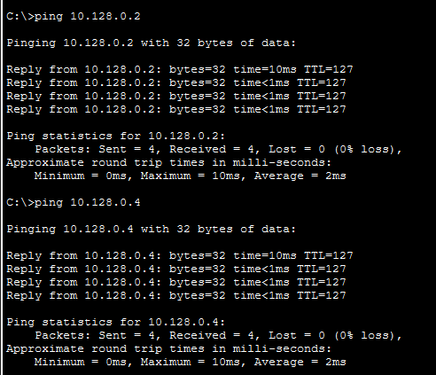{#fig:2-1}

В симуляционном режиме @fig:2 и @fig:2-2 отслежено движение ICMP-пакетов. На начальном этапе пакеты идут к серверам через коммутатор `msk-donskaya-aabdullakhi-sw-2`, что соответствует текущей конфигурации spanning-tree.

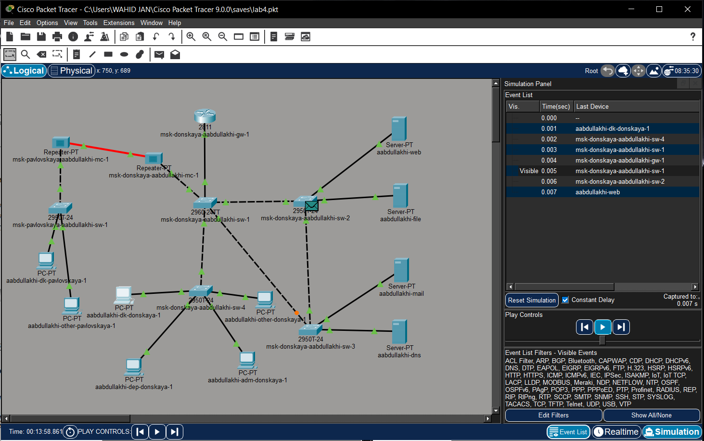{#fig:2}

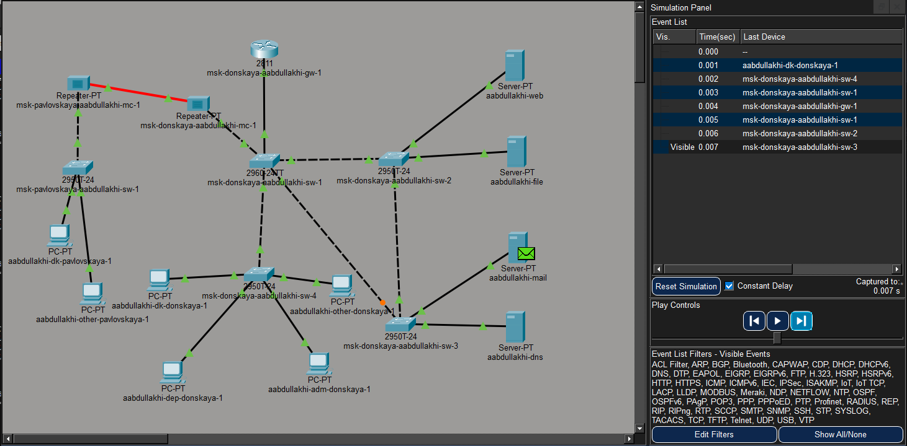{#fig:2-2}

## Просмотр состояния STP на коммутаторе msk-donskaya-aabdullakhi-sw-2

На коммутаторе `msk-donskaya-aabdullakhi-sw-2` выполнена команда `show spanning-tree vlan 3` для просмотра состояния STP:

```cisco
show spanning-tree vlan 3
```

Результат показал, что данный коммутатор не является корневым. Был определён корневой мост, роли портов: интерфейс GigabitEthernet0/1 работает как Root Port, остальные находятся в состоянии Designated Forwarding.


## Настройка коммутатора msk-donskaya-aabdullakhi-sw-1 в качестве корневого STP-коммутатора

Для оптимизации топологии коммутатор `msk-donskaya-aabdullakhi-sw-1` был вручную назначен корневым для VLAN 3 @fig:4 с помощью команды:

```cisco
spanning-tree vlan 3 root primary
```
{#fig:4}

## Путь ICMP-пакета к серверу web после перенастройки STP

После изменения корневого коммутатора @fig:4 повторно проверен путь ICMP-пакетов.

Трафик от хоста `aabdullakhi-dk-donskaya-1` к web-серверу проходит через:
- `msk-donskaya-aabdullakhi-sw-1` → `msk-donskaya-aabdullakhi-sw-2` @fig:5

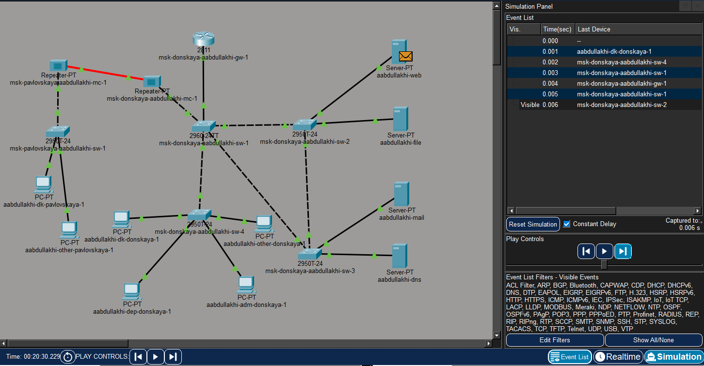{#fig:5}

## Путь ICMP-пакета к серверу mail после перенастройки STP

Трафик от хоста `aabdullakhi-dk-donskaya-1` к mail-серверу проходит через:
- `msk-donskaya-aabdullakhi-sw-1` → `msk-donskaya-aabdullakhi-sw-3` @fig:5-1

{#fig:5-1}

## Настройка режима PortFast на серверных интерфейсах коммутатора

Для ускорения перехода портов в активное состояние на интерфейсах, подключённых к серверам, включён режим PortFast @fig:6 .

На коммутаторе `msk-donskaya-aabdullakhi-sw-2` режим активирован на портах FastEthernet0/1 и FastEthernet0/2:

```cisco
interface FastEthernet0/1
 spanning-tree portfast
interface FastEthernet0/2
 spanning-tree portfast
```

Аналогичные действия выполнены на `msk-donskaya-aabdullakhi-sw-3` @fig:6-1 .

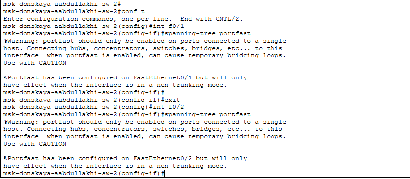{#fig:6}

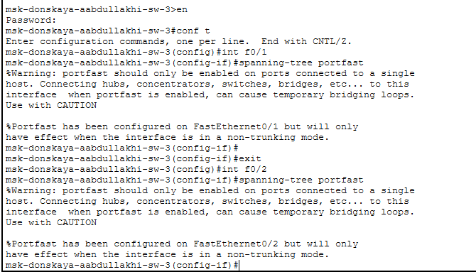{#fig:6-1}

## Проверка отказоустойчивости STP с помощью длительного ping

Исследована отказоустойчивость STP @fig:7 .

С ПК `aabdullakhi-dk-donskaya-1` запущена команда:

```cmd
ping -n 1000 mail.donskaya.rudn.ru
```

Затем один из межкоммутаторных интерфейсов переведён в состояние shutdown. Наблюдались кратковременные потери пакетов (Request timed out) с последующим восстановлением соединения после перестроения дерева.

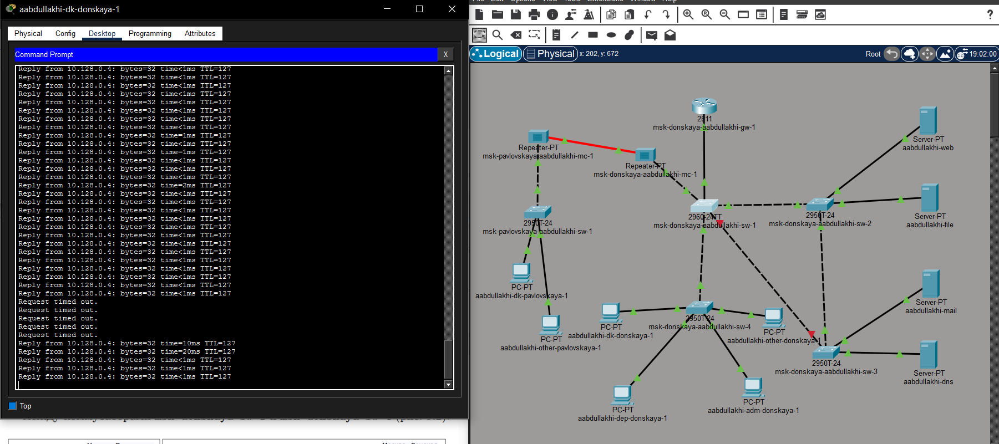{#fig:7}

## Перевод коммутатора в режим Rapid PVST+

Все коммутаторы переведены в режим Rapid PVST+ @fig:8 командой:

```cisco
spanning-tree mode rapid-pvst
```

Конфигурация сохранена в энергонезависимую память.

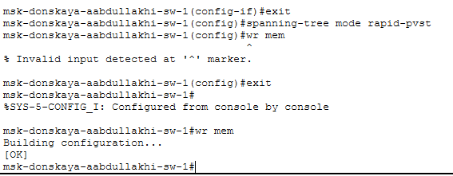{#fig:8}

## Проверка работы сети при использовании Rapid PVST+

После переключения на Rapid PVST+ повторно проверена отказоустойчивость @fig:9.

При аналогичном отключении интерфейса потери пакетов были минимальными, восстановление произошло значительно быстрее, что подтверждает преимущество Rapid PVST+ перед классическим STP (сравните с результатами в **разд. 2.9**).

{#fig:9}

## Настройка EtherChannel на коммутаторе msk-donskaya-aabdullakhi-sw-1

Настроено агрегированное соединение (EtherChannel) между `msk-donskaya-aabdullakhi-sw-1` и `msk-donskaya-aabdullakhi-sw-4` через интерфейсы FastEthernet0/20 – FastEthernet0/23 @fig:10.

На первом коммутаторе выполнены команды:

```cisco
interface range FastEthernet0/20-23
 channel-group 1 mode on
 exit
interface port-channel 1
 switchport mode trunk
```

В процессе были исправлены предупреждения о несовпадении параметров duplex.

{#fig:10}

## Сформированное агрегированное соединение между коммутаторами

Аналогичная настройка EtherChannel выполнена на втором коммутаторе `msk-donskaya-aabdullakhi-sw-4`. Параметры интерфейсов приведены к единым значениям (отключён access VLAN), после чего они добавлены в channel-group 1. В результате сформирован агрегированный канал @fig:11.

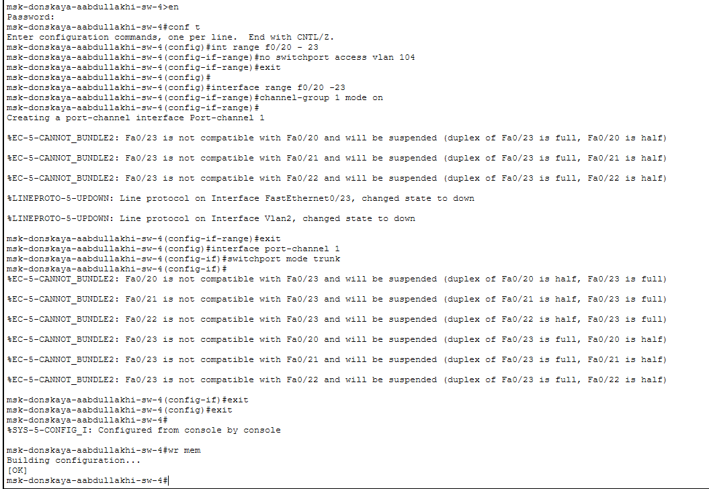{#fig:11}

## Успешная проверка соединения после настройки EtherChannel

После настройки EtherChannel выполнена проверка доступности сервера mail с ПК `aabdullakhi-dk-donskaya-1` @fig:13 :

```cmd
ping mail.donskaya.rudn.ru
```

Все пакеты прошли без потерь, что подтверждает корректную работу агрегированного соединения.

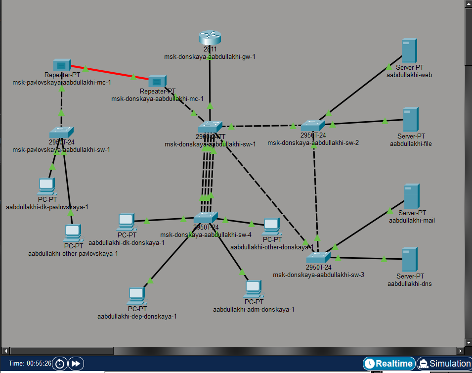

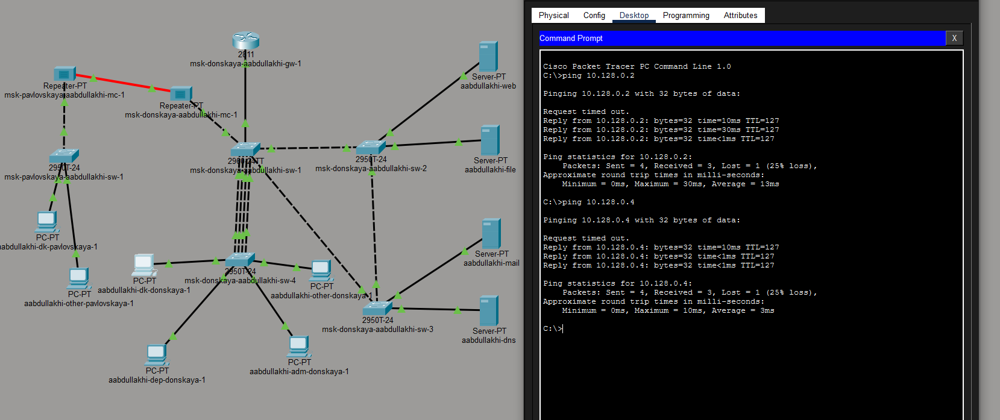{#fig:13}

# Вывод

В ходе работы была построена отказоустойчивая коммутируемая сеть в Cisco Packet Tracer с применением STP и Rapid PVST+. Созданы резервные соединения @fig:1, настроены транковые порты, выбран корневой коммутатор для VLAN 3.

Изучено поведение STP при изменении топологии. Переход на Rapid PVST+ позволил значительно сократить время восстановления сети после отказа.

На портах, подключённых к конечным устройствам, активирован режим PortFast для ускорения их перехода в рабочее состояние. Настроен EtherChannel, что повысило пропускную способность и отказоустойчивость.

Тестирование командой ping подтвердило корректную работу сети как в обычном режиме, так и при имитации отказов каналов.

# Контрольные вопросы

## Какую информацию можно получить, воспользовавшись командой определения состояния протокола STP для VLAN?

Команда `show spanning-tree vlan` показывает:

- идентификатор и MAC-адрес корневого коммутатора
- приоритет (Priority)
- стоимость пути до корня (Cost)
- роли портов (Root, Designated, Alternate)
- состояния портов (Forwarding, Blocking)
- параметры таймеров (Hello Time, Max Age, Forward Delay)

На корневом устройстве присутствует строка `This bridge is the root`. На некорневом — указывается Root Port.

**Пример вывода для корневого коммутатора:**
```
Root ID Priority 24579
This bridge is the root
```

**Пример вывода для некорневого коммутатора:**
```
Root ID Priority 32771
Cost 23
Port Gi0/1 (Root Port)
```

## При помощи какой команды можно узнать режим работы STP (STP или Rapid PVST+)?

Используется команда:

```cisco
show spanning-tree summary
```

В выводе будет указано:
- `ieee` — классический STP
- `rapid-pvst` — режим Rapid PVST+

**Пример:**
```
Switch is in rapid-pvst mode
```

## Для чего и в каких случаях нужно настраивать режим PortFast?

PortFast ускоряет переход порта в состояние Forwarding, минуя состояния Listening и Learning.

**Применяется:**
- на портах, подключённых к конечным устройствам (ПК, серверы)
- для уменьшения времени получения сетевого доступа
- для предотвращения задержек при загрузке устройств

**Не используется** на межкоммутаторных соединениях, так как может привести к петлям в сети.

    4.4 В чём состоит принцип работы агрегированного интерфейса? Для чего он используется?

Агрегированный интерфейс (EtherChannel) объединяет несколько физических каналов в один логический интерфейс (port-channel).

**Принцип работы:**
- несколько линий связи работают как один канал
- трафик распределяется между физическими интерфейсами
- отказ одного канала не приводит к потере соединения

**Используется для:**
- увеличения пропускной способности
- повышения отказоустойчивости
- балансировки нагрузки

## В чём отличия LACP, PAgP и статического агрегирования?

| Протокол | Тип | Режимы | Совместимость |
|----------|-----|--------|---------------|
| **LACP** | Стандарт IEEE 802.3ad | active / passive | Разные производители |
| **PAgP** | Проприетарный Cisco | desirable / auto | Только Cisco |
| **Статическое** | Без протокола | mode on | Требуется ручная настройка |

Основное отличие — наличие/отсутствие автоматического согласования параметров канала.

## При помощи каких команд можно узнать состояние EtherChannel?

Для проверки состояния агрегированного канала используются команды:

```cisco
show etherchannel summary
show etherchannel port-channel
show running-config
show interfaces port-channel 1
```

Эти команды позволяют определить активные порты, режим работы и состояние агрегированного соединения.


   


