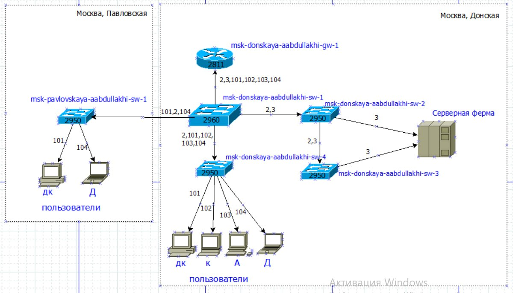

---
## Front matter
lang: ru-RU
title: Администрирование локальных сетей
subtitle: Лабораторная работа №3
author:
  - Абдуллахи Абдул Вахид
institute:
  - Российский университет дружбы народов, Москва, Россия
date: 27 февраля 2026

## i18n babel
babel-lang: russian
babel-otherlangs: english

## Formatting pdf
toc: false
toc-title: Содержание
slide_level: 2
aspectratio: 169
section-titles: true
theme: metropolis
header-includes:
 - \metroset{progressbar=frametitle,sectionpage=progressbar,numbering=fraction}
---

# Цель 

## Цель лабораторной работы 

Основной целью данной лабораторной работы является практическое освоение методологии проектирования структурированной локальной сети предприятия.

В ходе выполнения работы необходимо изучить принципы трехуровневого моделирования сети (физический, канальный и сетевой уровни), а также получить навыки разработки масштабируемого плана IP-адресации для различных частных диапазонов с учетом функциональной сегментации подразделений организации.

# Выполнение лабораторной работы

## Схема L1 — физическая топология

{ width=75% }

## Схема L2 — распределение VLAN

{ width=75% }

## Схема L3 — IP-план сети

{ width=75% }

## адресный план для 172.16.0.0/12

{ width=75% }

## адресный план для 192.168.0.0/16

{ width=75% }

# Выводы

## Выводы

В ходе выполнения лабораторной работы было завершено комплексное проектирование локальной сети организации.

  Ключевые результаты:  
1.  Разработаны трехуровневые модели (L1, L2, L3) для сети, что позволило разделить инфраструктурные, логические и адресные задачи.
2.  Реализована функциональная сегментация сети с помощью VLAN, обеспечивающая изоляцию трафика между отделами.
3.  Успешно выполнена адаптация IP-плана для трех различных частных диапазонов (`10.0.0.0/8`, `172.16.0.0/12`, `192.168.0.0/16`) без изменения физической структуры, что подтверждает универсальность разработанного подхода.
4.  Составлен регламент распределения адресов, который гарантирует предсказуемость конфигурации и упрощает дальнейшее масштабирование сети.

Разработанный проект полностью отвечает требованиям современной корпоративной сети: он обеспечивает логическую изоляцию подразделений, безопасность, удобство администрирования и имеет потенциал для дальнейшего роста.

