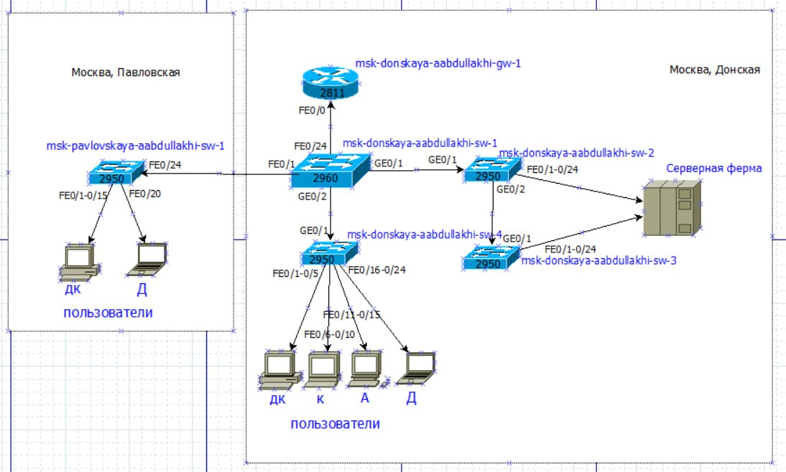
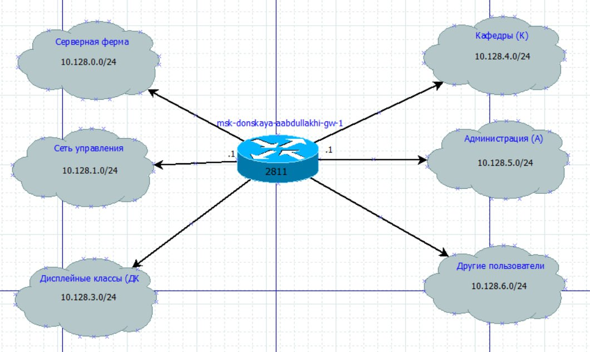
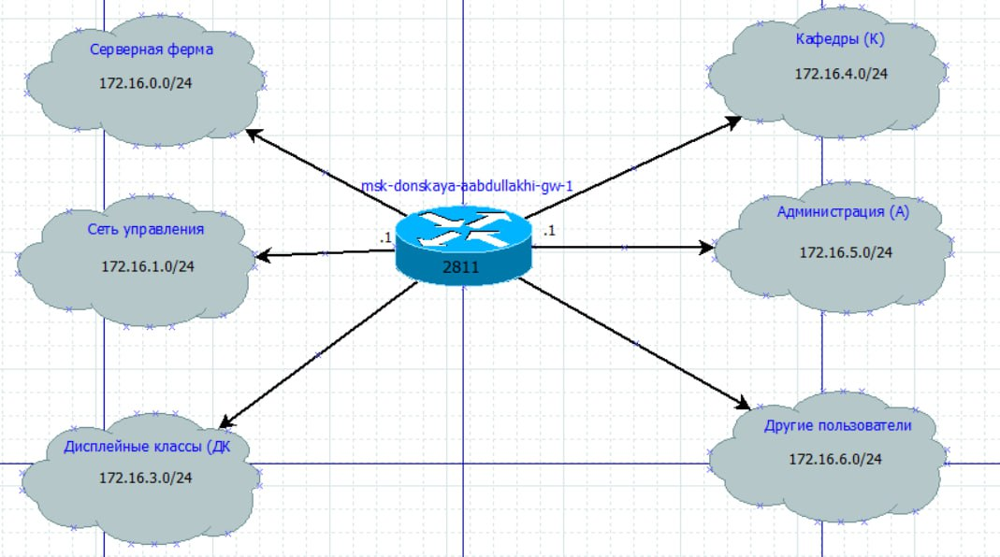
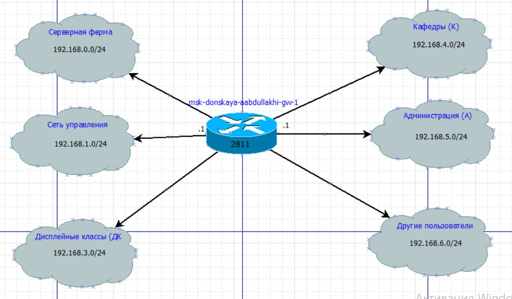

---
## Front matter
title: "Отчёт по лабораторной работе 3"
subtitle: "Планирование локальной сети организации"
author: "Абдуллахи Абдул Вахид"

## Generic otions
lang: ru-RU
toc-title: "Содержание"

## Bibliography
bibliography: bib/cite.bib
csl: pandoc/csl/gost-r-7-0-5-2008-numeric.csl

## Pdf output format
toc: true # Table of contents
toc-depth: 2
lof: true # List of figures
lot: true # List of tables
fontsize: 12pt
linestretch: 1.5
papersize: a
documentclass: scrreprt
## I18n polyglossia
polyglossia-lang:
  name: russian
  options:
	- spelling=modern
	- babelshorthands=true
polyglossia-otherlangs:
  name: english
## I18n babel
babel-lang: russian
babel-otherlangs: english
## Fonts
mainfont: IBM Plex Serif
romanfont: IBM Plex Serif
sansfont: IBM Plex Sans
monofont: IBM Plex Mono
mathfont: STIX Two Math
mainfontoptions: Ligatures=Common,Ligatures=TeX,Scale=0.94
romanfontoptions: Ligatures=Common,Ligatures=TeX,Scale=0.94
sansfontoptions: Ligatures=Common,Ligatures=TeX,Scale=MatchLowercase,Scale=0.94
monofontoptions: Scale=MatchLowercase,Scale=0.94,FakeStretch=0.9
mathfontoptions:
## Biblatex
biblatex: true
biblio-style: "gost-numeric"
biblatexoptions:
  - parentracker=true
  - backend=biber
  - hyperref=auto
  - language=auto
  - autolang=other*
  - citestyle=gost-numeric
## Pandoc-crossref LaTeX customization
figureTitle: "Рис."
tableTitle: "Таблица"
listingTitle: "Листинг"
lofTitle: "Список иллюстраций"
lotTitle: "Список таблиц"
lolTitle: "Листинги"
## Misc options
indent: true
header-includes:
  - \usepackage{indentfirst}
  - \usepackage{float} # keep figures where there are in the text
  - \floatplacement{figure}{H} # keep figures where there are in the text
---

##  Цель работы

Основной целью работы является изучение и практическое освоение принципов планирования структурированной кабельной системы и адресного пространства локальной сети предприятия. В рамках выполнения работы предполагается построение трехуровневой модели сети (физический уровень, уровень VLAN, сетевой уровень), разработка схем IP-адресации для различных частных диапазонов, а также формирование регламентов и таблиц конфигурации сетевых устройств.

##  Выполнение лабораторной работы

### Построение схем L1, L2, L3

Проектирование сети организации начинается с создания трехуровневого представления, соответствующего эталонной модели OSI. Это позволяет разделить сложную систему на логические компоненты и упростить процесс конфигурации и поиска неисправностей. Исходным адресным пространством выбрано 10.128.0.0/16, на основе которого в графическом редакторе были разработаны три схемы.

#### Схема L1 — физическая топология

Схема физического уровня (L1) отображает реальное расположение оборудования и физические соединения между ними. Она отвечает на вопрос «как устройства соединены проводкой?». На данной схеме показаны все активные сетевые устройства с их точными именами (FQDN-подобная нотация), что важно для однозначной идентификации в сети.

В состав спроектированной физической топологии входят:

Ядро сети:   Маршрутизатор (пограничный шлюз) `msk-donskaya-aabdullakhi-gw-1` и коммутатор ядра `msk-donskaya-aabdullakhi-sw-1`. Ядро обеспечивает высокоскоростную агрегацию трафика и связь с внешними сетями.
      Уровень распределения и доступа:   Коммутаторы `msk-donskaya-aabdullakhi-sw-2`, `msk-donskaya-aabdullakhi-sw-3`, `msk-donskaya-aabdullakhi-sw-4`, `msk-pavlovskaya-aabdullakhi-sw-1`. Эти устройства служат для подключения конечных пользователей и серверов, а также для первичной сегментации сети.
      Оконечное оборудование:   Серверная ферма, включающая в себя веб-сервер, файловый сервер, почтовый сервер и DNS-сервер, а также рабочие станции пользователей в различных отделах.
      

#### Схема L2 — распределение VLAN

Схема канального уровня (L2) описывает логическую структуру сети поверх физической. Здесь ключевым понятием является VLAN (Virtual Local Area Network), который позволяет создавать изолированные широковещательные домены независимо от физического расположения устройств.

На схеме отображены:
      Типы портов: 
          Access-порты:   Назначены для подключения конечных устройств (компьютеров, серверов, принтеров). Каждому такому порту присвоен идентификатор конкретного VLAN, например, `VLAN 101` для компьютеров в дисплейных классах.
          Trunk-порты:   Используются для соединения коммутаторов между собой и для подключения маршрутизатора. Эти порты настроены на передачу трафика множества VLAN одновременно, что обеспечивает транзит трафика между разными сегментами сети через магистральные каналы.
      Список разрешенных VLAN:   Для каждого транкового соединения указан перечень VLAN, трафик которых разрешен к передаче. Это повышает безопасность и эффективность использования полосы пропускания.
      Перечень используемых VLAN: 
          VLAN 2 — Management:   Выделен для управления сетевым оборудованием (коммутаторами, маршрутизаторами). Это позволяет администраторам подключаться к устройствам для настройки и мониторинга, изолируя управляющий трафик от пользовательского.
          VLAN 3 — Servers:   Создан для серверной фермы. Изоляция серверов в отдельный VLAN повышает уровень безопасности, позволяя применять к ним специфические политики доступа.
          VLAN 101 — Дисплейные классы (ДК):   Для учебных классов.
          VLAN 102 — Кафедры:   Для сотрудников кафедр.
          VLAN 103 — Администрация:   Для административного персонала.
          VLAN 104 — Другие пользователи:   Для гостевого доступа или отделов, не требующих изоляции.
          

          
#### Схема L3 — IP-план сети

Схема сетевого уровня (L3) показывает логическую адресацию (IP-план). На этом уровне каждому VLAN сопоставляется отдельная IP-подсеть. Это обеспечивает возможность маршрутизации между VLAN и является основой для построения любых сетевых политик (ACL, QoS).

Для исходного задания адресное пространство `10.128.0.0/16` было разбито на подсети фиксированной длины `/24`. Такой выбор позволяет в каждой подсети разместить до 254 узлов, что является достаточным для большинства отделов, и упрощает администрирование за счет единообразия маски. Каждой функциональной группе (управление, серверы, отделы) назначена своя уникальная подсеть, шлюзом по умолчанию для которой выступает IP-адрес маршрутизатора (как правило, первый адрес в диапазоне — `.1`).

### Таблица VLAN

В данной таблице систематизирована информация о созданных виртуальных сетях. Четкое разделение VLAN является основой для обеспечения безопасности и управляемости сети.

| № VLAN | Имя VLAN     | Примечание                                        |
| :----- | :----------- | :------------------------------------------------ |
| 1      | default      | Не используется (стандартный VLAN, рекомендуется отключить) |
| 2      | management   | Для управления сетевыми устройствами (SSH, SNMP)  |
| 3      | servers      | Для серверной фермы                               |
| 4-100  | —            | Зарезервировано для будущего расширения           |
| 101    | dk           | Дисплейные классы (ДК)                            |
| 102    | departments  | Кафедры                                           |
| 103    | adm          | Администрация                                     |
| 104    | other        | Для других пользователей и гостевой сети          |

###Таблица IP-адресов

####Общая сеть

| IP-адрес       | Примечание                     | VLAN |
| :------------- | :----------------------------- | :--- |
| 10.128.0.0/16  | Вся корпоративная сеть         | —    |

####Серверная ферма (VLAN 3)

 данной подсети статические адреса назначаются серверам в соответствии с регламентом.

| IP-адрес       | Примечание                     | VLAN |
| :------------- | :----------------------------- | :--- |
| 10.128.0.0/24  | Подсеть серверной фермы        | 3    |
| 10.128.0.1     | Шлюз по умолчанию              | 3    |
| 10.128.0.2     | Web-сервер                     | 3    |
| 10.128.0.3     | File-сервер                    | 3    |
| 10.128.0.4     | Mail-сервер                    | 3    |
| 10.128.0.5     | DNS-сервер                     | 3    |
| 10.128.0.6-254 | Зарезервировано (для БД, резерва и т.д.) | 3    |

####Сеть управления (VLAN 2)

Здесь перечислены IP-адреса, назначаемые управляющим интерфейсам (SVI) коммутаторов.

| IP-адрес       | Примечание                        | VLAN |
| :------------- | :-------------------------------- | :--- |
| 10.128.1.0/24  | Подсеть управления                | 2    |
| 10.128.1.1     | Шлюз                              | 2    |
| 10.128.1.2     | msk-donskaya-abdulvahid-sw-1      | 2    |
| 10.128.1.3     | msk-donskaya-abdulvahid-sw-2      | 2    |
| 10.128.1.4     | msk-donskaya-abdulvahid-sw-3      | 2    |
| 10.128.1.5     | msk-donskaya-abdulvahid-sw-4      | 2    |
| 10.128.1.6     | msk-pavlovskaya-abdulvahid-sw-1   | 2    |

####Пользовательские подсети

Каждому отделу выделена отдельная подсеть /24.

| Подсеть         | Назначение           | VLAN |
| :-------------- | :------------------- | :--- |
| 10.128.3.0/24   | Дисплейные классы    | 101  |
| 10.128.4.0/24   | Кафедры              | 102  |
| 10.128.5.0/24   | Администрация        | 103  |
| 10.128.6.0/24   | Другие пользователи  | 104  |

### Таблица портов подключения оборудования 

Эта таблица детализирует конфигурацию портов на каждом устройстве, связывая физическую схему (L1) с логической (L2).

| Устройство                         | Порт | Примечание       | Access VLAN | Trunk VLAN                      |
| :--------------------------------- | :--- | :--------------- | :---------- | :------------------------------ |
| msk-donskaya-aabdullakhi-gw-1       | f0/0 | к sw-1 (Trunk)   | —           | 2,3,101,102,103,104            |
| msk-donskaya-aabdullakhi-sw-1       | g0/1 | к sw-2 (Trunk)   | —           | 2,3                            |
| msk-donskaya-aabdullakhi-sw-2       | g0/2 | к sw-4 (Trunk)   | —           | 2,101,102,103,104              |
| msk-donskaya-aabdullakhi-sw-3       | f0/1 | Web-сервер       | 3           | —                              |
| msk-donskaya-aabdullakhi-sw-4       | f0/2 | File-сервер      | 3           | —                              |
| msk-donskaya-aabdullakhi-sw-3       | f0/2 | DNS-сервер       | 3           | —                              |
| msk-donskaya-aabdullakhi-sw-4       | f0/1-5 | ПК Дисплейных классов | 101    | —                              |
| msk-donskaya-aabdullakhi-sw-5       | f0/6-10 | ПК Кафедр       | 102         | —                              |
| msk-donskaya-aabdullakhi-sw-6       | f0/11-15 | ПК Администрации | 103       | —                              |
| msk-donskaya-aabdullakhi-sw-7       | f0/16-24 | ПК Другие        | 104         | —                              |
| msk-pavlovskaya-aabdullakhi-sw-1    | f0/1-15 | ПК ДК (удаленный офис) | 101     | —                              |
| msk-pavlovskaya-aabdullakhi-sw-1    | f0/20 | ПК Другие (удаленный офис) | 104     | —                              |

### Регламент выделения IP-адресов внутри подсети /24

Для обеспечения предсказуемости и упрощения администрирования был разработан единый регламент распределения адресов внутри каждой пользовательской подсети.

| Диапазон IP (внутри подсети /24) | Назначение                                   |
| :------------------------------- | :------------------------------------------- |
| 1                                | Шлюз по умолчанию (адрес маршрутизатора)    |
| 2-19                             | Сетевое оборудование (управляемые коммутаторы, точки доступа) |
| 20-29                            | Серверы и принт-серверы                      |
| 30-199                           | Компьютеры пользователей (выдаваемые по DHCP) |
| 200-219                          | Компьютеры пользователей (статические адреса для особых задач) |
| 220-229                          | Сетевые принтеры и МФУ                       |
| 230-254                          | Резерв                                       |

### Задание

На заключительном этапе лабораторной работы необходимо применить разработанную методологию для других частных диапазонов. Условия задания подчеркивают важность разделения уровней: физическая структура (L1) и логическая сегментация (L2) остаются неизменными, что доказывает гибкость спроектированной сети. Требуется подготовить аналогичный план адресного пространства для сетей:

`172.16.0.0/12`
`192.168.0.0/16`

Необходимо пересчитать подсети и адреса устройств под новые адресные пространства, сохранив функциональное назначение каждого сегмента.

#### Схема L3 – адресный план для 172.16.0.0/12

#### Схема L3 — адресный план для 192.168.0.0/16

### Таблица IP-адресов для 172.16.0.0/12

#### Общая сеть

| IP-адрес       | Примечание                     | VLAN |
| :------------- | :----------------------------- | :--- |
| 172.16.0.0/12  | Вся корпоративная сеть         | —    |

#### Серверная ферма (VLAN 3)

| IP-адрес           | Примечание                     | VLAN |
| :----------------- | :----------------------------- | :--- |
| 172.16.0.0/24      | Подсеть серверов               | 3    |
| 172.16.0.1         | Шлюз                           | 3    |
| 172.16.0.2         | Web-сервер                     | 3    |
| 172.16.0.3         | File-сервер                    | 3    |
| 172.16.0.4         | Mail-сервер                    | 3    |
| 172.16.0.5         | DNS-сервер                     | 3    |
| 172.16.0.6-254     | Зарезервировано                | 3    |

#### Сеть управления (VLAN 2)

| IP-адрес           | Примечание                     | VLAN |
| :----------------- | :----------------------------- | :--- |
| 172.16.1.0/24      | Подсеть управления             | 2    |
| 172.16.1.1         | Шлюз                           | 2    |
| 172.16.1.2         | msk-donskaya-aabdullakhi-sw-1   | 2    |
| ...                | ...                            | ...  |
| 172.16.1.6         | msk-pavlovskaya-aabdullakhi-sw-1| 2    |
| 172.16.1.7-254     | Зарезервировано                | 2    |

#### Сеть Point-to-Point (служебная)

Для организации связей между маршрутизаторами или особых служебных нужд выделена отдельная подсеть. Это позволяет избежать лишнего расходования адресов в пользовательских подсетях.

| IP-адрес           | Примечание                     | VLAN |
| :----------------- | :----------------------------- | :--- |
| 172.16.2.0/24      | Сеть Point-to-Point            | —    |
| 172.16.2.1         | Шлюз (или один из концов линка)| —    |
| 172.16.2.2-254     | Зарезервировано                | —    |

#### Пользовательские подсети

| Подсеть          | Назначение           | VLAN | Адрес шлюза |
| :--------------- | :------------------- | :--- | :---------- |
| 172.16.3.0/24    | Дисплейные классы    | 101  | 172.16.3.1  |
| 172.16.4.0/24    | Кафедры              | 102  | 172.16.4.1  |
| 172.16.5.0/24    | Администрация        | 103  | 172.16.5.1  |
| 172.16.6.0/24    | Другие пользователи  | 104  | 172.16.6.1  |

### Таблица IP-адресов для 192.168.0.0/16

#### Общая сеть

| IP-адрес         | Примечание                     | VLAN |
| :--------------- | :----------------------------- | :--- |
| 192.168.0.0/16   | Вся корпоративная сеть         | —    |

####Серверная ферма (VLAN 3)

| IP-адрес           | Примечание                     | VLAN |
| :----------------- | :----------------------------- | :--- |
| 192.168.0.0/24     | Подсеть серверов               | 3    |
| 192.168.0.1        | Шлюз                           | 3    |
| 192.168.0.2        | Web-сервер                     | 3    |
| 192.168.0.3        | File-сервер                    | 3    |
| 192.168.0.4        | Mail-сервер                    | 3    |
| 192.168.0.5        | DNS-сервер                     | 3    |
| 192.168.0.6-254    | Зарезервировано                | 3    |

####Сеть управления (VLAN 2)

| IP-адрес           | Примечание                     | VLAN |
| :----------------- | :----------------------------- | :--- |
| 192.168.1.0/24     | Подсеть управления             | 2    |
| 192.168.1.1        | Шлюз                           | 2    |
| 192.168.1.2        | msk-donskaya-aabdullakhi-sw-1   | 2    |
| ...                | ...                            | ...  |
| 192.168.1.6        | msk-pavlovskaya-aabdullakhi-sw-1| 2    |
| 192.168.1.7-254    | Зарезервировано                | 2    |

####Сеть Point-to-Point (служебная)

| IP-адрес           | Примечание                     | VLAN |
| :----------------- | :----------------------------- | :--- |
| 192.168.2.0/24     | Сеть Point-to-Point            | —    |
| 192.168.2.1        | Шлюз                           | —    |
| 192.168.2.2-254    | Зарезервировано                | —    |

####Пользовательские подсети

| Подсеть            | Назначение           | VLAN | Адрес шлюза   |
| :----------------- | :------------------- | :--- | :------------ |
| 192.168.3.0/24     | Дисплейные классы    | 101  | 192.168.3.1   |
| 192.168.4.0/24     | Кафедры              | 102  | 192.168.4.1   |
| 192.168.5.0/24     | Администрация        | 103  | 192.168.5.1   |
| 192.168.6.0/24     | Другие пользователи  | 104  | 192.168.6.1   |

## Вывод

В ходе выполнения лабораторной работы были successfully разработаны планы адресного пространства для двух частных диапазонов: `172.16.0.0/12` и `192.168.0.0/16`. Ключевым результатом стало не просто механическое пересчитывание адресов, а демонстрация принципа модульности и иерархичности при проектировании сетей.

Проектирование велось с учетом жесткого разделения уровней: физическая топология (L1) и конфигурация VLAN (L2) были приняты как неизменяемая инфраструктурная основа. Это позволило сфокусироваться исключительно на задаче сетевой адресации (L3), доказав, что правильно спроектированная инфраструктура способна функционировать с разными адресными планами без изменения физической логики соединений.

Для каждого из заданных диапазонов было выполнено разбиение на подсети `/24`, строго соответствующее функциональному назначению сегментов (серверная ферма, управление,отделы). Такой подход (VLAN = subnet) является стандартом промышленной сетевой архитектуры, так как он:
1.    Обеспечивает изоляцию:   Трафик бухгалтерии не смешивается с трафиком учебных классов на канальном уровне.
2.    Повышает безопасность:   Позволяет применять политики межсетевого экрана на границах подсетей.
3.    Упрощает администрирование и поиск неисправностей:   Адрес устройства четко указывает на его местоположение в логической структуре сети.

Составленные таблицы VLAN, портов и IP-адресов, а также принятый регламент распределения адресов (шлюз, сетевое оборудование, серверы, DHCP-клиенты) создают законченный проект, пригодный для непосредственной реализации. Разработанный план является масштабируемым: при появлении нового отдела ему может быть выделена следующая свободная подсеть `/24`, а регламент определит, какие адреса назначать новым устройствам. Таким образом, цель работы по знакомству с принципами планирования локальной сети достигнута в полном объеме.

## Контрольные вопросы

### Что такое модель взаимодействия открытых систем (OSI)? Какие уровни в ней есть?

Модель OSI (Open Systems Interconnection) — это концептуальная модель, которая стандартизирует правила взаимодействия сетевых устройств и приложений. Она разделяет сложный процесс передачи данных на семь последовательных уровней. Каждый уровень выполняет строго определенные функции и предоставляет сервисы вышестоящему уровню, скрывая детали своей реализации.

  Уровни модели OSI: 6. Что такое сетевой порт?

1.    Физический (Physical):   Отвечает за передачу неструктурированного потока битов по физической среде. Определяет электрические, оптические и механические характеристики (типы кабелей, разъемы, уровни напряжения, скорость передачи).

2.    Канальный (Data Link):   Обеспечивает надежную передачу данных между двумя соседними узлами в одной сети. Формирует кадры, использует MAC-адреса для идентификации устройств, отвечает за обнаружение и коррекцию ошибок на этом уровне.
3.    Сетевой (Network):   Отвечает за маршрутизацию и логическую адресацию (IP-адреса). Определяет оптимальный путь передачи пакетов от отправителя к получателю через составную сеть.
4.    Транспортный (Transport):   Обеспечивает надежную доставку данных между конечными приложениями. Отвечает за сегментацию, контроль потока и управление ошибками (протоколы TCP, UDP).
5.    Сеансовый (Session):   Управляет диалогом между приложениями: устанавливает, поддерживает и завершает сеансы связи, синхронизирует передачу данных.
6.    Представления (Presentation):   Отвечает за преобразование данных в формат, понятный приложению. Занимается шифрованием, сжатием и перекодировкой (например, из ASCII в EBCDIC).
7.    Прикладной (Application):   Обеспечивает интерфейс для взаимодействия пользовательских приложений с сетью (HTTP, FTP, SMTP, DNS).

### Какие функции выполняет коммутатор?

Коммутатор (Switch) — это устройство, работающее преимущественно на канальном уровне (L2). Его ключевые функции:
      Коммутация кадров:   Анализирует MAC-адреса назначения во входящих кадрах и пересылает их только на тот порт, где находится получатель.
      Обучение:   Постоянно строит и обновляет таблицу MAC-адресов, связывая MAC-адреса устройств с номерами портов.
      Сегментация сети:   Разделяет сеть на коллизионные домены, что повышает общую производительность.
      Поддержка VLAN:   Позволяет создавать виртуальные локальные сети для логической изоляции трафика.
      Фильтрация трафика:   Может блокировать кадры на основе MAC-адресов или других критериев.
      
### Какие функции выполняет маршрутизатор?

Маршрутизатор (Router) — это устройство сетевого уровня (L3), предназначенное для соединения разных сетей. Основные функции:
      Маршрутизация:   Принимает решение о том, на какой интерфейс и какому следующему устройству отправить пакет на основе его IP-адреса назначения и таблицы маршрутизации.
      Выбор пути:   Использует протоколы маршрутизации (OSPF, RIP, BGP) для определения наилучшего пути к удаленным сетям.
      Разделение широковещательных доменов:   В отличие от коммутатора, маршрутизатор не передает широковещательный трафик из одной сети в другую.
      NAT/PAT:   Преобразует частные IP-адреса в публичные для выхода в интернет.
      Безопасность:   Может фильтровать трафик с помощью списков контроля доступа (ACL).
      
### В чём отличие коммутаторов третьего уровня от коммутаторов второго уровня?

 Коммутатор L2:   Работает на основе MAC-адресов. Не понимает IP-адресацию и не может маршрутизировать трафик между разными VLAN. Для обеспечения связи между VLAN ему требуется внешний маршрутизатор ("маршрутизатор на палочке").
      Коммутатор L3 (Многослойный коммутатор):   Объединяет функции коммутатора и маршрутизатора. Он выполняет коммутацию на L2 внутри VLAN и аппаратную маршрутизацию (L3) между VLAN на высокой скорости, являясь стандартом для ядра и уровня распределения современных сетей.
      
### Что такое сетевой интерфейс?

Сетевой интерфейс — это точка подключения устройства к сети. Это может быть как физический интерфейс (сетевая карта, порт Ethernet), так и виртуальный (логический). Примерами виртуальных интерфейсов являются VLAN-интерфейсы (SVI) на коммутаторах, loopback-интерфейсы или туннели VPN.

### Что такое сетевой порт?

Термин «сетевой порт» имеет два основных значения:
1.    Физический порт:   Разъем на устройстве (RJ-45, SFP+), куда подключается кабель.
2.    Логический порт:   Числовой идентификатор в заголовках протоколов транспортного уровня (TCP/UDP). Используется для различения нескольких приложений на одном устройстве (например, порт 80 для HTTP-сервера, порт 22 для SSH).

### Кратко охарактеризуйте технологии Ethernet, Fast Ethernet, Gigabit Ethernet.

Все три технологии описывают семейство стандартов для проводных локальных сетей, использующих одинаковый формат кадров и принципы доступа к среде (CSMA/CD в ранних версиях). Различия в основном в скорости:
      Ethernet (IEEE 802.3):   Базовая технология со скоростью 10 Мбит/с. В настоящее время устарела для подключения пользователей.
      Fast Ethernet (IEEE 802.3u):   Развитие Ethernet со скоростью 100 Мбит/с. Обеспечивает обратную совместимость на физическом уровне.
      Gigabit Ethernet (IEEE 802.3ab/z):   Скорость 1000 Мбит/с (1 Гбит/с). Является основным стандартом для подключения рабочих станций и серверов в современных сетях.
      
### Что такое IP-адрес (IPv4-адрес)? Определите понятия сеть, подсеть, маска подсети. Приведите пример разбиения сети.

P-адрес (IPv4):   Это уникальный 32-битный идентификатор устройства в сети, записываемый в десятично-точечной нотации (например, `192.168.1.100`). Он состоит из двух частей: номера сети и номера узла.
      Сеть:   Совокупность устройств, имеющих одинаковую сетевую часть IP-адреса.
      Подсеть:   Логическое разделение одной большой сети на более мелкие сегменты.
      Маска подсети:   32-битное число, которое "отсекает" сетевую часть от адреса узла. Записывается либо в десятичном виде (`255.255.255.0`), либо в префиксном (`/24`). Единичные биты маски указывают на сетевую часть.

  Служебные адреса в подсети: 
      Адрес сети:   Самый первый адрес в диапазоне (все биты узла равны 0). Не может быть назначен устройству.
      Широковещательный адрес (Broadcast):   Самый последний адрес в диапазоне (все биты узла равны 1). Используется для отправки данных всем узлам данной подсети.
      
Пример разбиения сети `192.168.1.0/24`:  
Исходная сеть имеет маску `255.255.255.0` (`/24`). Чтобы разделить её на две равные части, мы увеличиваем маску на 1 бит (`/25`).
      Подсеть A:   `192.168.1.0/25` (маска `255.255.255.128`). Диапазон адресов узлов: `192.168.1.1` – `192.168.1.126`. Адрес сети: `192.168.1.0`, Broadcast: `192.168.1.127`.
      Подсеть B:   `192.168.1.128/25` (маска `255.255.255.128`). Диапазон адресов узлов: `192.168.1.129` – `192.168.1.254`. Адрес сети: `192.168.1.128`, Broadcast: `192.168.1.255`.
      
### Дайте определение понятию VLAN. Для чего применяется VLAN?

VLAN (Virtual Local Area Network)   — это технология, позволяющая создать логическую широковещательную область внутри одной физической сети. Устройства в разных VLAN не "видят" друг друга на канальном уровне, как если бы они были подключены к разным физическим коммутаторам.

  Применение и преимущества:  
      Безопасность:   Конфиденциальный трафик (например, бухгалтерии) изолирован от остальных пользователей.
      Уменьшение широковещательного трафика:   Широковещательные запросы (ARP, DHCP) не передаются между VLAN, снижая нагрузку на сеть.
      Организационная и административная гибкость:   Пользователей можно объединять в группы по функциональному признаку, независимо от их физического расположения. Перемещение пользователя в другой кабинет не требует перекоммутации кабелей, достаточно изменить VLAN на порту.
      
### В чём отличие Trunk Port от Access Port?

 Access Port (Порт доступа):  
        Принадлежит только одному VLAN (чаще всего для конечных устройств).
        Убирает VLAN-тег (метку) из всех входящих кадров перед отправкой на устройство.
        Устройство (компьютер, принтер) не знает о существовании VLAN.
      Trunk Port (Магистральный порт):  
        Предназначен для передачи трафика множества VLAN между коммутаторами или от коммутатора к маршрутизатору.
        Маркирует кадры каждого VLAN специальным тегом (стандарт 802.1Q), чтобы принимающее устройство могло отличить, какому VLAN принадлежит трафик.
        На нем настроен список разрешенных VLAN.
      

